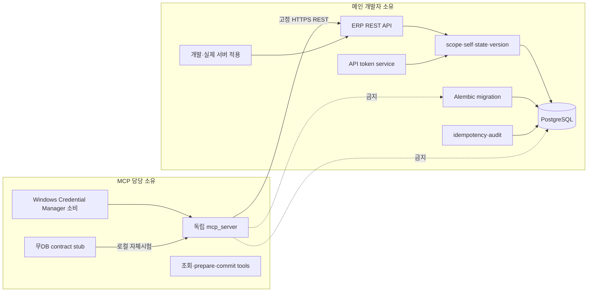

# LSS ERP MCP Backend·DB·Token Main Developer Handoff

> - 작성일: 2026-07-25
> - 전달 대상: LSS ERP 메인 개발자
> - 기준 저장소: `D:\_Project\LSS_ERP`
> - 기준 branch·HEAD: `khlee-add-mcp@1e46a0c`
> - 현재 상태: 설계·계획 완료, backend·DB·MCP 구현 `NOT-RUN`
> - 목적: 실제 PostgreSQL·ERP backend·운영 서버 변경을 메인 개발자에게 분리 인계

## 1. 요청 요약

메인 개발자는 다음 범위의 정본 소유자다.

1. PostgreSQL test DB와 migration 실행
2. API token 생성·조회·폐기·scope·resource 정책
3. JWT와 API token을 분리한 인증 context
4. 미등록 API token endpoint 기본 거부
5. 타임시트 본인·상태·version·직원/주차 unique
6. idempotency·audit transaction
7. MCP 전용 최소 REST API
8. 개발 서버와 실제 서버 적용
9. DB·API·배포 검증 증거 반환

MCP 구현 담당자는 별도 `mcp_server/` 패키지만 소유한다. MCP는 ERP REST API만 호출하며 DB 자격증명·ORM·backend 내부 모듈을 받거나 import하지 않는다.



## 2. 절대 경계

### 2.1 메인 개발자에게 전달하지 않는 것

- 운영 token 원문
- DB 비밀번호
- 운영 `DATABASE_URL`
- Credential Manager 저장값
- 업무일지 원문·Obsidian 경로

### 2.2 MCP 담당자에게 전달하지 않는 것

- DB 관리자 계정
- PostgreSQL 직접 접속 권한
- ORM session
- 내부 SQL 실행 권한
- 운영 서버 shell 권한

### 2.3 MCP 담당자에게 필요한 것

- 개발 ERP API base URL
- MCP 전용 test user
- 허용 scope로 발급된 one-time API token
- token 저장에 사용할 Credential Manager key 이름
- OpenAPI 또는 아래 REST 계약
- integration test에 사용할 격리된 test project, 허용 work type, 비어 있는 disposable draft test week
- 실행 결과를 확인할 수 있는 correlation ID

token 원문은 Git·Markdown·이메일·명령행 인자에 기록하지 않는다. 사용자가 secure one-time channel에서 받아 로컬 Credential Manager에 직접 저장한다.

## 3. 현재 소스 확인 결과

| 영역 | 현재 파일·동작 | 문제 |
|---|---|---|
| DB 종류 | `docker-compose.yml`: `postgres:16-alpine`; `backend/.env.example`: `postgresql+pg8000` | `AGENTS.md`·`CLAUDE.md`의 SQLite 표기는 stale |
| DB driver | `backend/requirements.txt`: `pg8000==1.31.2` | advisory 도달성·upgrade 회귀 미검증 |
| DB 설정 | `backend/app/config.py`: `DATABASE_URL` 필수 | 이 PC에는 `backend/.env`·PostgreSQL·Docker 없음 |
| schema | `backend/alembic/versions/*`; latest `0014` | MCP migration 미생성 |
| 자동 schema | `backend/app/main.py`: `AUTO_CREATE_SCHEMA`와 ensure 함수 | test·운영 migration 경계 재검증 필요 |
| API token model | `backend/app/models/common.py:47` | 공통 모델에 혼재, `client_id`·`resource` 없음 |
| token router | `backend/app/routers/auth.py:121` | 로그인·회원가입 router와 혼재, broad default scope |
| token auth | `backend/app/utils/auth.py:58` | JWT fallback과 혼재, `last_used_at`마다 독립 commit |
| middleware | `backend/app/utils/authorization.py:113` | 미등록 permission이면 기본 통과 |
| timesheet read | `backend/app/routers/timesheet.py:538` | client가 `employee_id`를 전달 |
| timesheet write | `backend/app/routers/timesheet.py:559` | 기존 상태를 무조건 `작성중`으로 reset |
| concurrency | `backend/app/models/timesheet.py` | `version`과 `(employee_id, week_start)` unique 없음 |
| audit | `backend/app/utils/audit.py:5` | `log_action()`이 독립 `db.commit()` 수행 |
| 기존 MCP | `backend/app/mcp/tools.py` | ORM·DB 모델 직접 import |
| 표준 MCP | repo root `mcp_server/` | 미생성 |
| tests | `backend/tests/`, `mcp_server/tests/` | 미생성 |

## 4. 메인 개발자 산출물

### B0. PostgreSQL 16 test lane

필수 결과:

- 운영 DB와 다른 PostgreSQL 16 database
- 운영 host·database name 차단 guard
- test 실행마다 schema 또는 transaction 격리
- Alembic `upgrade head`와 `downgrade` 검증
- 테스트 완료 후 test data 정리

권장 test DB 이름:

```text
lss_erp_mcp_test
```

운영 보호 규칙:

```python
def assert_test_database_url(database_url: str) -> None:
    lowered = database_url.lower()
    if "lss_erp_mcp_test" not in lowered:
        raise RuntimeError("Refusing to run MCP tests outside lss_erp_mcp_test")
    if any(marker in lowered for marker in ("erp.sauter.co.kr", "production", "prod-db")):
        raise RuntimeError("Refusing to run MCP tests against production-like database")
```

SQLite는 빠른 순수 unit test 보조 수단으로만 허용한다. migration·unique race·transaction·PostgreSQL dialect acceptance에는 사용할 수 없다.

### B1. Dependency·API 계약 기준선

생성:

```text
backend/tests/
├─ conftest.py
├─ contract/
│  ├─ test_auth_contract.py
│  ├─ test_timesheet_current_contract.py
│  └─ test_legacy_mcp_freeze.py
├─ security/
│  └─ test_host_path_authorization.py
└─ integration/
   └─ test_postgresql_migrations.py
```

필수 검증:

- JWT 정상·만료·변조
- API token 정상·만료·폐기
- 정상·401·403·404·409·422·429·5xx 오류 의미
- malformed Host·path authorization
- 현재 `/api/mcp` 읽기 도구 수·이름 동결
- 기존 `/api/mcp` 신규 쓰기 도구 0
- dependency audit 전·후 결과

SEC-20·21이 해소되지 않으면 backend 인계 결과는 `BLOCKED`다.

### B2. Token 코드 분리

목표 파일:

```text
backend/app/
├─ models/
│  └─ api_token.py
├─ schemas/
│  └─ api_token.py
├─ services/
│  └─ api_token_service.py
├─ routers/
│  └─ api_tokens.py
└─ utils/
   ├─ auth_context.py
   └─ api_token_scopes.py
```

기존 `backend/app/models/common.py`와 `backend/app/routers/auth.py`에서 token 책임을 분리한다. DB table 이름 `api_tokens`와 기존 데이터는 유지한다.

필수 모델 필드:

```text
id
name
token_hash
token_prefix
user_id
client_id
resource
scopes
expires_at
last_used_at
revoked_at
created_by
created_at
```

필수 정책:

- token 원문은 생성 응답에서 한 번만 반환
- DB에는 SHA-256 hash와 prefix만 저장
- 기본 scope는 빈 집합
- 허용되지 않은 scope 거부
- MCP token은 `client_id=lss-erp-mcp-local`
- MCP token은 `resource=lss-erp-api`
- 만료일 필수
- 폐기 즉시 반영
- token 조회 응답에 원문 없음
- `last_used_at` 때문에 요청마다 독립 commit 금지
- 발급·폐기 감사 event

허용 scope:

```python
MCP_ALLOWED_SCOPES = frozenset(
    {
        "mcp:discover",
        "timesheet:read:self",
        "timesheet:write:self:draft",
    }
)
```

### B3. 단일 `AuthContext`

예정 타입:

```python
from dataclasses import dataclass
from typing import Literal

@dataclass(frozen=True)
class AuthContext:
    user_id: int
    kind: Literal["jwt", "api_token"]
    token_id: int | None
    client_id: str | None
    resource: str | None
    scopes: frozenset[str]
```

필수 동작:

- middleware와 endpoint dependency가 동일 인증 결과 사용
- JWT role/menu 권한과 API token scope 합집합 금지
- API token endpoint mapping 미등록 시 403
- API token `resource` 불일치 시 403
- API token scope 불일치 시 403
- token user가 inactive면 401
- revoked·expired token이면 401
- `request.url.path` 기반 mapping 전 Host 검증

### B4. MCP REST endpoint allowlist

MCP가 호출할 수 있는 endpoint만 등록한다.

| Method | Endpoint | Scope | 행·상태 Gate |
|---|---|---|---|
| GET | `/api/auth/me` | `mcp:discover` | token user |
| GET | `/api/timesheets/week` | `timesheet:read:self` | server-side self |
| GET | `/api/timesheets/projects` | `timesheet:read:self` | 최소 active project |
| POST | `/api/timesheets/mcp-draft` | `timesheet:write:self:draft` | self·작성중·version |

기존 `/api/projects`와 기존 broad `/api/timesheets` 응답을 MCP에서 사용하지 않는다.

API token 요청은 `employee_id`, `user_id`, `approver_id`, `status`를 body/query에서 받지 않는다. server-side token identity에서 employee를 계산한다.

### B5. 응답 계약

#### `GET /api/auth/me`

```json
{
  "user_id": 10,
  "employee_id": 25,
  "employee_code": "E0010",
  "display_name": "테스트 사용자",
  "client_id": "lss-erp-mcp-local",
  "resource": "lss-erp-api",
  "scopes": ["mcp:discover", "timesheet:read:self"]
}
```

#### `GET /api/timesheets/week?week_start=2026-07-20`

```json
{
  "timesheet_id": 100,
  "week_start": "2026-07-20",
  "week_end": "2026-07-26",
  "status": "작성중",
  "version": 3,
  "entries": [
    {
      "entry_id": 1001,
      "work_date": "2026-07-20",
      "project_id": 123,
      "hours": 7.5,
      "work_type": "개발",
      "description": "MCP API 계약 검토"
    }
  ]
}
```

현재 ERP는 요일별 컬럼 구조다. endpoint service에서 MCP의 일자별 entry 계약으로 변환하되 DB schema를 MCP 표현에 맞추기 위해 불필요하게 전면 재설계하지 않는다.

#### `GET /api/timesheets/projects?q=MCP&limit=20`

```json
{
  "items": [
    {
      "project_id": 123,
      "project_code": "P-2026-001",
      "project_name": "MCP 개발",
      "active": true
    }
  ],
  "truncated": false
}
```

원가·매출·내부 비고·고객 민감 필드는 반환하지 않는다.

#### `POST /api/timesheets/mcp-draft`

필수 header:

```http
Idempotency-Key: 3df050b8-d137-45d7-a087-1c44c7e6e6de
X-Correlation-ID: 33776663-98f1-4dc0-8e7b-271f0c8d8cd8
```

요청:

```json
{
  "week_start": "2026-07-20",
  "expected_version": 3,
  "entries": [
    {
      "work_date": "2026-07-20",
      "project_id": 123,
      "hours": 7.5,
      "work_type": "개발",
      "description": "MCP API 계약 검토"
    }
  ]
}
```

성공:

```json
{
  "timesheet_id": 100,
  "week_start": "2026-07-20",
  "status": "작성중",
  "version": 4,
  "correlation_id": "33776663-98f1-4dc0-8e7b-271f0c8d8cd8",
  "idempotency_replayed": false
}
```

오류:

```json
{
  "error": {
    "code": "stale_write",
    "message": "현재 버전이 변경되었습니다.",
    "correlation_id": "33776663-98f1-4dc0-8e7b-271f0c8d8cd8",
    "retryable": false,
    "details": {
      "expected_version": 3,
      "current_version": 4
    }
  }
}
```

필수 error code:

```text
authentication_required
token_expired
token_revoked
api_endpoint_not_allowed
resource_denied
scope_denied
self_only
timesheet_not_draft
stale_write
idempotency_conflict
validation_failed
rate_limited
upstream_timeout
```

### B6. 타임시트 상태·동시성 migration

현재 `save_timesheet()`는 기존 상태를 무조건 `작성중`으로 되돌린다. MCP endpoint에서는 절대 재사용하지 않는다. 내부 domain service를 분리하고 기존 UI 회귀를 검토한다.

필수 변경:

- `timesheets.version INTEGER NOT NULL DEFAULT 1`
- `(employee_id, week_start)` unique constraint
- MCP write는 `작성중 → 작성중`만
- 제출·승인·반려 상태 MCP write 거부
- 성공 write마다 version +1
- `expected_version` 불일치 시 409
- entries 교체·header 갱신·audit·idempotency 단일 transaction

migration 전 필수 쿼리:

```sql
SELECT employee_id, week_start, COUNT(*) AS duplicate_count
FROM timesheets
GROUP BY employee_id, week_start
HAVING COUNT(*) > 1;
```

1행 이상이면 자동 삭제·병합하지 말고 다음 상태로 반환한다.

```text
BLOCKED/DATA-RECONCILIATION-REQUIRED
```

### B7. Idempotency·audit

예정 모델:

```text
backend/app/models/mcp_idempotency.py
```

예정 migration:

```text
backend/alembic/versions/20260725_0016_mcp_idempotency_records.py
```

필수 unique:

```text
(token_id, operation, idempotency_key)
```

필수 동작:

- 같은 key·같은 request hash: 기존 결과 반환
- 같은 key·다른 request hash: 409
- token이 다르면 namespace 분리
- commit 전 connection loss: 재시도 시 1회 반영
- commit 후 response loss: 기존 success 반환
- rollback 시 completed audit 없음
- token·Authorization·원문·vault path logging 금지
- `log_action()`의 독립 commit을 MCP transaction에 사용 금지

### B8. Alembic

권장 migration 분리:

```text
backend/alembic/versions/20260725_0015_mcp_token_scope_timesheet_version.py
backend/alembic/versions/20260725_0016_mcp_idempotency_records.py
```

0015:

- `api_tokens.client_id`
- `api_tokens.resource`
- scope 정규화·검증 준비
- `timesheets.version`
- duplicate preflight
- `(employee_id, week_start)` unique

0016:

- `mcp_idempotency_records`
- unique·index
- retention index

검증:

```powershell
.\backend\venv\Scripts\python.exe -m alembic upgrade head
.\backend\venv\Scripts\python.exe -m alembic current
.\backend\venv\Scripts\python.exe -m pytest backend\tests\integration\test_postgresql_migrations.py -q
```

운영 적용은 backup·duplicate query·dry-run 결과 없이 실행하지 않는다.

### B9. Backend test acceptance

최소 test 파일:

```text
backend/tests/contract/test_auth_contract.py
backend/tests/contract/test_api_token_contract.py
backend/tests/contract/test_mcp_timesheet_contract.py
backend/tests/contract/test_legacy_mcp_freeze.py
backend/tests/security/test_host_path_authorization.py
backend/tests/security/test_api_token_default_deny.py
backend/tests/security/test_timesheet_self_status_version.py
backend/tests/integration/test_postgresql_migrations.py
backend/tests/integration/test_mcp_idempotency.py
backend/tests/integration/test_mcp_transaction_atomicity.py
```

필수 사례:

- broad default scope 0
- API token 미등록 endpoint 통과 0
- 다른 employee 접근 0
- 제출·승인·반려 write 0
- stale write 덮어쓰기 0
- 직원·주차 duplicate 0
- partial write 0
- duplicate write 0
- secret canary 검출 0
- legacy UI 회귀 신규 실패 0

## 5. 개발 서버 integration 제공 방식

### 5.1 메인 개발자 준비

메인 개발자는 다음 환경을 제공한다.

```text
ENVIRONMENT=development
AUTO_CREATE_SCHEMA=false
DATABASE_URL=SERVER-SIDE-SECRET
SECRET_KEY=SERVER-SIDE-SECRET
```

MCP 담당자에게는 `DATABASE_URL`과 `SECRET_KEY`를 전달하지 않는다.

### 5.2 MCP 담당자에게 전달

```text
ERP API base URL
Credential Manager key name
test user identity
empty disposable draft test week
test project IDs
accepted test work type
allowed scopes
health endpoint
OpenAPI hash
backend commit SHA
Alembic current revision
```

API token 원문은 secure one-time channel로만 전달한다. 사용자가 직접 Credential Manager에 입력한다.

### 5.3 연결 Gate

원격 개발 서버:

- HTTPS 필수
- redirect 금지
- 고정 origin
- certificate 검증
- test user·test project만

동일 PC 또는 SSH tunnel:

- `127.0.0.1`만 허용
- 명시적 development flag
- 운영 host와 혼동 금지

### 5.4 실제 서버 적용

실제 서버 적용은 메인 개발자 소유다.

1. backup 확인
2. duplicate query
3. Alembic dry-run 검토
4. migration 적용
5. backend contract suite
6. 기존 UI smoke
7. read-only MCP canary
8. prepare shadow
9. one-user draft commit
10. rollback rehearsal

## 6. Main developer hand-back package

메인 개발자는 다음을 한 묶음으로 반환한다.

```yaml
status: NOT-RUN
backend_commit: NONE
branch_or_pr: NONE
alembic_revision: "20260725_0016"
postgresql_version: "16.x"
database_target: "non-production test database"
duplicate_query_rows: UNKNOWN
tests:
  contract: NOT-RUN
  security: NOT-RUN
  integration: NOT-RUN
dependency_audit:
  unresolved_p0: UNKNOWN
  unresolved_p1: UNKNOWN
openapi_sha256: NONE
legacy_ui_smoke: NOT-RUN
rollback_rehearsal: NOT-RUN
unknowns:
  - Backend implementation and verification have not started
```

반환 시 `NONE`, `NOT-RUN`, `UNKNOWN`을 실제 측정값으로 교체한다. 미실행 항목은 `NOT-RUN`, 확인되지 않은 항목은 `UNKNOWN`으로 유지하며 `status: COMPLETE`는 아래 수용 기준을 모두 만족한 뒤에만 기록한다.

반환 파일:

```text
backend OpenAPI JSON
migration upgrade log
migration downgrade 또는 forward-fix evidence
pytest 결과
dependency audit 결과
duplicate query 결과
secret scan 결과
기존 UI smoke 결과
개발 서버 connection instructions
```

## 7. 수락·거부 기준

### ACCEPT

- PostgreSQL 16 test 결과
- migration·contract·security·integration PASS
- API token default deny
- 본인 작성중 초안만 write
- version·unique·idempotency·audit PASS
- DB 자격증명 비공개
- OpenAPI와 commit SHA 고정
- 개발 서버 연결 정보 제공

### REJECT

- SQLite만으로 migration acceptance
- MCP가 ORM·DB를 직접 import
- broad default scope
- 미등록 API token endpoint 기본 통과
- 제출·승인본 reset 가능
- duplicate 자동 삭제
- token 원문 Git·Markdown·로그 기록
- 운영 DB에서 첫 migration test
- 실측 없는 PASS 주장

## 8. Branch·commit·push 경계

- 메인 개발자는 별도 branch 또는 PR에서 backend·DB 변경 수행
- 반환 시 commit SHA와 변경 파일 목록 제공
- `khlee-add-mcp` 통합은 MCP 담당자의 계약·회귀 검증 후 수행
- 검증된 협업 체크포인트는 `origin/khlee-add-mcp`에만 push 허용
- 모든 G0009 이전 체크포인트는 `DEVELOPMENT/NOT-RELEASED`
- `main` merge·PR merge·실제 서버 배포·실 ERP write 활성화는 G0009
  `COMPLETE/PASS`와 사용자 별도 승인 전 금지
- token·DB 계정·`DATABASE_URL`·`SECRET_KEY`·원문 업무일지 push 금지
- 실제 서버 migration·배포는 메인 개발자 승인·운영 절차로 별도 수행

## 9. 정본 문서

- Obsidian: `99. LS사우타 ERP/2026-07-24_LSS-ERP-MCP-G0000-정책-위협모델-결정.md`
- Obsidian: `99. LS사우타 ERP/2026-07-24_LSS-ERP-MCP-G0001-G0010-개발-최적화-테스트-계획.md`
- Obsidian: `99. LS사우타 ERP/2026-07-25_LSS-ERP-MCP-통합-설계도.md`
- Repo: `docs/superpowers/plans/2026-07-25-lss-erp-mcp-isolated-implementation.md`
- MCP transport: <https://modelcontextprotocol.io/specification/2025-11-25/basic/transports>
- MCP authorization: <https://modelcontextprotocol.io/specification/2025-11-25/basic/authorization>
- MCP tools: <https://modelcontextprotocol.io/specification/2025-11-25/server/tools>

## 10. 다음 행동

1. `LSS-MCP-G0001` 단일 ACTIVE Goal 발행
2. 이 문서와 구현 계획을 `origin/khlee-add-mcp`에 협업 체크포인트로 push
3. 메인 개발자 AI가 이 문서를 읽고 branch·PostgreSQL test lane 회신
4. 우리 쪽은 DB 없는 stub·독립 `mcp_server` TDD를 병렬 실행
5. backend hand-back package 수령 후 G0001~G0004 순차 수락
6. G0009에서 실제 API·canary·rollback 증거 공동 검증
