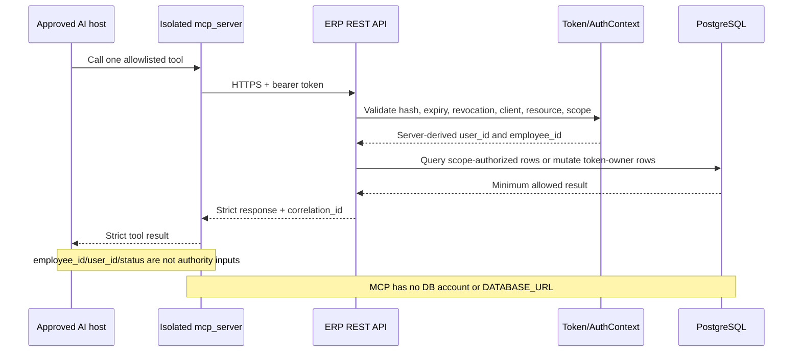

# LSS ERP MCP AI Safety Baseline

## Purpose and claim boundary

This document records the safety controls required before an AI host may use
the LSS ERP MCP. It is an evidence baseline, not a blanket guarantee that the
system is safe.

- Current state: `DEVELOPMENT/NOT-RELEASED`
- Current local evidence: backend schedule unit/contract plus database-free MCP
- External runtime evidence: `WAITING`
- Real API, PostgreSQL, canary, and rollback: `NOT-RUN`

The current MCP does **not** expose every ERP API. It exposes exactly fourteen
MCP tools over twelve allowlisted REST method/path pairs:

| MCP tool | Purpose | Remote write |
|---|---|---|
| `erp_get_current_user` | Return minimum identity bound to the API token | No |
| `timesheet_get_week` | Read the token owner's requested week | No |
| `timesheet_get_entry_context` | Read token-owner entry rules and daily targets | No |
| `timesheet_search_projects` | Search the minimum active-project view | No |
| `timesheet_prepare_draft` | Build an explicit complete-replacement diff | No |
| `timesheet_prepare_from_worklog` | Merge structured facts and ask only unresolved exceptions | No |
| `timesheet_commit_draft` | Save the token owner's draft after all write Gates | Yes; disabled by default |
| `schedule_list` | Read a bounded, content-redacted enterprise schedule range | No |
| `schedule_get` | Read redacted owner/etag/eligibility evidence with Google/DB time consistency | No |
| `schedule_prepare_create` | Prepare and confirm one exact create proposal | No |
| `schedule_prepare_update` | Prepare and confirm one exact update proposal | No |
| `schedule_prepare_delete` | Prepare and confirm one exact delete proposal | No |
| `schedule_commit` | Send one exact confirmed schedule mutation | Yes; independently disabled by default |
| `schedule_operation_status` | Read the authenticated user's journal evidence | No; never retries a write |

Any additional ERP function or endpoint requires a new inventory, scope,
contract, threat review, tests, and release Goal. It must not be inferred from
this branch.

## Identity and authorization invariant

The MCP client never chooses the employee whose timesheet is accessed or whose
schedule is mutated. The backend must derive `user_id` and `employee_id` from
the validated API token and bind them to one `AuthContext`. The explicit
`schedule:read` scope is the narrow exception for bounded enterprise schedule
list/detail: it returns no owner identifier or user-entered content, and
cross-owner mutation remains denied.

Required token constraints:

- raw token returned only once at issuance and never stored in Git;
- database stores token hash and prefix, not the raw token;
- `client_id=lss-erp-mcp-local`;
- `resource=lss-erp-api`;
- default scope is empty and unregistered token endpoints return `403`;
- allowed scopes are only `mcp:discover`, `timesheet:read:self`,
  `timesheet:write:self:draft`, `schedule:read`, and `schedule:write`;
- expired, revoked, invalid, or inactive-user tokens return `401`;
- JWT role/menu privileges are never unioned into API-token scopes;
- API requests do not accept `employee_id`, `user_id`, `approver_id`, or
  `status` as authority.

## Safety control matrix

| Risk | Required control | Local evidence in this branch | Main developer or joint proof still required |
|---|---|---|---|
| AI accesses another employee | Server derives identity from token; self-only endpoints; strict schemas reject extra identity fields | Contract oracle, strict Pydantic models, same-user confirmation check | Real `AuthContext`, IDOR tests, deployed OpenAPI |
| Broad ERP access | Twelve-method/path REST allowlist; five explicit scopes; default deny | REST client allowlist and contract/error tests | Deployed endpoint mapping and unregistered-path `403` |
| Direct database bypass | Separate stdio process; no backend, ORM, DB driver, account, or `DATABASE_URL` | Import isolation test and banned-reference scan | Deployment configuration review |
| Unapproved write | Independent default-off timesheet and schedule Gates; prepare is no-write; expiring confirmation required | Prepare/commit integration, exact-lowercase Gate, and confirmation tests | Approved canary configuration and operator evidence |
| Cross-user or stale confirmation | Confirmation bound to authenticated user and exact proposal/target/version evidence plus one idempotency key | Integrity, expiry, mismatch, owner-lease, and user-namespace tests | Real token/ownership enforcement |
| Duplicate or uncertain write | Expected version/etag, per-user idempotency, deterministic correlation, no blind retry, status-only reconciliation | Fault/replay/concurrency tests against contract oracle | PostgreSQL transaction and real response-loss/cancellation test |
| Protected record modification | Timesheet write is own draft only; MCP schedule synchronization rejects non-`작성중` affected weeks | Local prepare plus backend locked-state contract tests | PostgreSQL contention and deployed protected-state tests |
| Missing-row race | Employee namespace lock before globally ordered Timesheet row locks; unique employee/week constraint | SQL/order/restart/uniqueness tests and locking contract | Actual PostgreSQL blocking and migration rehearsal |
| Legacy or mismatched schedule owner | Immutable owner metadata; no display-name rebinding; owner checked before durable update/delete claim | Backend owner tests plus stub correction-and-retry contract | Dedicated Google calendar owner canary |
| Operation evidence leakage | User-scoped journal status; field and value allowlists; strict correlation grammar | Cross-user 404 and injected-value redaction tests | Deployed log and journal-retention review |
| Secret or business-content leak | Credential Manager, redacted telemetry, no raw body/vault path, no stdout diagnostics | Credential loader, redaction, secret scan, stdio tests | Live Credential Manager and deployed log inspection |
| Raw personal worklog leak | AI host extracts locally; MCP accepts bounded structured facts only; path-like IDs and extra raw/authority fields rejected | Strict worklog schema, vault-reference scan, no-POST prepare tests | Approved host configuration and deployed log inspection |
| Silent loss of existing rows | Worklog preparation is merge-only and reports preserved rows; complete replacement remains a separately described compatibility tool | No-silent-deletion, merge, diff, and golden-case tests | Real API mapping and legacy UI regression |
| AI invents missing time or project | Missing hours/work type and ambiguous projects return deterministic blocking questions; only coverage exceptions can be explicitly accepted | Ambiguity, missing-field, deterministic-question, and golden-case tests | Representative user shadow review |
| SSRF or response abuse | Origin-only base URL, HTTPS outside loopback, redirects rejected, response-size bound | Configuration, SSRF, client contract tests | Development endpoint and network policy evidence |
| Unsafe release inference | Collaboration push is not release approval; kill switch, revoke, rollback Gates | State and handoff documents | G0009 joint PASS and separate user approval |

## Evidence classification

### Verified locally

- Backend schedule suite: `124 passed`; this proves local unit/contract and
  SQLite/static structure, not PostgreSQL blocking.
- Database-free non-real-API/non-canary MCP suite: `379 passed`.
- Task 10 contract/security/performance slice: `28 passed`.
- Official MCP SDK stdio initialize/list/call coverage lists exactly fourteen
  tools with AI-oriented annotations.
- MCP source has zero backend/ORM/DB-driver/Google-SDK imports and banned
  runtime references.
- Broad personal-path/secret scan has only the intentional test guard and
  documentation authorization-header placeholder; no literal runtime secret or
  personal vault path is present in MCP runtime source.
- MCP and backend compile checks and dependency consistency checks pass.
- Write confirmation is integrity-bound, expiring, single in-flight, and
  permanently bound to one idempotency key.
- A response lost after a possible write is reconciled by readback before any
  same-key retry.
- Schedule prepare/commit has an independent exact-lowercase write Gate,
  user-separated deterministic correlation, owner lease, and no forward retry
  after typed-write entry.
- Schedule status requires write scope and a matching authenticated user;
  result/error projections validate both field names and value grammar.
- Employee-before-Timesheet query order, post-parent-lock scope re-query,
  three-attempt DB-only restart, unique constraint structure, and unchanged
  Calendar frontend pass local regression tests.
- Structured worklog facts cover project, common, leave, and non-project rows.
- Worklog preparation preserves unrelated existing rows and never posts.
- Missing hours, work type, project identity, and daily coverage block
  confirmation unless the underlying fact is corrected or a same-proposal
  coverage exception is explicitly accepted.

### Not yet verified

- token-to-`AuthContext` behavior against a real deployed backend;
- Alembic upgrade/downgrade and actual PostgreSQL row-lock contention;
- real default-deny, IDOR, protected-state, and audit behavior;
- live Windows Credential Manager use;
- development API read-only integration;
- real entry-context and expanded execution/sales/common/leave DTO parity;
- frontend/backend work-type catalog parity;
- representative personal-worklog shadow evaluation;
- one-user timesheet draft and dedicated Google schedule canaries;
- deployed restart/cancellation correlation recovery and journal retention;
- token revocation, backend rollback, and legacy UI recovery.

No AI or developer may convert these items from `NOT-RUN` or `UNKNOWN` to
`PASS` without reproduced command output and identifiable artifacts.

## Main developer acceptance work

The main developer must return the following before the local safety claims can
be extended to the real system:

1. exact backend branch and commit SHA;
2. non-production PostgreSQL 16 lane identity;
3. Alembic upgrade and downgrade evidence;
4. token hash/expiry/revocation/client/resource/scope default-deny tests;
5. token-derived self-only and protected-state authorization tests;
6. employee/week duplicate preflight, `20260727_0016` upgrade/downgrade, named
   unique-constraint, and PostgreSQL lock-contention evidence;
7. timesheet and schedule idempotency, request-hash, mutation, audit,
   owner/etag, and recovery transaction tests;
8. normal plus 401/403/404/409/422/429/5xx contract results;
9. deployed OpenAPI artifact and SHA-256;
10. credential-free development base URL and Credential Manager target name;
11. dedicated Google test-calendar create/replay/update/stale-etag/delete and
    partial-failure/reconciliation evidence;
12. token revoke `401`, both write Gates disabled, rollback, and legacy UI
    smoke evidence;
13. every remaining blocker and `UNKNOWN`.

Use `docs/mcp/EVIDENCE-HAND-BACK.md`; do not include token values, database
credentials, connection strings, authorization headers, raw request bodies, or
personal paths.

## Release decision

A main developer may branch from or merge `origin/khlee-add-mcp` into a
separate backend working branch to perform the requested implementation. That
does not authorize merging into `origin/main`, deploying to a real server, or
enabling real ERP writes.

Release merge, deployment, and real write activation require G0009
`COMPLETE/PASS` plus separate user approval.
