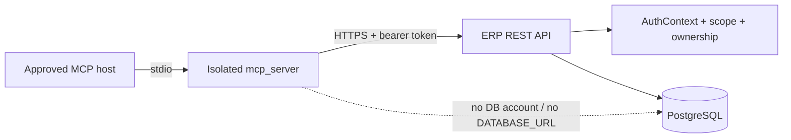

# LSS ERP MCP REST Contract

## Authority

The main developer's versioned backend OpenAPI document and returned SHA-256
are the integration authority. The local FastAPI stub is a database-free test
oracle, not the deployed API.

The scope names below come from the versioned handoff and must not be silently
renamed. If the backend already uses different names, stop and resolve the
contract explicitly.

| Method | Path | Required scope | State effect |
|---|---|---|---|
| `GET` | `/api/auth/me` | `mcp:discover` | None; minimum token identity |
| `GET` | `/api/timesheets/week` | `timesheet:read:self` | None; server-bound self |
| `GET` | `/api/timesheets/projects` | `timesheet:read:self` | None; active-project search |
| `POST` | `/api/timesheets/mcp-draft` | `timesheet:write:self:draft` | Own draft only |

## Trust boundary

The API derives employee ownership from the authenticated token. It must not
trust an employee identifier supplied by the MCP client.

## Common response contract

- Success returns stable, versioned JSON and a correlation ID.
- `401`: missing, expired, revoked, or invalid token.
- `403`: client, scope, ownership, resource, or protected-state denial.
- `404`: allowlisted resource not found without cross-user disclosure.
- `409`: stale version, duplicate logical row, or idempotency conflict.
- `422`: strict input validation failure.
- `429`: bounded retry metadata; no blind write retry.
- `5xx`: redacted error with correlation ID; no secret, SQL, or raw body.
- Redirects are rejected by the MCP client.
- Response bodies over the configured byte limit are rejected.

The deployed field names and schemas must match the versioned OpenAPI
artifact. The detailed example bodies in the original handoff remain the
baseline until that artifact is returned.

## Write invariants

- self-only and draft-only;
- explicit expected version;
- employee/week uniqueness enforced in PostgreSQL;
- project eligibility validated by the backend;
- idempotency key and request hash enforced together;
- the same key and hash replay the original result;
- the same key with another hash returns `409`;
- an uncertain timeout is reconciled by readback before any same-key retry;
- a verified write advances exactly from `expected_version` to
  `expected_version + 1`;
- mutation and audit record commit in one transaction;
- post-write readback must match before the MCP reports success;
- submitted, approved, and rejected records are immutable through MCP.

## MCP tool mapping

| MCP tool | REST call | Local or remote mutation |
|---|---|---|
| `erp_get_current_user` | `GET /api/auth/me` | None |
| `timesheet_get_week` | `GET /api/timesheets/week` | None |
| `timesheet_search_projects` | `GET /api/timesheets/projects` | None |
| `timesheet_prepare_draft` | Read endpoints only | Local expiring confirmation |
| `timesheet_commit_draft` | `POST /api/timesheets/mcp-draft` | Remote own-draft write; disabled by default |

`timesheet_prepare_draft` does not grant write permission. A commit also
requires an unexpired confirmation, the same user and version, an explicit
idempotency key, and an enabled canary-write Gate.
