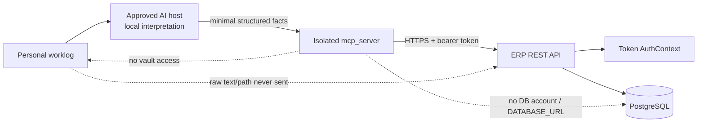

# LSS ERP MCP REST Contract

## Authority and release state

The main developer's versioned backend OpenAPI document and returned SHA-256
are the integration authority. The local FastAPI stub is a database-free test
oracle, not the deployed API.

- State: `DEVELOPMENT/NOT-RELEASED`
- Local MCP surface: exactly fourteen tools
- ERP REST allowlist: exactly twelve method/path pairs
- Remote write tools: exactly two, independently disabled by default
- Real backend, PostgreSQL, OpenAPI, canary, and rollback: `NOT-RUN`

This is not a generic ERP bridge. Any capability outside this document requires
a separate inventory, data-minimization rule, scope, contract, threat review,
test Gate, and user approval.

## Trust boundary



The backend derives `user_id` and `employee_id` from the validated token.
Client-provided `employee_id`, `user_id`, `approver_id`, `status`, or
`labor_type` authority fields must be rejected rather than ignored.

## REST allowlist

| Method | Path | Required scope | State effect |
|---|---|---|---|
| `GET` | `/api/auth/me` | `mcp:discover` | None; minimum token identity |
| `GET` | `/api/timesheets/week` | `timesheet:read:self` | None; server-bound self |
| `GET` | `/api/timesheets/entry-context` | `timesheet:read:self` | None; token-owner entry rules |
| `GET` | `/api/timesheets/projects` | `timesheet:read:self` | None; eligible project candidates |
| `POST` | `/api/timesheets/mcp-draft` | `timesheet:write:self:draft` | Own draft only |
| `GET` | `/api/mcp/schedules` | `schedule:read` | None; bounded company/refresh projection |
| `GET` | `/api/mcp/schedules/{event_id}` | `schedule:read` | None; owner/etag/eligibility evidence |
| `POST` | `/api/mcp/schedules/preflight` | `schedule:write` | None; current mutation impact and denial evidence |
| `GET` | `/api/mcp/schedules/operations/{correlation_id}` | `schedule:write` | None; authenticated user's journal evidence |
| `POST` | `/api/schedules` | `schedule:write` plus backend write Gate | Schedule create |
| `PUT` | `/api/schedules/{event_id}` | `schedule:write` plus backend write Gate | Schedule update with `If-Match` |
| `DELETE` | `/api/schedules/{event_id}` | `schedule:write` plus backend write Gate | Schedule delete with `If-Match` |

All other method/path pairs are denied by the MCP REST client and must be
default-denied for an API token by the backend.

The standalone client validates dynamic event and correlation IDs before path
construction. It accepts no arbitrary URL, path, method, query map, body, or
header map. Schedule detail/status responses and every schedule write response
are strict, size-bounded typed envelopes; unknown response fields are rejected.

## Common response contract

- Success returns stable, versioned JSON and a correlation ID where applicable.
- `401`: missing, expired, revoked, or invalid token.
- `403`: client, scope, ownership, resource, endpoint, or protected-state denial.
- `404`: allowlisted resource not found without cross-user disclosure.
- `409`: stale version, duplicate logical row, or idempotency conflict.
- `422`: strict input validation failure.
- `429`: bounded retry metadata; no blind write retry.
- `5xx`: redacted error with correlation ID; no secret, SQL, or raw body.
- Redirects are rejected.
- Responses over the configured byte limit are rejected.
- Unknown response fields are rejected.

## Enterprise schedule contract

The schedule extension is additive. It does not change the existing calendar
UI request/response shape and does not give the standalone MCP direct database
or Google Calendar access.

### Read and preflight

- `GET /api/mcp/schedules` accepts `category=company|refresh`, optional bounded
  date range, and `limit=1..100`.
- `GET /api/mcp/schedules/{event_id}` returns a content-redacted schedule
  projection, immutable owner-binding state, current `etag`, and write
  eligibility.
- `POST /api/mcp/schedules/preflight` accepts one strict
  `CREATE|UPDATE|DELETE` request and returns current/desired projections,
  affected weeks, current timesheet statuses, owner evidence, `etag`, stable
  denial reasons, and `write_allowed`. It performs no schedule mutation.
- `GET /api/mcp/schedules/operations/{correlation_id}` requires
  `schedule:write`, resolves the authenticated user's journal namespace, and
  returns only allowlisted result/error fields and values. It never retries a
  write.

Schedule preparation is local and content-redacted. CREATE calls current-user
and preflight reads. UPDATE/DELETE additionally read current detail and require
detail/preflight owner, target, category, time projection, and `etag` evidence
to agree. Any disagreement returns `preflight_state_changed` and no
confirmation.

### Confirmed mutation

The public write tool accepts only `confirmation_token` and `idempotency_key`.
The exact proposal, authenticated user, action, category, event ID, expected
`etag`, and proposal hash are bound by the preceding prepare result. The MCP
then sends exactly one typed request with:

- `Idempotency-Key`;
- deterministic `X-Correlation-ID`;
- `X-LSS-MCP-Schedule: 1`;
- `If-Match` for UPDATE and DELETE.

The deterministic correlation contract is:

```text
material =
  UTF-8("lss-erp-schedule-correlation:v1")
  + NUL
  + UTF-8(decimal authenticated user_id)
  + NUL
  + UTF-8(idempotency_key)

correlation_id = "schedule_v1_" + first_40_hex(SHA-256(material))
```

The local Gate `LSS_ERP_SCHEDULE_CANARY_WRITE=true` and backend Gate
`MCP_SCHEDULE_WRITE_ENABLED=true` are independent and exact-lowercase. Both
default disabled. Enabling the timesheet write Gate does not enable schedule
writes.

CREATE uses a deterministic Google event ID and durable, per-user idempotency.
UPDATE/DELETE require immutable owner evidence and exact `etag`. A potentially
sent exception is not retried; the local confirmation is consumed or retained
`INFLIGHT_FAIL_CLOSED`, and the host queries operation status with the
recoverable correlation ID.

### Database concurrency option 1

The selected schedule/timesheet concurrency design is database row locking:

1. claim or exact-replay the per-user operation;
2. lock affected `Employee` namespace rows by ascending ID;
3. re-query current local/linked employee-week scope under those parent locks;
4. if a new Employee appears, roll back and restart DB-only acquisition, at
   most three times;
5. lock existing `Timesheet` rows globally by `week_start,id`;
6. re-read protected status before Google/local mutation;
7. keep locks through Google, local synchronization, journal finalization, and
   final commit or rollback.

The Employee parent lock protects a week whose Timesheet header does not yet
exist. The named PostgreSQL constraint
`uq_timesheets_employee_week_start` is the final uniqueness invariant.
Persistent scope churn fails closed as `timesheet_scope_unstable`. Recovery
evidence is written only after the failed locked transaction rolls back.

The normative details, including exact lock ordering, restart rules, replay
order, compensation restrictions, and test boundary, are
`docs/mcp/SCHEDULE-MUTATION-LOCKING.md`. Confirmation ownership, prepare diff,
dual Gates, correlation recovery, and status-only reconciliation are
`docs/mcp/SCHEDULE-CONFIRMATION-AND-PREPARE.md`.

## Canonical daily entry

```json
{
  "work_date": "2026-07-20",
  "project_id": 123,
  "project_name": "MCP 개발",
  "project_source": "실행",
  "spg": "에너지",
  "hours": "8",
  "work_type": "실행 > 업무지원",
  "description": "MCP 안전 계약 개발"
}
```

Rules:

- `work_date` is inside the requested Monday-to-Sunday week.
- `hours` is `0.25..24` in quarter-hour increments.
- `project_source` is `실행`, `영업`, or `공통`.
- `실행` requires an eligible active `project_id`.
- `영업` and `공통` omit `project_id` and require `project_name`.
- `연차` is `project_id=null`, `project_name=연차`,
  `project_source=공통`, `work_type=공통 > 연차`.
- `description` maps to the existing ERP row note.
- The backend derives employee and labor type.

The backend adapter maps daily entries into the existing weekly
`mon_hours..sun_hours` row representation without redesigning the database
solely for MCP.

## `GET /api/timesheets/entry-context`

Request:

```text
GET /api/timesheets/entry-context?week_start=2026-07-20
```

Response:

```json
{
  "week_start": "2026-07-20",
  "week_end": "2026-07-26",
  "labor_type": "원가",
  "project_sources": ["실행", "영업", "공통"],
  "work_types": [
    "공통 > 연차",
    "공통 > 교육",
    "공통 > 행사",
    "공통 > 기타",
    "실행 > 업무지원"
  ],
  "daily_targets": [
    {
      "work_date": "2026-07-20",
      "target_hours": "8",
      "reason": "normal"
    }
  ]
}
```

The actual response contains exactly seven ordered `daily_targets`. Weekend,
holiday, leave-policy, or employee-calendar behavior is backend-owned and must
be evidenced. The request and response contain no employee selector.

The main developer must resolve and test the existing frontend/backend
work-type catalog drift, including `영업 > SHOP작업`, before declaring DTO
parity.

## `GET /api/timesheets/projects`

Request:

```text
GET /api/timesheets/projects?q=MCP&limit=20
```

Response:

```json
{
  "items": [
    {
      "project_id": 123,
      "project_code": "P-2026-001",
      "project_name": "MCP 개발",
      "project_source": "실행",
      "spg": "에너지",
      "active": true
    }
  ],
  "truncated": false
}
```

`project_id` may be `null` for a sales/common candidate only when the backend
can persist the returned `project_name` and `project_source` safely.

## Structured worklog input

The raw worklog and its path are not REST payloads. The approved AI host reads
them locally and calls the local MCP with facts such as:

```json
{
  "fact_id": "log-20260720-1",
  "work_date": "2026-07-20",
  "entry_kind": "project",
  "description": "MCP 안전 계약 개발",
  "hours": "8",
  "project_query": "MCP 개발",
  "work_type": "실행 > 업무지원"
}
```

`fact_id` is an opaque local correlation ID. It accepts only bounded
alphanumeric punctuation and cannot contain a path. The local prepare layer
rejects extra identity, status, raw-content, or authority fields.

The local `timesheet_prepare_from_worklog` tool:

- performs no POST;
- resolves only an unambiguous eligible candidate;
- never invents missing hours or work type;
- preserves unrelated current rows;
- returns daily/weekly totals and deterministic questions;
- accepts only explicitly approved coverage exception IDs;
- creates a confirmation only when blockers are cleared.

Worklog facts, question objects, candidate options, and accepted exception IDs
are not included in the ERP write body.

## `POST /api/timesheets/mcp-draft`

Request:

```json
{
  "week_start": "2026-07-20",
  "expected_version": 3,
  "entries": [
    {
      "work_date": "2026-07-20",
      "project_id": null,
      "project_name": "연차",
      "project_source": "공통",
      "spg": null,
      "hours": "8",
      "work_type": "공통 > 연차",
      "description": "연차"
    }
  ]
}
```

Required headers:

- `Authorization: Bearer <token>`; never recorded in evidence;
- `Idempotency-Key: <UUID>`;
- `X-Correlation-ID: <UUID>`.

Write invariants:

- self-only and draft-only;
- explicit expected version;
- employee/week uniqueness in PostgreSQL;
- project eligibility and source validation;
- backend-derived labor type;
- idempotency key and request hash enforced together;
- same key and hash replay the original result;
- same key with another hash returns `409`;
- uncertain timeout reconciled by readback before any same-key retry;
- version advances exactly once;
- mutation and audit commit in one transaction;
- submitted, approved, and rejected records are immutable;
- post-write readback must match the complete expanded entry proposal.

## MCP tool mapping

| MCP tool | REST call | Remote mutation |
|---|---|---|
| `erp_get_current_user` | `GET /api/auth/me` | No |
| `timesheet_get_week` | `GET /api/timesheets/week` | No |
| `timesheet_get_entry_context` | `GET /api/timesheets/entry-context` | No |
| `timesheet_search_projects` | `GET /api/timesheets/projects` | No |
| `timesheet_prepare_draft` | Read endpoints only; complete replacement | No |
| `timesheet_prepare_from_worklog` | Read endpoints only; merge-only | No |
| `timesheet_commit_draft` | `POST /api/timesheets/mcp-draft` | Yes; disabled by default |
| `schedule_list` | `GET /api/mcp/schedules`; bounded, content-redacted enterprise DB snapshot | No |
| `schedule_get` | `GET /api/mcp/schedules/{event_id}`; redacted enterprise detail plus Google/DB temporal consistency | No |
| `schedule_prepare_create` | Current user + `POST /api/mcp/schedules/preflight` | No |
| `schedule_prepare_update` | Current user + detail + preflight | No |
| `schedule_prepare_delete` | Current user + detail + preflight | No |
| `schedule_commit` | Exactly one `POST|PUT|DELETE /api/schedules...` selected by the bound confirmation | Yes; independently disabled by default |
| `schedule_operation_status` | `GET /api/mcp/schedules/operations/{correlation_id}` | No; status only |

Preparation does not grant write permission. Commit additionally requires an
unexpired confirmation, same token user, same week/version/proposal, one bound
idempotency key, and the separately approved canary-write Gate.

For schedule commits, the equivalent binding is the same authenticated user,
action, category, event target, expected `etag`, canonical proposal hash, one
permanently bound idempotency key, and both independently approved schedule
write Gates.

`schedule:read` is the explicit enterprise read policy. It permits cross-owner
list/detail only for bounded temporal metadata; owner identifiers and
user-entered content are never returned. Cross-owner write eligibility remains
false. Detail and update/delete preflight fail closed with
`409 schedule_state_drift` if the current Google temporal projection differs
from the local ERP schedule row.
