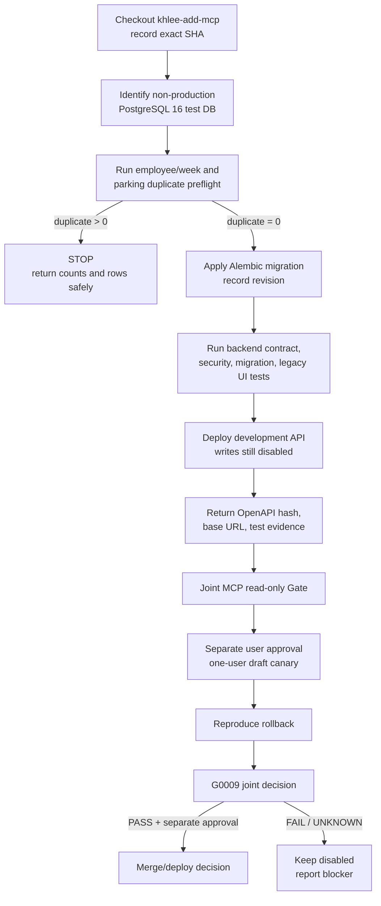
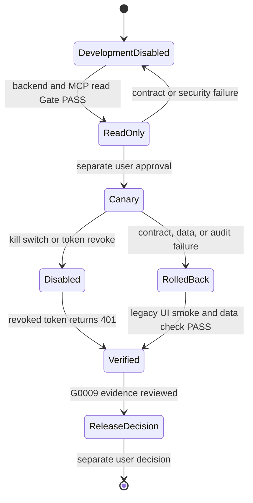

# LSS ERP MCP Apply and Rollback

## Current authority

This document is an execution and evidence checklist. It does not authorize
production access, merge, deployment, token issuance, or real writes.

Verified collaboration checkpoints may be pushed only to
`origin/khlee-add-mcp`. Every such checkpoint remains
`DEVELOPMENT/NOT-RELEASED`.

## Application flow

## Gate ownership

| Gate | Required evidence | Decision owner |
|---|---|---|
| Backend test lane | Non-production DB identity, duplicate counts, migration and backend tests | Main developer |
| Local MCP | Unit, contract, stdio, security, fault, performance, dependency audit | MCP lane |
| Read-only integration | `/auth/me`, week, project search, OpenAPI hash, correlation IDs | Joint |
| Canary | Separate approval, one user, own draft, protected-state denial, audit | User + joint |
| Rollback | Tool disable, token revoke `401`, backend rollback, legacy UI smoke | Joint |
| Release | G0009 `COMPLETE/PASS` plus separate user approval | User |

## Runtime state

## Stop order

1. Disable the MCP write tool.
2. Stop the MCP process and remove its host configuration.
3. Revoke the MCP API token.
4. Verify that the revoked token receives `401`.
5. Roll back the backend deployment or migration using the recorded revision.
6. Run the existing ERP UI smoke test.
7. Verify the final timesheet, audit, token, and migration state.
8. Preserve correlation IDs and redacted evidence.
9. Report reproduced output; do not infer recovery from a command exit alone.

## Mandatory stop conditions

- The database target is production or cannot be proved non-production.
- Employee/week or parking duplicate counts are nonzero.
- A secret, database account, or connection string appears in a handoff.
- The backend SHA, OpenAPI hash, or Alembic revision is missing.
- PostgreSQL migration acceptance relies only on SQLite.
- Legacy UI regression, authorization, protected-state, audit, or rollback
  evidence fails.
- The real write was not separately approved by the user.

## Evidence return

Copy `docs/mcp/EVIDENCE-HAND-BACK.md`, fill only reproduced values, and return
it with command output. Do not edit an `UNKNOWN` into `PASS` without evidence.
