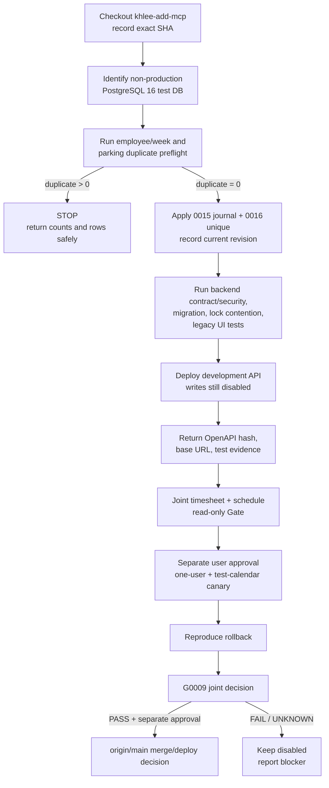
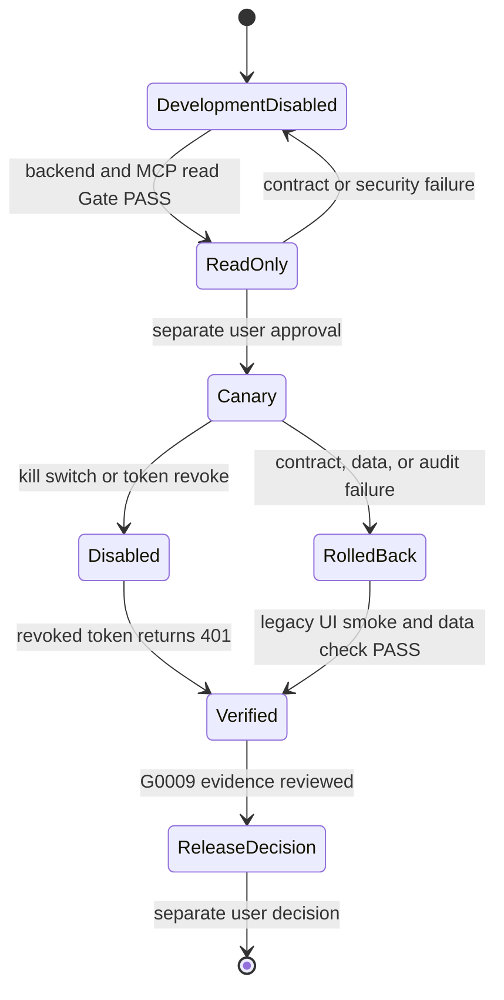

# LSS ERP MCP Apply and Rollback

## Current authority

This document is an execution and evidence checklist. It permits a main
developer to branch from the collaboration branch or merge it into a separate
backend working branch. It does not authorize production access,
`origin/main` release merge, deployment, token issuance, or real writes.

Verified collaboration checkpoints may be pushed only to
`origin/khlee-add-mcp`. Every such checkpoint remains
`DEVELOPMENT/NOT-RELEASED`.

## Application flow

## Gate ownership

| Gate | Required evidence | Decision owner |
|---|---|---|
| Backend test lane | Non-production DB identity, duplicate counts, revisions `0015`/`0016`, backend tests, PostgreSQL lock contention | Main developer |
| Local MCP | Unit, contract, stdio, security, fault, performance, dependency audit | MCP lane |
| Read-only integration | `/auth/me`, timesheet reads, schedule list/detail/preflight/status, OpenAPI hash, correlation IDs | Joint |
| Canary | Separate approval, one user, own draft, dedicated Google test calendar, protected-state/owner/etag denial, audit | User + joint |
| Rollback | Both tool Gates disabled, token revoke `401`, event cleanup, backend/migration rollback, legacy UI smoke | Joint |
| Release | G0009 `COMPLETE/PASS` plus separate user approval | User |

## Runtime state

## Stop order

1. Disable both local MCP write flags:
   `LSS_ERP_CANARY_WRITE=false` and
   `LSS_ERP_SCHEDULE_CANARY_WRITE=false`.
2. Disable the backend schedule write flag:
   `MCP_SCHEDULE_WRITE_ENABLED=false`.
3. Stop the MCP process and remove its host configuration.
4. Revoke the MCP API token.
5. Verify that the revoked token receives `401`.
6. Reconcile and remove only recorded disposable test-calendar events whose
   ownership is proven; conflicting evidence requires manual review.
7. Roll back the backend deployment or migration using the recorded revision.
8. Run the existing ERP calendar and timesheet UI smoke tests.
9. Verify the final schedule, timesheet, journal, audit, token, and migration
   state.
10. Preserve correlation IDs and redacted evidence.
11. Report reproduced output; do not infer recovery from a command exit alone.

## Mandatory stop conditions

- The database target is production or cannot be proved non-production.
- Employee/week or parking duplicate counts are nonzero.
- A secret, database account, or connection string appears in a handoff.
- The backend SHA, OpenAPI hash, or Alembic revision is missing.
- PostgreSQL migration acceptance relies only on SQLite.
- Employee-before-Timesheet lock contention was not reproduced against
  PostgreSQL, including the missing-Timesheet-row case.
- Legacy UI regression, authorization, protected-state, audit, or rollback
  evidence fails.
- A schedule result is uncertain and operation status/Google/DB evidence
  conflicts or is unavailable.
- The real write was not separately approved by the user.

## Current evidence boundary

Local backend schedule tests (`124 passed`) and the database-free MCP suite
(`379 passed`) are implementation evidence only. Revisions `20260727_0015` and
`20260727_0016` exist and have structural tests, but no approved PostgreSQL
upgrade/downgrade or lock-contention run has occurred. Real API read-only,
Google test-calendar canary, deployment, rollback, commit, and push remain
`NOT-RUN`.

## Evidence return

Copy `docs/mcp/EVIDENCE-HAND-BACK.md`, fill only reproduced values, and return
it with command output. Do not edit an `UNKNOWN` into `PASS` without evidence.
