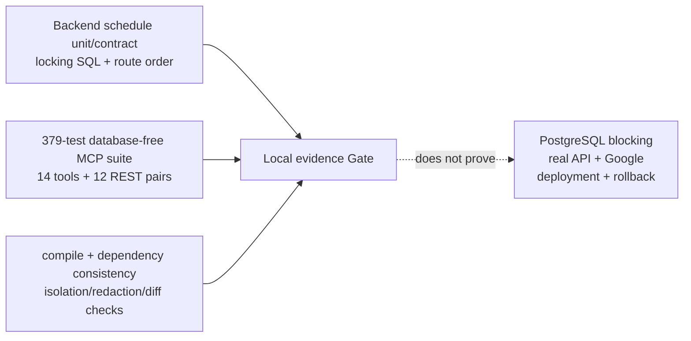

# LSS ERP MCP Local Verification

## Classification

- Branch: `khlee-add-mcp`
- Baseline commit: `b9c0c1bced40397b713efb4497a1e5ea9f947be7`
- Release state: `DEVELOPMENT/NOT-RELEASED`
- Local backend evidence: unit/contract plus SQLite/static structure
- Local MCP evidence: isolated, database-free, non-real-API/non-canary
- MCP dependency audit: `PASS`, no known vulnerabilities
- Backend dependency audit: `FAIL`, 30 findings in 7 packages; main-developer
  dependency/remediation gate
- PostgreSQL migration execution and row-lock contention: `NOT-RUN`
- Real API, Google Calendar, canary, deployment, rollback: `NOT-RUN`
- Task 13 implementation commit: `8a5b1ed11c68bc2edbc7feb23686106b9f8e3954`
- Collaboration branch push: `PASS`, local/remote implementation SHA matched

Local PASS means only that the checked source and test doubles satisfy their
documented contracts. It does not mean the system is operationally deployed or
that PostgreSQL and Google Calendar have reproduced the behavior.

## Covered locally



### Backend schedule lane

- API-token scope/default-deny and immutable user/employee authority;
- deterministic event ID, per-user idempotency, operation journal, and
  correlation conflicts;
- owner binding, legacy-owner denial, mismatch denial, and `etag`;
- exact replay before mutable timesheet status;
- Employee namespace locks before globally ordered Timesheet locks;
- post-parent-lock schedule/link scope re-query;
- UPDATE desired-week union and DELETE current-scope revalidation;
- at most three DB-only restarts on newly discovered Employee scope;
- stable `timesheet_scope_unstable` failure and replay;
- timesheet save/submit/approve/reject and ordinary schedule writer
  participation;
- model/SQLite employee-week uniqueness;
- Alembic `20260727_0016` duplicate fail-closed and named
  `uq_timesheets_employee_week_start` structure;
- existing calendar route characterization and unchanged frontend.

The normative lock order, transaction boundaries, allowed post-rollback
observations, and test limitations are
`docs/mcp/SCHEDULE-MUTATION-LOCKING.md`.

### Isolated MCP lane

- fail-closed environment, base-origin, redirect, query, and response-size
  validation;
- mocked Windows Credential Manager adapter;
- no backend, ORM, DB driver, `DATABASE_URL`, Google SDK, or credential-file
  dependency;
- exactly fourteen registered tools: seven timesheet plus seven schedule;
- exactly twelve typed REST method/path pairs; no generic path or header input;
- strict Pydantic request/response envelopes and
  `additionalProperties=false`;
- framework validation redacted to `invalid_tool_arguments`;
- timesheet worklog merge, deterministic questions, totals, confirmation,
  replay, and no-silent-deletion controls;
- schedule list/detail/preflight, content-redacted prepare diff, confirmation
  integrity, owner lease, independent write Gate, and status-only replay;
- redacted cross-owner enterprise list/detail under exact `schedule:read`,
  token-owner-only writes, and fail-closed Google/DB temporal drift detection;
- deterministic correlation derived from authenticated `user_id` plus
  idempotency key;
- same key isolated across users;
- commit-time owner/timesheet revalidation and exact replay ordering;
- owner denial not durably replayed when real backend claim would roll back;
- mutable timesheet denial stored and replayed exactly;
- response loss, stale `etag`, update/delete partial failure,
  reconciliation/manual-review, operation-value redaction, and p95 budget.

The normative prepare/commit/status contract is
`docs/mcp/SCHEDULE-CONFIRMATION-AND-PREPARE.md`.

## Reproduction

From the repository root:

```powershell
.\backend\venv\Scripts\python.exe -m pytest backend\tests\schedule -q
.\mcp_server\.venv\Scripts\python.exe -m pytest `
  mcp_server\tests\contract\test_schedule_contract_stub.py `
  mcp_server\tests\security\test_schedule_security.py `
  mcp_server\tests\performance\test_schedule_local_budget.py -q
.\mcp_server\.venv\Scripts\python.exe -m pytest `
  mcp_server\tests -q -m "not real_api and not canary_write"
.\mcp_server\.venv\Scripts\python.exe -m compileall -q `
  mcp_server\src mcp_server\tests
.\backend\venv\Scripts\python.exe -m compileall -q backend\app backend\tests
.\mcp_server\.venv\Scripts\python.exe -m pip check
.\backend\venv\Scripts\python.exe -m pip check
rg -n "DATABASE_URL|create_engine|SessionLocal|sqlalchemy|googleapiclient|service_account" `
  mcp_server\src
git diff --check
git diff --exit-code b9c0c1bced40397b713efb4497a1e5ea9f947be7 `
  -- frontend/src/views/CalendarView.vue
```

## Latest reproduced result — 2026-07-28

| Evidence lane | Result |
|---|---|
| Backend schedule suite | `PASS`, 124 passed, 102 deprecation warnings |
| Task 10 contract/security/performance | `PASS`, 28 passed |
| Complete MCP non-real-API/non-canary suite | `PASS`, 379 passed |
| Backend compileall | `PASS`, exit 0 |
| MCP compileall | `PASS`, exit 0 |
| Backend `pip check` | `PASS`, no broken requirements |
| MCP `pip check` | `PASS`, no broken requirements |
| MCP `pip-audit` | `PASS`, no known vulnerabilities; local package skipped because it is not published on PyPI |
| Backend `pip-audit` | `FAIL`, 30 findings in 7 packages; backend base dependency remediation remains with the main developer |
| MCP DB/ORM/Google SDK runtime scan | `PASS`, zero findings |
| Broad personal-path/secret scan | Guard-test pattern and documentation placeholder only; no literal runtime secret/personal path |
| `git diff --check` | `PASS`, exit 0; line-ending conversion warnings only |
| `CalendarView.vue` baseline diff | `PASS`, exit 0, no output |
| Independent Task 10 specification review | `PASS` |
| Independent Task 10 quality/security review | `Ready=Yes` |

The backend warnings are existing Pydantic, SQLAlchemy, and naive-datetime
deprecations. They do not change the test result, but this document does not
reclassify them as fixed.

## Tool-list expectation

The stdio server must list exactly:

- `erp_get_current_user`
- `timesheet_get_week`
- `timesheet_get_entry_context`
- `timesheet_search_projects`
- `timesheet_prepare_draft`
- `timesheet_prepare_from_worklog`
- `timesheet_commit_draft`
- `schedule_list`
- `schedule_get`
- `schedule_prepare_create`
- `schedule_prepare_update`
- `schedule_prepare_delete`
- `schedule_commit`
- `schedule_operation_status`

External MCP Inspector reproduction was not rerun for this change set and
remains `NOT-RUN`; the local official-SDK protocol tests cover registration and
calls.

## Not proved by the local Gate

- actual Windows Credential Manager storage and retrieval;
- deployed token issuance, hash, client/resource, expiry, revocation, and exact
  scope behavior;
- Alembic upgrade/downgrade against approved PostgreSQL;
- actual PostgreSQL blocking between schedule and timesheet writers;
- real OpenAPI, TLS, network, response-limit, and authorization behavior;
- real ERP read-only schedule and timesheet integration;
- dedicated Google test-calendar create/replay/update/stale-etag/delete;
- response loss, cancellation/restart, operation retention, and reconciliation
  against deployed services;
- a separately approved one-user timesheet or schedule canary;
- token revoke, both write-Gate disable, migration/data rollback, deployment,
  release, commit, or push.

These remain `NOT-RUN` or `UNKNOWN` until reproduced evidence is returned.
