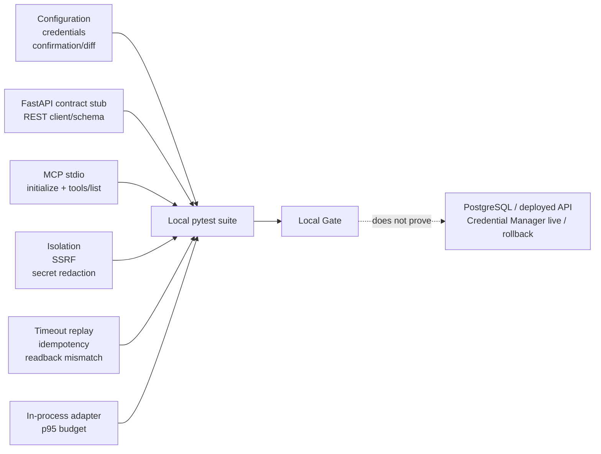

# LSS ERP MCP Local Verification

## Classification

- Branch: `khlee-add-mcp`
- Lane: isolated, database-free MCP
- Release state: `DEVELOPMENT/NOT-RELEASED`
- Real API and real ERP writes: `NOT-RUN`
- PostgreSQL and Alembic: main-developer-owned, `NOT-RUN` in this lane

## Covered locally



The suite covers:

- fail-closed environment and origin configuration;
- Windows Credential Manager adapter behavior with mocked keyring;
- environment-token denial outside an explicit test/development opt-in;
- no backend import, ORM, database driver, or `DATABASE_URL` reference;
- allowlisted HTTP methods and paths, redirect rejection, response-size limit;
- strict response and error schemas through a database-free FastAPI stub;
- MCP stdio initialization and tool listing;
- external MCP Inspector `tools/list` over stdio;
- read tools, local prepare/diff, expiring confirmation, and protected state;
- confirmed draft commit, version conflict, idempotent replay, timeout recovery,
  response-loss readback reconciliation, and post-write readback mismatch;
- telemetry allowlist helper drops secret and business-content fields;
- response-loss readback reconciliation before any same-key retry;
- exact `expected_version + 1`, timesheet, entry, and correlation verification;
- one in-flight commit per confirmation with permanent idempotency-key binding;
- local in-process adapter p95 budget.

## Reproduction

From the repository root:

```powershell
.\mcp_server\.venv\Scripts\python.exe -m pytest mcp_server\tests -q
.\mcp_server\.venv\Scripts\python.exe -m compileall -q mcp_server\src mcp_server\tests
.\mcp_server\.venv\Scripts\python.exe -m pip_audit --progress-spinner off
rg -n -i 'backend\.app|sqlalchemy|pg8000|database_url' mcp_server\src
```

The external Inspector check below is self-contained and uses a literal
non-secret test token. It performs `tools/list` only and does not call the REST
API. Never replace the literal test value with a real token:

```powershell
$env:LSS_ERP_ENVIRONMENT = 'test'
$env:LSS_ERP_BASE_URL = 'http://127.0.0.1:8765'
$env:LSS_ERP_ALLOW_ENV_TOKEN = 'true'
$env:LSS_ERP_API_TOKEN = 'inspector-test-token'
try {
  npx --yes @modelcontextprotocol/inspector --cli `
    .\mcp_server\.venv\Scripts\python.exe -m lss_erp_mcp --method tools/list
} finally {
  Remove-Item Env:LSS_ERP_ENVIRONMENT -ErrorAction SilentlyContinue
  Remove-Item Env:LSS_ERP_BASE_URL -ErrorAction SilentlyContinue
  Remove-Item Env:LSS_ERP_ALLOW_ENV_TOKEN -ErrorAction SilentlyContinue
  Remove-Item Env:LSS_ERP_API_TOKEN -ErrorAction SilentlyContinue
}
```

It must list exactly these five tools:

- `erp_get_current_user`
- `timesheet_get_week`
- `timesheet_search_projects`
- `timesheet_prepare_draft`
- `timesheet_commit_draft`

The exact latest result and commit are recorded in
`goals/LSS-MCP-G0001/STATUS.md`.

## Not proved by the local Gate

- actual Windows Credential Manager storage and retrieval;
- main developer token issuance, hash, scope, expiry, or revocation;
- PostgreSQL constraints, duplicate preflight, and Alembic migration;
- deployed OpenAPI compatibility and network/TLS behavior;
- real ERP read-only integration;
- a one-user own-draft canary;
- token-revoke, data, migration, and legacy UI rollback.

These remain `NOT-RUN` or `UNKNOWN` until the main developer returns evidence
and the joint G0009 Gate is executed.
