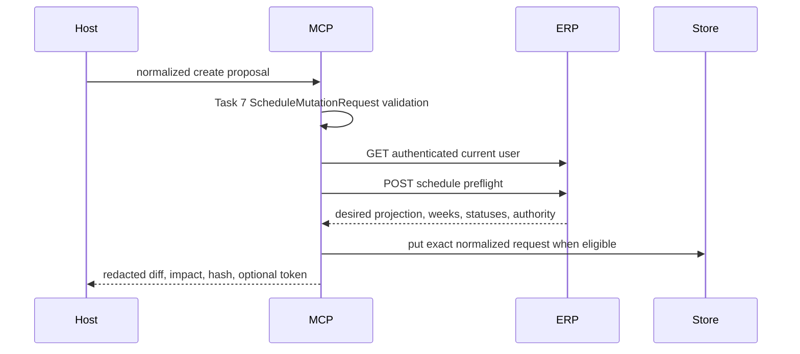
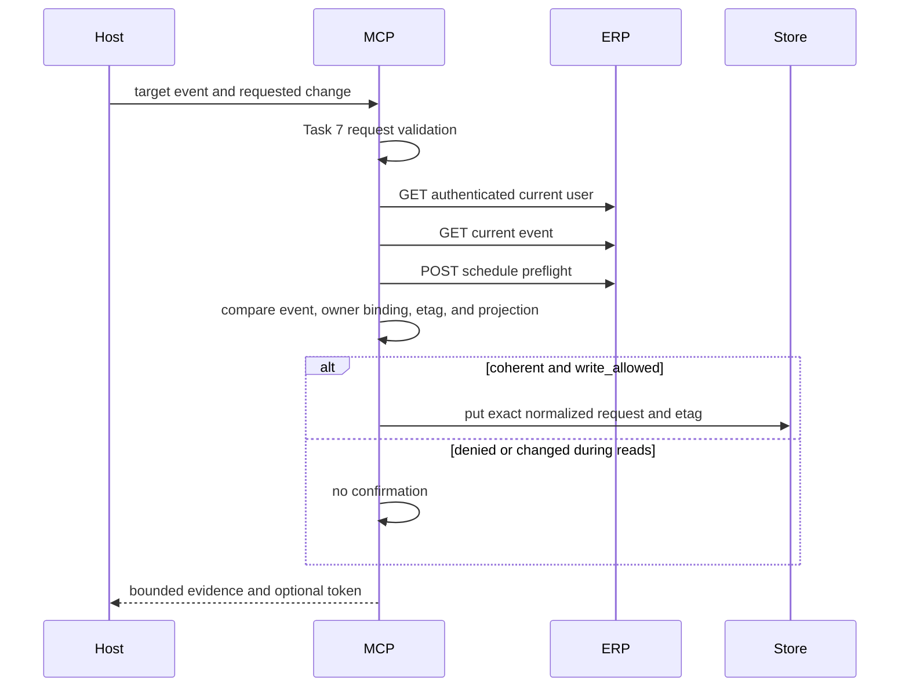

# Schedule Confirmation, Prepare, Commit, and Status Contract

## 1. Purpose and Evidence Boundary

This document is the implementation contract for Tasks 8 and 9 of the
enterprise schedule MCP plan. It explains how the standalone MCP prepares a
schedule change, binds a later commit to the exact reviewed request, and
switches to read-only operation-status reconciliation after an uncertain
write attempt.

Current evidence:

- local Python contract only;
- Task 7 schema/client focused tests: `158 passed`;
- Task 8 confirmation/prepare focused tests: `54 passed`;
- Task 9 commit/config/protocol/replay focused tests: `38 passed`;
- Task 10 contract/security/performance focused tests: `28 passed`;
- full non-real-API/non-canary standalone MCP suite: `379 passed`;
- independent specification review: `PASS`;
- independent code-quality/security review: `Ready=Yes`;
- Python compile, `git diff --check`, and Calendar baseline checks: exit 0;
- no ERP or Google write is performed by prepare;
- exactly seven schedule tools are locally registered alongside the unchanged
  seven timesheet tools;
- the local schedule write gate defaults disabled and accepts only the exact
  lowercase environment literals `true` or `false`;
- external backend runtime, PostgreSQL runtime, Google Calendar, deployment,
  commit, and push remain `NOT-RUN`.

This document does not authorize a canary or production write.

## 2. Separation from Timesheet Confirmation

Schedule confirmation is implemented in
`mcp_server/src/lss_erp_mcp/schedule_confirmation.py`.

It does not modify or generalize
`mcp_server/src/lss_erp_mcp/confirmation.py`. The two stores remain separate
because a schedule mutation must bind more authority fields:

| Binding | Schedule confirmation meaning |
|---|---|
| `user_id` | immutable user identity returned by the authenticated ERP token |
| `action` | exactly one of `CREATE`, `UPDATE`, or `DELETE` |
| `category` | exactly `company` or `refresh` |
| `event_id` | absent for CREATE; required for UPDATE and DELETE |
| `expected_etag` | absent for CREATE; required for UPDATE and DELETE |
| `proposal_hash` | SHA-256 of the canonical normalized Task 7 request |
| `expires_at` | local expiry; default ten minutes |
| idempotency key | exact Task 7 grammar, 8-128 `[A-Za-z0-9._:-]` characters; the first successful claim permanently binds one key |
| lease ID | one owner capability for the current in-flight claim |

The default token and lease factories generate cryptographically random
URL-safe values. Injected deterministic factories exist only for tests and do
not support an operational randomness claim. The store is bounded by item
count, serialized proposal size, and lease history per confirmation. Proposal
data is copied on input and output. An integrity mismatch invalidates and
removes the record.

## 3. Confirmation State Machine

```mermaid
stateDiagram-v2
    [*] --> AVAILABLE: eligible coherent prepare
    AVAILABLE --> EXPIRED: TTL reached
    AVAILABLE --> CLAIMED: exact bindings and valid key; return lease
    CLAIMED --> AVAILABLE: matching lease release before TTL
    CLAIMED --> CLAIMED: TTL reached; owner lease retained
    CLAIMED --> EXPIRED: matching lease release after TTL
    CLAIMED --> CONSUMED: matching lease consume, including after TTL
    AVAILABLE --> INVALIDATED: integrity mismatch
    CLAIMED --> CLAIMED: second claim rejected while in flight
    CLAIMED --> CLAIMED: wrong, missing, or stale lease rejected
    CLAIMED --> CLAIMED: different idempotency key rejected
    EXPIRED --> [*]
    CONSUMED --> [*]
    INVALIDATED --> [*]
```



`claim` first validates the idempotency key against the exact Task 7 grammar,
before any idempotency binding or in-flight mutation. It then validates user,
action, category, target event, expected `etag`, and canonical proposal hash.
A mismatched or invalid caller therefore cannot poison the authorized key
binding.

A successful claim returns a frozen `ScheduleConfirmationLease` containing a
defensive `ScheduleConfirmation` copy and a bounded `lease_id`. The store keeps
the authoritative `token -> lease_id` ownership. Only the matching lease may
release or consume that claim. Wrong, missing, or stale leases fail without
clearing ownership, so a second actor remains blocked until the owner releases
or consumes. `release` preserves the permanent idempotency-key binding;
`consume` removes the confirmation. Lease IDs are not reused during a
confirmation's lifetime, and lease history is capped at 64 claims.

TTL expiry does not revoke an active owner lease. Purge skips expired
confirmations that still have an in-flight lease. `get` and another `claim`
return the fixed `confirmation_commit_in_progress` error without removing the
token, permanent idempotency binding, lease history, or active ownership.
Such an expired-but-active item continues to count toward `max_items`, so a
full store fails closed with the bounded capacity error instead of evicting an
owner.

The matching owner may still `consume` after TTL, which removes every local
state entry. A matching `release` before TTL returns the token to `AVAILABLE`;
a matching release at or after TTL removes the expired token immediately.
Wrong, missing, or stale release/consume attempts do not change either path.
This prevents an unrelated prepare, purge, read, or retry from automatically
losing ownership while a commit is active.

The prepare boundary converts local Pydantic validation failures to the fixed
machine-safe codes `invalid_schedule_proposal` or
`invalid_schedule_request`. Rejected content, category, event ID, unknown
fields, and other values never appear in the public error string, and no HTTP
call occurs. Existing safe `ERPError` values from typed client calls are not
rewrapped. An injected clock must be timezone-aware; otherwise the store fails
with `confirmation_clock_not_timezone_aware` instead of a datetime comparison
error.

Task 8 implements the local prepare state machine. Task 9 connects its owner
lease to the write-disabled-by-default commit tool. A matching lease is
released only while the typed schedule write is known not to have been
entered. Once a write method is entered, both definite success and an
uncertain transport result consume the confirmation. This prevents a repeated
tool call from turning reconciliation into an accidental forward retry.

## 4. Prepare Read Sequence

The callable preparation layer is
`mcp_server/src/lss_erp_mcp/tools/schedules.py`.

### CREATE



CREATE has no current event or `etag`. It does not call a schedule mutation
method.

### UPDATE and DELETE



The independent current read and preflight must agree on target identity,
category, time projection, schedule kind, immutable owner state, and `etag`.
If they differ, preparation fails closed as `preflight_state_changed`.

## 5. Prepare Result

Every preparation returns these bounded fields:

- `action`, `category`, and target `event_id`;
- content-redacted `before` and `after` projections;
- `impact.kind`;
- `impact.visible_changed_fields`: only content-redacted before/after fields
  whose displayed values are definitely different;
- `impact.requested_write_fields`: normalized field names that a later commit
  would send, without their values;
- `impact.unverified_requested_fields`: requested fields whose current values
  are unavailable or deliberately redacted;
- `impact.comparison_complete`: `false` whenever an unverified field exists;
- `affected_weeks`, `timesheet_statuses`, and `locked_weeks`;
- expected `etag` for UPDATE or DELETE;
- stable `denial_reasons`;
- `can_commit`, canonical `proposal_hash`, and optional
  `confirmation_token`.

The presentation projection contains only target identity, category,
all-day/timed boundaries, and schedule kind. It deliberately omits schedule
`content`, bearer tokens, credential paths, personal vault paths, and other
free-form prose. The exact normalized request remains only in bounded
in-process confirmation state so Task 9 can bind the commit without accepting
a changed proposal.

The impact object must not be read as a complete object comparison. For
CREATE and UPDATE, `content` and `type` are always listed as requested and
unverified because their values are not exposed in the current Task 7 detail
projection. A supplied `timesheet_project_id`, `timesheet_project_name`, or
`timesheet_project_source` is handled the same way. Therefore a content-only,
color-only, or project-binding-only UPDATE can legitimately have:

```json
{
  "visible_changed_fields": [],
  "unverified_requested_fields": ["content", "type"],
  "comparison_complete": false
}
```

The example contains field names only, not schedule prose or project values.
The exact complete request is still protected by `proposal_hash` and the
confirmation record. CREATE reports every safe projected field as visibly
introduced and marks redacted requested fields unverified. DELETE has no
proposal body: its visible fields are the fields being removed,
`requested_write_fields` identifies `category`, `event_id`, and
`expected_etag`, and `comparison_complete` is `true`.

Evidence collections are limited to 64 affected/status rows in the local
result. A larger backend preflight response is not silently treated as
eligible; it adds `preflight_evidence_too_large` and issues no confirmation.

## 6. Stable Local Denial Reasons

Backend denial reasons are preserved:

- `legacy_owner_unbound`;
- `owner_mismatch`;
- `employee_not_found`;
- `timesheet_locked`.

The local prepare layer may add:

- `preflight_state_changed`: current event and preflight evidence are not one
  coherent snapshot;
- `preflight_evidence_too_large`: the evidence exceeds the local presentation
  bound.

Any denial reason means `can_commit=false` and
`confirmation_token=null`. Legacy display-name ownership is never inferred or
upgraded locally.

## 7. Registered Tool Surface

The local stdio server exposes fourteen tools in total. The existing seven
timesheet tools and their original `LSS_ERP_CANARY_WRITE` gate are unchanged.
The seven added schedule tools are:

| Tool | Annotation | Typed client boundary |
|---|---|---|
| `schedule_list` | read-only, non-destructive, idempotent | `list_schedules` |
| `schedule_get` | read-only, non-destructive, idempotent | `get_schedule` |
| `schedule_prepare_create` | read-only, non-destructive, idempotent | current user + preflight |
| `schedule_prepare_update` | read-only, non-destructive, idempotent | current user + detail + preflight |
| `schedule_prepare_delete` | read-only, non-destructive, idempotent | current user + detail + preflight |
| `schedule_commit` | destructive, idempotent | exactly one typed create/update/delete call |
| `schedule_operation_status` | read-only, non-destructive, idempotent | `get_schedule_operation` |

Prepare still calls only Task 7 read methods: `get_current_user`,
`get_schedule` for UPDATE and DELETE, and `preflight_schedule`. It never calls
`create_schedule`, `update_schedule`, or `delete_schedule`. The public server
accepts typed schedule proposal objects, not arbitrary REST paths, URLs, query
maps, JSON bodies, or header maps.

## 8. Dual Write Gates

Schedule commit requires two independent, fail-closed gates:

1. local stdio MCP: `LSS_ERP_SCHEDULE_CANARY_WRITE=true`;
2. backend API: `MCP_SCHEDULE_WRITE_ENABLED=true`.

Both default false. The local config accepts only exact lowercase `true` and
`false` strings; values such as `TRUE`, `True`, `1`, `yes`, or values with
whitespace are rejected during settings validation. A Python boolean remains
valid for explicit programmatic construction in tests. Enabling
`LSS_ERP_CANARY_WRITE` for timesheets does not enable schedule commit, and the
schedule setting does not change timesheet behavior.

The backend gate is not reproduced or trusted locally. It remains enforced by
the remote schedule endpoint, so a local gate alone can never authorize the
backend write.

## 9. Commit and Owner-Lease Sequence

`schedule_commit` accepts only a confirmation token and an idempotency key.
It does not accept a proposal, user identity, event identity, `etag`, REST
path, or headers. Those values come from the bounded confirmation produced by
prepare.

```mermaid
sequenceDiagram
    participant Host
    participant MCP
    participant Store
    participant ERP

    Host->>MCP: schedule_commit(token, idempotency_key)
    MCP->>MCP: require local schedule gate
    MCP->>Store: get integrity-checked confirmation
    MCP->>ERP: GET authenticated current user
    MCP->>Store: claim exact user/action/category/event/etag/hash/key
    Store-->>MCP: immutable confirmation + owner lease_id
    MCP->>MCP: validate stored proposal and derive bounded correlation ID
    alt pre-send validation fails
        MCP->>Store: release(token, matching lease_id)
        alt release succeeds
            MCP-->>Host: fixed local validation failure
        else release cannot be proven
            MCP-->>Host: confirmation_release_failed; lease remains fail-closed
        end
    else typed write entered
        MCP->>ERP: one typed CREATE, UPDATE, or DELETE
        alt success response
            MCP->>Store: attempt consume(token, matching lease_id)
            MCP-->>Host: SUCCEEDED + correlation + finalization state
        else any exception after write entry
            MCP->>Store: attempt consume(token, matching lease_id)
            MCP-->>Host: RECONCILIATION_REQUIRED or propagate cancellation
        end
    end
```

All proposal, target, category, `etag`, idempotency, and correlation values are
validated before the typed client sends the write. The Task 7 client generates
the exact allowlisted headers:

- `Idempotency-Key`;
- `X-Correlation-ID`;
- `X-LSS-MCP-Schedule: 1`;
- `If-Match` for UPDATE and DELETE.

The MCP tool never accepts arbitrary caller headers. The production correlation
ID is deterministic and operator-recoverable from authenticated `user_id` plus
the already validated idempotency key:

```text
material =
  UTF-8("lss-erp-schedule-correlation:v1")
  + NUL
  + UTF-8(decimal user_id)
  + NUL
  + UTF-8(idempotency_key)

correlation_id = "schedule_v1_" + first_40_hex(SHA-256(material))
```

It does not expose the key itself and satisfies the same bounded
`[A-Za-z0-9_-]{8,128}` grammar used by the operation-status route. An injected
factory exists only for deterministic unit tests. A host must persist the
authenticated numeric `user_id` returned by `erp_get_current_user` and the
idempotency key before commit. If the stdio response is cancelled or lost, the
same formula recovers the correlation ID for the read-only status lookup
without resending the mutation. Including `user_id` is required because
backend idempotency is per user while correlation IDs are globally unique.

FastMCP still builds and enforces the strict Pydantic input schema. The local
`RedactingFastMCP` boundary catches framework-level Pydantic validation errors
and replaces their response with `invalid_tool_arguments`. Rejected values,
Pydantic `input_value`, free text, and unknown owner-like fields are therefore
not reflected across stdio. It also publishes `additionalProperties=false` and
rejects unknown top-level arguments before tool code or write-gate evaluation.
This does not weaken the advertised or runtime input schema.

## 10. Success, Uncertainty, and Replay Boundary

On a definite typed-client success, the result contains:

- `status=SUCCEEDED`;
- action and event ID;
- generated correlation ID and the validated idempotency key;
- `write_applied=true`;
- `reconciliation_required=false`;
- `confirmation_finalization=CONSUMED` when local consumption succeeded, or
  `INFLIGHT_FAIL_CLOSED` when consumption could not be proven.

The safety boundary is entry into the typed write method, not the exception
class. On any `ERPError`, `ValueError`, `RuntimeError`, malformed typed result,
or other ordinary exception after that entry, the MCP cannot prove whether the
backend accepted the request. It therefore:

1. makes no automatic retry;
2. consumes the matching local confirmation lease;
3. returns `status=RECONCILIATION_REQUIRED`;
4. preserves action, target when known, correlation ID, idempotency key, and
   either the machine-safe `ERPError.code` or the fixed
   `unexpected_schedule_write_failure`;
5. directs the host to `schedule_operation_status(correlation_id)`.

`asyncio.CancelledError` and process-level `BaseException` values are different
only in control flow: the MCP attempts the same matching-lease consumption and
then re-raises them. The deterministic correlation formula lets an operator
recover the journal key from the persisted authenticated `user_id` and
idempotency key even when no tool response is delivered.

Consumption failure must not replace or hide the original success or uncertain
result. The tool returns `confirmation_finalization=INFLIGHT_FAIL_CLOSED`,
meaning local finalization could not be proven to the caller. If failure
occurred before removal, the matching lease remains owned and another commit is
rejected with `confirmation_commit_in_progress`. If removal completed but its
return path failed, the token is unavailable. In both cases, a forward replay
is forbidden; the state name is deliberately conservative rather than a claim
that the token definitely still exists.

Consuming or retaining the token fail-closed on uncertainty is intentional. A
repeated `schedule_commit` with the same token is rejected locally and cannot
issue a second write. Replay evidence comes from the backend operation journal
through the read-only status tool, not from resending the mutation. A terminal
backend status returns the stored `SUCCEEDED`, `FAILED`,
`RECONCILIATION_REQUIRED`, or `MANUAL_REVIEW` evidence validated by the Task 7
schema.

A failure before the typed write method is entered is different: the matching
owner lease is released, provided it has not expired, because the operation is
known not to have been sent. If the confirmation expires while owned, the
owner release removes it; an unrelated actor still cannot release or consume
that lease. If the matching release itself fails, the tool emits only
`confirmation_release_failed`; it does not expose the store exception and the
lease remains fail-closed.

The confirmation store is process-local and intentionally not a durable
journal. A normal MCP restart removes prepared and in-flight confirmations, so
the host must prepare again for operations that never crossed the write
boundary. For a potentially sent operation, restart is not permission to
prepare and resend blindly: recover the deterministic correlation ID from the
journal inputs—authenticated `user_id` and idempotency key—and query the
backend operation journal. Backend
journal absence, retention expiry, or contradictory evidence requires manual
review. Actual restart/cancellation against a deployed backend remains
`NOT-RUN`.

## 11. Local Verification

From the repository root:

```powershell
.\mcp_server\.venv\Scripts\python.exe -m pytest `
  mcp_server\tests\unit\test_schedule_confirmation.py `
  mcp_server\tests\integration\test_schedule_prepare.py -q
```

Covered behavior includes:

- TTL, integrity tamper, defensive copies, capacity, proposal-size, and lease
  history bounds;
- user/action/category/event/etag/proposal binding;
- exact idempotency grammar and invalid-attempt non-poisoning;
- owner lease, concurrent wrong-release protection, stale-lease rejection,
  owner release/consume, and lease collision/format handling;
- active-claim TTL retention across purge/read/retry, post-TTL owner consume,
  post-TTL owner release cleanup, and expired-active capacity fail-closed;
- naive-clock fixed failure;
- machine-safe proposal/request validation errors with zero HTTP and preserved
  safe ERP errors;
- CREATE/UPDATE/DELETE read call order and zero mutation calls;
- bounded redacted before/after/impact results;
- explicit visible-versus-unverified semantics for content-only, color-only,
  and project-binding-only requests;
- locked-timesheet, legacy-owner, owner-mismatch, and incoherent-read denial;
- exact normalized request and `etag` confirmation binding.
- exact independent local write-gate parsing and default-off behavior;
- fourteen-tool stdio registration and schedule tool annotations;
- CREATE, UPDATE, and DELETE typed commit wiring;
- matching owner-lease release/consume behavior;
- missing, expired, and integrity-changed confirmation rejection;
- success consumption, timeout single-call behavior, and no write replay;
- structured `RECONCILIATION_REQUIRED` evidence and read-only operation-status
  retrieval;
- framework-level invalid-input redaction without weakening the strict tool
  schema;
- post-write `ValueError`, unexpected exception, cancellation, consume failure,
  and pre-send release-failure boundaries;
- deterministic, user-separated correlation recovery from authenticated
  `user_id` plus idempotency key;
- unknown top-level argument rejection before write-gate evaluation.

Latest focused results on 2026-07-27 are Task 7 `158 passed`, Task 8
`54 passed`, Task 9 `38 passed`, and Task 10 `28 passed`. The complete
non-real-API/non-canary MCP suite is `379 passed`. These are separate commands
and are not presented as a summed suite count. Task 10 additionally verifies
the DB-free contract oracle, user-scoped idempotency and operation status,
commit-time owner/timesheet revalidation, exact replay, partial failures,
redaction, and the distinction between replayable mutable-timesheet denial and
non-durable owner denial. Python compile, `git diff --check`, and the unchanged
`CalendarView.vue` check exit 0.

PostgreSQL blocking, external ERP transport, Google Calendar, deployed API,
canary write, real process cancellation/restart recovery, rollback, commit, and
push are not proven by this local test.
