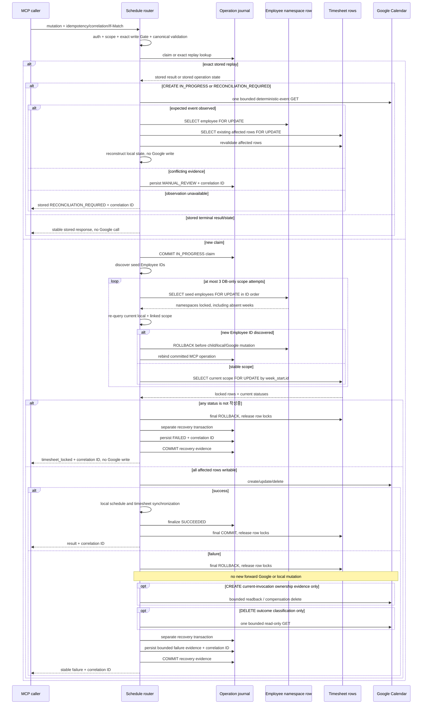

# MCP Schedule Mutation Locking and Reconciliation Contract

**Status:** APPROVED-DESIGN / LOCAL-CONTRACT-REVIEW-PASS /
POSTGRESQL-ROW-LOCK-RUNTIME-NOT-RUN

**Applies to:** MCP schedule `CREATE`, `UPDATE`, and `DELETE`; ordinary schedule
`CREATE`, `UPDATE`, and `DELETE` when they synchronize timesheets; and
timesheet `save`, `submit`, `approve`, and `reject`

**Does not change:** existing authentication, authorization, request/response
shapes, or ordinary JWT calendar UI behavior

## 1. Why This Contract Exists

An MCP schedule mutation can change both Google Calendar and one or more weekly
timesheets. A read-only check of the timesheet status is insufficient: another
transaction can create, save, submit, approve, or reject the same employee-week
after the check but before the Google request. Every participating writer
therefore locks the always-existing `employees` namespace row before locking
existing affected `timesheets` rows. The parent lock protects absent weeks; the
child locks protect existing headers and status transitions. MCP mutations keep
both locks until the Google operation and matching local synchronization either
succeed and commit, or the locked mutation transaction rolls back. Failure
evidence is persisted only afterwards in a separate recovery transaction.

This is deliberately narrower than a new reservation subsystem. It adds no new
table or frontend workflow. Alembic revision `20260727_0016` adds the named
database invariant `uq_timesheets_employee_week_start`; its duplicate preflight
fails closed and never deletes or merges rows automatically.

This is the selected **concurrency option 1: database row locking**. It must not
be confused with the overall integration-design option recorded in the
enterprise schedule design. Here, “option 1” means the concrete lock protocol
in this file: lock the always-existing Employee namespace row first, then lock
existing Timesheet rows in global order. Code changes that alter that order,
the three-attempt scope restart, or the post-rollback recovery boundary require
this document and its regression tests to change in the same review.

## 2. Non-negotiable Invariants

1. `MCP_SCHEDULE_WRITE_ENABLED` enables backend schedule writes only when its
   value is exactly the lowercase literal `true`. Missing, uppercase,
   whitespace-padded, or any other value remains disabled.
2. Authentication, scope, write Gate, canonical request hash, and idempotency
   conflict checks happen before any Google or local schedule side effect.
3. An exact replay of a stored operation is resolved before mutable timesheet
   status checks. A stored `SUCCEEDED` result remains replayable even when its
   timesheet is submitted later.
4. A newly claimed mutation commits its operation-journal claim before any
   external side effect.
5. After the claim commit, a pre-lock scope read discovers only the seed
   employee IDs. It is not authoritative for the child-row lock.
6. A new transaction locks every seed `employees` row using
   `SELECT ... FOR UPDATE` in deterministic `Employee.id` order.
7. While those parent locks are held, the backend re-queries the current
   `calendar_schedules` row and `timesheet_entries`-linked employee-week scope.
   UPDATE unions the desired weeks for the authenticated employee; DELETE uses
   the current local/linked scope; CREATE uses the desired weeks.
8. If the locked-scope re-query discovers a previously unlocked employee ID,
   the transaction rolls back before any child lock or local/Google mutation.
   The next attempt locks the expanded Employee set in sorted order. MCP
   rebinds its already committed operation row after every restart. At most
   three attempts are allowed; persistent churn fails closed as
   `timesheet_scope_unstable` with the original correlation ID and no Google
   write.
9. Only a stable post-parent-lock scope may lock affected `timesheets` headers,
   globally ordered by `week_start, id` with `SELECT ... FOR UPDATE`.
10. The parent lock reserves the employee-week namespace even when no
   `timesheets` row exists. The named database constraint
   `uq_timesheets_employee_week_start` is the final duplicate-prevention
   invariant.
11. On the MCP path, the locked rows are re-read and must still be `작성중`.
   A locked status rejects the request before the Google write. Ordinary routes
   preserve their existing status behavior while still mutating only under the
   revalidated locks.
12. On success, the row locks remain held across the Google request, local
   `calendar_schedules` and `timesheet_entries` changes, journal finalization
   to `SUCCEEDED`, and the final commit.
13. On failure, the locked mutation transaction rolls back first. That final
   rollback releases the row locks. Only then may a separate recovery
   transaction persist bounded `FAILED`, `RECONCILIATION_REQUIRED`, or
   `MANUAL_REVIEW` operation evidence and the original correlation ID. After
   rollback there is no new forward Google mutation and no local schedule or
   timesheet mutation.
14. Bounded post-rollback Google observations are read-only. CREATE may read
   back its deterministic event; the only allowed post-rollback Google
   mutation is an ownership-proven CREATE compensation delete under the
   current-invocation guard in Section 6. DELETE may issue a bounded `GET` to
   classify 404, present, or conflicting DB/journal evidence but never retries
   delete or compensates. UPDATE has no automatic readback, retry, or
   compensation unless separately designed. After that bounded handling, the
   separate recovery transaction writes operation evidence only.
15. This split is intentional: a failed SQLAlchemy transaction cannot safely
   persist recovery evidence, and recovery code must not assume that the
   timesheet locks still exist.
16. A create compensation delete is allowed only when the current invocation
   attempted the Google insert and evidence shows that insert was accepted.
   Reconciliation that only observes an event from a previous invocation must
   never delete that event.
17. Every pre-Google rejection exposed to MCP uses a stable allowlisted error
   code. Repeating the same invalid request cannot change its error meaning.
18. An uncertain Google result is never automatically retried. It is recorded
    as `RECONCILIATION_REQUIRED` or `MANUAL_REVIEW` with the original
    correlation ID.

## 3. Transaction and Lock Sequence

The journal claim and the locked mutation transaction are intentionally
separate. The claim must survive a process loss; the row locks must cover the
shortest transaction that still spans the external side effect and matching
local state change. A successful path finalizes `SUCCEEDED` before its final
commit releases the locks. A failure path uses the locked transaction's final
rollback as the lock-release boundary, then opens a separate recovery
transaction that writes only bounded operation evidence and correlation. This
separation avoids trying to persist recovery state in a failed SQLAlchemy
transaction. After rollback, no new forward Google mutation or local
schedule/timesheet mutation is allowed. CREATE may perform bounded readback and
ownership-proven current-invocation compensation under Section 6. DELETE may
perform one bounded read-only `GET` to classify Google/DB/journal evidence but
never retries delete or compensates. UPDATE has no automatic readback, retry,
or compensation unless separately designed.

## 4. Lock Target and Ordering

The first scope read is a seed-ID discovery only. It cannot authorize child
locks because `calendar_schedules` or `timesheet_entries` may change before
the parents are held. After all seed parents are locked, the authoritative
scope is re-queried from the current local schedule row and the currently
linked Timesheet entries. The affected child rows are:

- create: desired weeks;
- update: post-parent-lock current local/linked weeks plus desired weeks;
- delete: post-parent-lock current local/linked weeks.

Every participating writer first locks `Employee.id` with
`with_for_update()`. It then filters `Timesheet.employee_id` and
`Timesheet.week_start IN (...)`, orders by `Timesheet.week_start` and
`Timesheet.id`, and calls `with_for_update()`. If an operation spans multiple
employees, it locks every `Employee.id` in sorted order before any Timesheet
row, then locks all children globally by `week_start, id`.

If the authoritative re-query adds an Employee not present in the locked parent
set, no child is locked and no schedule, Timesheet, or Google mutation occurs.
The current DB transaction rolls back, the parent set expands, and lock
acquisition restarts. MCP reloads the durable operation claim after that
rollback before continuing. Three DB-only attempts are the hard bound; this is
not a Google retry. Persistent scope churn returns the stable MCP code
`timesheet_scope_unstable` with its original correlation ID.

The parent lock is deliberately coarser than one lock per employee-week. It
serializes participating timesheet mutations for the same employee, including
a week that has no Timesheet header yet. This closes the missing-row race
without adding a reservation table. The database unique constraint
`uq_timesheets_employee_week_start` remains the final invariant if a
non-participating writer bypasses the protocol.

The participating writers are:

- MCP schedule create, update, and delete;
- ordinary schedule create, update, and delete when local timesheet
  synchronization can occur;
- timesheet save, submit, approve, and reject.

Each route performs its existing authentication and authorization checks,
acquires the shared lock order before mutating Timesheet state, and re-reads
the locked state. MCP routes do not acquire the same lock twice when they call
the ordinary schedule implementation.

## 5. Replay Order

Replay lookup is based on authenticated user ID, idempotency key, and the full
canonical request hash.

- hash mismatch: `idempotency_conflict`;
- stored `SUCCEEDED`: return the stored success without preflight, Google, or
  local mutation;
- stored `FAILED` or `MANUAL_REVIEW`: return the stored stable code, state, and
  correlation ID without a Google call;
- stored update/delete non-success: return the stored stable code, state, and
  correlation ID without a forward retry;
- stored create `IN_PROGRESS` or `RECONCILIATION_REQUIRED`: perform exactly one
  bounded read-only Google observation of the deterministic event;
- if that expected event exists, lock affected timesheets and reconstruct local
  state without inserting or deleting the Google event;
- conflicting create evidence becomes `MANUAL_REVIEW`; unavailable observation
  returns the stored `RECONCILIATION_REQUIRED` state and original correlation
  ID without changing its evidence.

Mutable business gates apply only to a newly claimed write or to local
reconstruction that would modify a currently locked timesheet. They do not
rewrite the historical result of a completed operation.

## 6. Create Compensation Ownership

The router tracks two independent facts:

- `insert_attempted_by_current_invocation`;
- `expected_event_observed`.

Compensation requires both facts. `reconcile_observed` means the event came
from an earlier invocation and therefore forces
`insert_attempted_by_current_invocation = false`. Any local reconstruction
failure in that branch records reconciliation evidence but performs zero
Google deletes.

## 7. Stable Pre-upstream Errors

Time shape, date ordering, category, headers, owner binding, ETag, employee
binding, and locked-week checks must return machine-readable allowlisted
codes. Validation that can run without a durable claim runs before the claim.
Any rejection after a claim is stored with the same code and correlation ID
that the first response returns.

Free-text legacy UI errors remain confined to the ordinary JWT path.

## 8. Evidence Boundary

Local evidence can prove:

- exact write-Gate parsing;
- replay ordering;
- zero-delete reconciliation behavior;
- stable first/replay error codes;
- SQLAlchemy parent-before-child `FOR UPDATE` query construction;
- namespace-lock acquisition for a missing week before the Google test double
  is invoked;
- post-parent-lock local/linked scope re-query and UPDATE desired-week union;
- bounded rollback/restart when the re-query introduces a new Employee, with
  MCP operation rebind and no child/local/Google mutation under partial parents;
- stable `timesheet_scope_unstable` first response and replay after persistent
  churn, with zero Google writes;
- all participating route call order and state re-read behavior;
- model-level SQLite enforcement of one Timesheet header per employee-week;
- revision `20260727_0016` duplicate preflight and exact named
  upgrade/downgrade operations;
- existing schedule and UI regression behavior.

The current SQLite test environment does not implement PostgreSQL row-lock
semantics. Structural migration tests do not execute Alembic against a
PostgreSQL database. Actual blocking between schedule mutation, ordinary
schedule synchronization, and timesheet save/submit/approve/reject remains
`POSTGRESQL-ROW-LOCK-RUNTIME-NOT-RUN` until Task 12 provides the approved
isolated PostgreSQL test environment. Local PASS must not be reported as that
runtime proof.

## 9. Required Regression Tests

1. A reconciliation-local failure after observing a prior create performs
   zero Google deletes.
2. A stored successful create replays after the target timesheet becomes
   locked.
3. Invalid update input returns the same stable code on repeated calls.
4. Missing, `false`, `TRUE`, ` true `, `yes`, and `1` keep backend writes
   disabled; only exact `true` enables them.
5. The Employee namespace query precedes the ordered affected-timesheet
   `FOR UPDATE` query.
6. A missing week still locks Employee before the Google test double runs.
7. Existing JWT UI characterization remains unchanged.
8. UPDATE and DELETE locked-week first responses and exact replays return the
   same `timesheet_locked` code and original correlation ID with zero Google
   writes.
9. Stored create `FAILED` and `MANUAL_REVIEW` replay their stored code, state,
   and correlation ID with zero Google calls.
10. Stored create `RECONCILIATION_REQUIRED` performs at most one read-only
    deterministic-event observation; unavailable observation preserves its
    stored state, error evidence, and original correlation ID with zero Google
    writes.
11. A post-rollback DELETE may issue one bounded read-only `GET` for evidence
    classification but never retries the delete or performs compensation.
12. Model/SQLite tests reject duplicate `(employee_id, week_start)` headers.
13. Alembic `0016` fails closed on duplicate preflight evidence, creates and
    drops only `uq_timesheets_employee_week_start`, and never auto-deletes data.
14. Timesheet save/submit/approve/reject and ordinary schedule
    create/update/delete use Employee-before-Timesheet order, re-read locked
    state, and preserve existing authentication and response behavior.
15. Ordinary and MCP UPDATE/DELETE tests inject seed scope A before the parent
    lock and actual scope B afterwards; the final child lock covers B, excludes
    stale A unless desired, and precedes local and Google mutation.
16. UPDATE retains its desired-week union after the post-parent-lock re-query;
    DELETE uses only its current local/linked scope.
17. A newly discovered Employee causes rollback and sorted-parent restart
    before any child lock. Persistent churn is bounded to three attempts and
    MCP first/replay responses preserve `timesheet_scope_unstable`, the original
    correlation ID, and zero Google writes.

## 10. Operational Boundary

No production write is authorized by this document. The backend and local MCP
write Gates remain disabled by default. Revision `20260727_0016` exists in the
working tree, but its actual upgrade/downgrade has not run. Migration rehearsal,
PostgreSQL lock contention, real API read-only checks, Google test-calendar
canary, deployment, rollback, and push remain separate approval and evidence
Gates.

## 11. Local Contract Evidence (2026-07-27)

- New missing-row/unique/writer/DELETE-bounds contract slice: `13 passed`.
- New post-parent-lock scope/restart/churn contract slice: `9 passed`.
- Focused create/idempotency/update-delete/fault/locking/characterization/
  scope-revalidation suite: `84 passed`.
- Full schedule suite: `124 passed`.
- Python compile check for `backend/app` and `backend/tests/schedule`: exit 0.
- Alembic structural chain: `20260727_0016 (head)` after `20260727_0015`.
- `git diff --check`: exit 0 (existing line-ending conversion warnings only).
- `CalendarView.vue` diff against baseline commit
  `b9c0c1bced40397b713efb4497a1e5ea9f947be7`: exit 0, no diff.
- Independent specification review: `PASS`.
- Independent code-quality/security review: `Ready=Yes`.
- PostgreSQL contention/blocking execution:
  `POSTGRESQL-ROW-LOCK-RUNTIME-NOT-RUN`.
