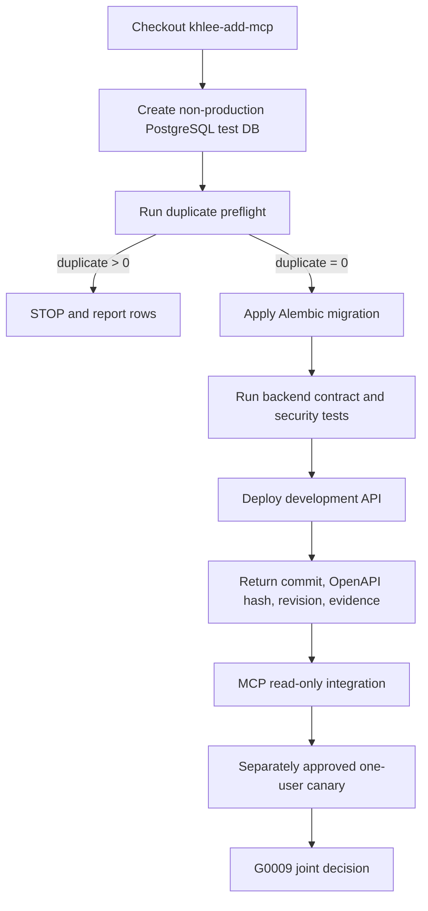
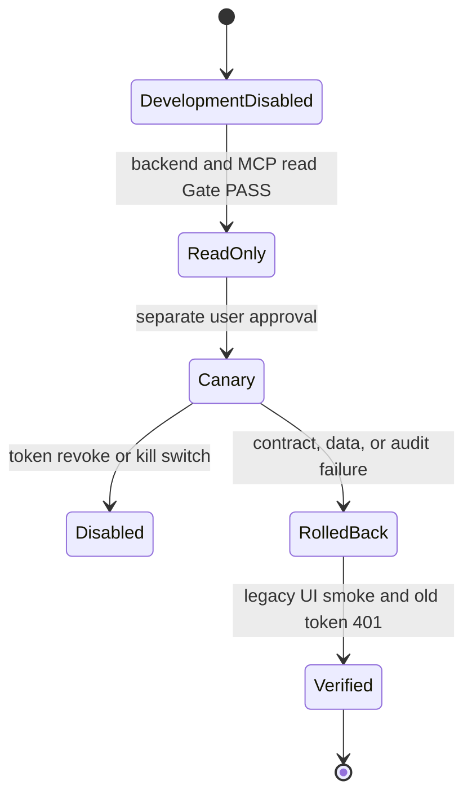
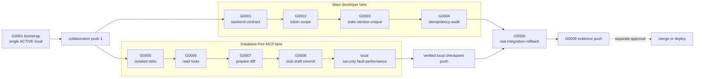

# LSS ERP Isolated MCP Implementation Plan

> **For agentic workers:** REQUIRED SUB-SKILL: Use `subagent-driven-development` (recommended) or `executing-plans` to implement this plan task-by-task. Steps use checkbox (`- [ ]`) syntax for tracking.

**Goal:** Build and locally verify a separately packaged stdio MCP server without a local database, publish reviewed checkpoints to `origin/khlee-add-mcp` for the main developer's AI, then integrate through the G0009 release Gate.

**Architecture:** The MCP process lives only under repo-root `mcp_server/`, reads an ERP API token from Windows Credential Manager, and calls a fixed allowlist of ERP REST endpoints. Local tests use an in-memory FastAPI contract stub with no ORM or database while the main developer's PostgreSQL/API lane proceeds in parallel. Verified development checkpoints may be pushed to `origin/khlee-add-mcp`; a main developer may integrate them into a separate backend working branch, while `origin/main` release merge, deployment, and real ERP write activation remain blocked until G0009 and separate user approval.

**Tech Stack:** Python 3.12, MCP Python SDK v1 (`mcp>=1.28,<2`), FastMCP stdio, httpx, Pydantic v2, keyring, pytest, pytest-asyncio, FastAPI test-only contract stub, PowerShell, PostgreSQL-backed ERP REST API supplied by the main developer.

---

## Execution snapshot — 2026-07-25

| Area | State | Evidence |
|---|---|---|
| Single active Goal | PASS | `LSS-MCP-G0001` is the only `ACTIVE` Goal |
| Collaboration branch | PUSHED COLLABORATION BRANCH | `origin/khlee-add-mcp`; verify the exact current SHA with `git ls-remote` |
| Database-free MCP code | LOCAL-PASS | code checkpoint `cf31647` |
| Local test suite | PASS | 70 tests, compileall PASS, banned runtime references 0 |
| Dependency audit | PASS | no known vulnerabilities; unpublished local package skipped |
| MCP protocol | PASS | Python SDK stdio tests and external Inspector five-tool listing |
| AI application package | IN COLLABORATION BRANCH | `docs/mcp/`, including `AI-SAFETY-BASELINE.md`, and `mcp_server/README.md` |
| GitHub work registration | MANUAL-PENDING | Copy `docs/mcp/GITHUB-ISSUE-HANDOFF.md` into a GitHub issue |
| Main developer hand-back | WAITING | PostgreSQL, Alembic, backend, OpenAPI, legacy UI evidence not received |
| Real API, canary, rollback | NOT-RUN | blocked until the documented joint Gates and separate user approval |
| Working-branch integration | GRANTED | main developer may branch from or merge into a separate backend working branch |
| origin/main merge and deployment | NOT-GRANTED | requires G0009 `COMPLETE/PASS` and separate user approval |

This snapshot records implementation progress without promoting G0005 through
G0009 out of order. `LSS-MCP-G0001` remains the only active management Goal.

---

## 0. Scope and ownership

### Our implementation lane

```text
mcp_server/
goals/LSS-MCP-G0001 through G0009 evidence
MCP contract stub
MCP unit·contract·protocol·security·fault·performance tests
real ERP API read-only and canary integration client
local packaging and launcher documentation
```

### Main developer lane

```text
backend/app token·AuthContext·scope policy
PostgreSQL test DB
Alembic migration
timesheet self·state·version·unique
idempotency·audit transaction
MCP REST endpoints
development and actual server deployment
backend tests and hand-back evidence
```

The main-developer contract is:

```text
docs/handoffs/2026-07-25-lss-erp-mcp-backend-db-token-handoff.md
```

The collaboration-push decision is:

```text
docs/superpowers/specs/2026-07-25-lss-erp-collaboration-branch-push-design.md
```

### Hard rule

MCP code must not import or access:

```text
backend
backend.app
sqlalchemy
pg8000
DATABASE_URL
PostgreSQL credentials
```

### Execution and push model

1. Create `LSS-MCP-G0001` as the only active Goal.
2. Push the verified Goal bootstrap to `origin/khlee-add-mcp`.
3. Start the database-free MCP lane after the bootstrap push while the main
   developer executes G0001 through G0004.
4. Push only verified development checkpoints to the same branch.
5. Mark every pre-G0009 checkpoint `DEVELOPMENT/NOT-RELEASED`.
6. Do not merge, deploy, or activate a real ERP write path before G0009 PASS
   and separate user approval.

The local lane may implement a write-shaped contract against the in-memory
stub, but it must not claim real integration or send a write to a real ERP API
before the applicable Gate.

## 1. Planned file structure

```text
D:\_Project\LSS_ERP
├─ goals
│  ├─ _INDEX.md
│  ├─ LSS-MCP-G0001
│  │  ├─ STATUS.md
│  │  └─ EXIT-EVIDENCE.md
│  └─ LSS-MCP-G0002 ... LSS-MCP-G0009
├─ mcp_server
│  ├─ pyproject.toml
│  ├─ README.md
│  ├─ src
│  │  └─ lss_erp_mcp
│  │     ├─ __init__.py
│  │     ├─ __main__.py
│  │     ├─ server.py
│  │     ├─ config.py
│  │     ├─ credentials.py
│  │     ├─ credential_cli.py
│  │     ├─ erp_client.py
│  │     ├─ errors.py
│  │     ├─ telemetry.py
│  │     ├─ confirmation.py
│  │     ├─ schemas
│  │     │  ├─ __init__.py
│  │     │  ├─ common.py
│  │     │  └─ timesheet.py
│  │     └─ tools
│  │        ├─ __init__.py
│  │        ├─ identity.py
│  │        └─ timesheets.py
│  ├─ scripts
│  │  └─ Test-LssErpMcpIntegration.ps1
│  └─ tests
│     ├─ conftest.py
│     ├─ contract_server
│     │  ├─ __init__.py
│     │  ├─ app.py
│     │  └─ state.py
│     ├─ unit
│     │  ├─ test_config.py
│     │  ├─ test_credentials.py
│     │  ├─ test_confirmation.py
│     │  └─ test_diff.py
│     ├─ contract
│     │  ├─ test_erp_client.py
│     │  └─ test_error_mapping.py
│     ├─ integration
│     │  ├─ test_read_tools.py
│     │  ├─ test_prepare.py
│     │  └─ test_commit.py
│     ├─ protocol
│     │  └─ test_stdio.py
│     ├─ security
│     │  ├─ test_isolation.py
│     │  ├─ test_secret_redaction.py
│     │  └─ test_ssrf.py
│     ├─ fault
│     │  └─ test_commit_replay.py
│     ├─ performance
│     │  └─ test_local_budget.py
│     └─ real_api
│        ├─ test_read_only.py
│        └─ test_canary_draft.py
└─ docs
   ├─ handoffs
   │  └─ 2026-07-25-lss-erp-mcp-backend-db-token-handoff.md
   └─ mcp
      ├─ AI-MAIN-DEVELOPER-ENTRYPOINT.md
      ├─ API-CONTRACT.md
      ├─ APPLY-AND-ROLLBACK.md
      ├─ EVIDENCE-HAND-BACK.md
      ├─ OPERATIONS.md
      └─ RELEASE-CHECKLIST.md
```

## Task 1: Start the single active Goal and dispatch the backend handoff

**Goal mapping:** `LSS-MCP-G0001`

**Files:**

- Create: `goals/_INDEX.md`
- Create: `goals/LSS-MCP-G0001/STATUS.md`
- Create at exit only: `goals/LSS-MCP-G0001/EXIT-EVIDENCE.md`
- Read: `docs/handoffs/2026-07-25-lss-erp-mcp-backend-db-token-handoff.md`
- Read: `docs/superpowers/specs/2026-07-25-lss-erp-collaboration-branch-push-design.md`

- [ ] **Step 1: Verify the branch baseline**

Run:

```powershell
git status --short --branch
git rev-parse --short HEAD
git branch --show-current
```

Expected:

```text
branch = khlee-add-mcp
code baseline = 1e46a0c
design HEAD = 3b4f001 before the Goal bootstrap commit
no unrelated working-tree change
```

- [ ] **Step 2: Create the Goal index**

Create `goals/_INDEX.md`:

```markdown
# LSS ERP MCP Goal Index

| Goal | Purpose | Status | Owner |
|---|---|---|---|
| LSS-MCP-G0001 | Backend API contract and dependency baseline | ACTIVE | coordinator + main developer |
| LSS-MCP-G0002 | API token scope and default deny | PLANNED | main developer |
| LSS-MCP-G0003 | Timesheet self, state, version, unique | PLANNED | main developer |
| LSS-MCP-G0004 | Idempotency and audit transaction | PLANNED | main developer |
| LSS-MCP-G0005 | Isolated stdio MCP package | PLANNED | MCP implementer |
| LSS-MCP-G0006 | Read-only REST tools | PLANNED | MCP implementer |
| LSS-MCP-G0007 | Local prepare and diff | PLANNED | MCP implementer |
| LSS-MCP-G0008 | Confirmed draft commit | PLANNED | MCP implementer |
| LSS-MCP-G0009 | Security, fault, performance, rollback, push gate | PLANNED | coordinator |

Rule: exactly one Goal may be ACTIVE.
```

- [ ] **Step 3: Create G0001 status**

Create `goals/LSS-MCP-G0001/STATUS.md`:

```markdown
# LSS-MCP-G0001 Status

- status: ACTIVE
- baseline: khlee-add-mcp@1e46a0c
- owner: coordinator
- backend_owner: main developer
- local_database: UNAVAILABLE
- execution_model: parallel backend handoff and database-free MCP lane
- collaboration_push: GRANTED
- release_merge_deploy: NOT-GRANTED
- release_state: DEVELOPMENT/NOT-RELEASED

## Done-When

- Backend dependency and contract test evidence received.
- PostgreSQL 16 test database identified as non-production.
- SEC-20 and SEC-21 resolved with regression evidence.
- Legacy `/api/mcp` read contract frozen and write surface remains zero.
- Normal, 401, 403, 409, and 422 contracts are fixed.
- No unclassified P0 risk remains.

## Stop Conditions

- Production-like database target.
- Missing backend commit SHA.
- SQLite-only migration acceptance.
- Secret or database credential placed in Git or Markdown.
- Backend reports PASS without command output.
```

- [ ] **Step 4: Deliver the handoff**

Publish and point the main developer's AI to:

```text
docs/mcp/AI-MAIN-DEVELOPER-ENTRYPOINT.md
docs/handoffs/2026-07-25-lss-erp-mcp-backend-db-token-handoff.md
```

Before `docs/mcp/AI-MAIN-DEVELOPER-ENTRYPOINT.md` exists, the backend handoff
is the temporary entrypoint. The permanent AI entrypoint is created in Task
11A.

Update handoff section 8 before the first push:

```text
Verified collaboration checkpoints may be pushed only to
origin/khlee-add-mcp. Every checkpoint is DEVELOPMENT/NOT-RELEASED.
Merge, deployment, and real ERP write activation remain blocked until G0009
COMPLETE/PASS and separate user approval.
```

Require the main developer to reply with:

```text
accepted scope
working branch or PR
PostgreSQL test lane
estimated first hand-back Goal
blocked items
```

- [ ] **Step 5: Verify only one active Goal**

Run:

```powershell
$active = rg -n 'status: ACTIVE' goals
if (@($active).Count -ne 1) { throw "Expected exactly one ACTIVE Goal" }
$active
```

Expected: one match in `goals/LSS-MCP-G0001/STATUS.md`.

- [ ] **Step 6: Commit Goal bootstrap**

```powershell
git add `
  docs/handoffs/2026-07-25-lss-erp-mcp-backend-db-token-handoff.md `
  docs/superpowers/plans/2026-07-25-lss-erp-mcp-isolated-implementation.md `
  goals/_INDEX.md `
  goals/LSS-MCP-G0001/STATUS.md
git commit -m "docs: start LSS MCP G0001 contract baseline"
```

- [ ] **Step 7: Push collaboration checkpoint 1**

Verify the remote branch is absent or equal to the expected base:

```powershell
git fetch origin --prune
$remote = @(git ls-remote --heads origin khlee-add-mcp)
if ($remote.Count -gt 0) {
    git branch -r --contains 1e46a0c
    git log --oneline --left-right --cherry-pick origin/khlee-add-mcp...khlee-add-mcp
}
git status --short --branch
```

Scan the committed range before push:

```powershell
git diff --check 1e46a0c..HEAD
git grep -n -I -E 'lss_erp_[A-Za-z0-9_-]{20,}|Authorization: Bearer|DATABASE_URL=.*@' HEAD
```

Expected: no real secret, no unrelated path, and the branch is
`khlee-add-mcp`.

Push:

```powershell
git push -u origin khlee-add-mcp
git ls-remote --heads origin khlee-add-mcp
```

Expected: the remote SHA equals local `HEAD`. This is a collaboration
checkpoint, not a release.

## Task 2: Accept G0001 through G0004 backend evidence

**Goal mapping:** `LSS-MCP-G0001` → `G0004`

**Files:**

- Read: main developer hand-back package
- Update: `goals/LSS-MCP-G0001/STATUS.md`
- Create: `goals/LSS-MCP-G0001/EXIT-EVIDENCE.md`
- Repeat the same pattern for `G0002`, `G0003`, and `G0004`

- [ ] **Step 1: Verify the backend commit**

Run against the returned ref:

```powershell
$backendCommit = Read-Host 'Backend commit SHA'
if ($backendCommit -notmatch '^[0-9a-f]{7,40}$') {
    throw 'Invalid backend commit SHA'
}
git show --stat --oneline $backendCommit
git diff 1e46a0c..$backendCommit -- backend
```

Expected:

- exact backend·migration·test changes
- no `mcp_server/` implementation by the backend lane
- no committed secret

- [ ] **Step 2: Verify the PostgreSQL evidence**

The returned evidence must state:

```text
PostgreSQL 16.x
non-production test database
duplicate query row count
alembic current revision
upgrade result
integration test result
```

Reject evidence that uses only SQLite.

- [ ] **Step 3: Verify the contract**

Confirm the returned OpenAPI contains:

```text
GET /api/auth/me
GET /api/timesheets/week
GET /api/timesheets/projects
POST /api/timesheets/mcp-draft
```

Confirm `POST /api/timesheets/mcp-draft` does not accept:

```text
employee_id
user_id
approver_id
status
raw_worklog
worklog_path
url
sql
```

- [ ] **Step 4: Verify G0001 exit evidence**

Create `goals/LSS-MCP-G0001/EXIT-EVIDENCE.md` with measured values:

```yaml
goal_id: LSS-MCP-G0001
status: BLOCKED
baseline_commit: 1e46a0c
backend_commit: NONE
postgresql: NOT-RUN
tests:
  contract: NOT-RUN
  security: NOT-RUN
dependency:
  sec_20: UNKNOWN
  sec_21: UNKNOWN
  unresolved_p0: UNKNOWN
unknowns:
  - Backend hand-back evidence not yet received
next_goal: LSS-MCP-G0002
push:
  performed: false
  approval: none
```

Replace `NONE`, `NOT-RUN`, and `UNKNOWN` only with values reproduced from the returned evidence. Change `status` to `COMPLETE` only after every G0001 exit criterion passes.

- [ ] **Step 5: Close G0001 and activate G0002**

Update G0001:

```text
status: COMPLETE
```

Create G0002 with:

```text
status: ACTIVE
```

Run the single-active check before commit.

- [ ] **Step 6: Repeat for G0002**

Accept only when:

```text
token default scopes = empty
client_id and resource enforced
unregistered API token endpoint denied
revoked and expired token denied
raw token returned once and not stored
```

- [ ] **Step 7: Repeat for G0003**

Accept only when:

```text
self-only enforced
submitted, approved, rejected MCP write denied
version race permits one writer
employee/week duplicate count = 0
unique constraint active
```

- [ ] **Step 8: Repeat for G0004**

Accept only when:

```text
same key + same hash returns same result
same key + different hash returns 409
transaction and audit are atomic
response loss replay is deterministic
secret canary count = 0
```

- [ ] **Step 9: Commit each accepted Goal separately**

Example:

```powershell
git add goals/LSS-MCP-G0002 goals/_INDEX.md
git commit -m "docs: accept LSS MCP G0002 token scope gate"
```

Push an accepted-Goal commit only after its reproduced evidence and secret
scan pass. These remain collaboration checkpoints marked
`DEVELOPMENT/NOT-RELEASED`.

## Task 3: Scaffold the isolated MCP package

**Goal mapping:** `LSS-MCP-G0005`

**Start Gate:** Task 1 checkpoint push is complete. Task 2 may still be waiting
for main-developer evidence. Do not mark G0005 `ACTIVE` while G0001 is active;
record the local lane as `PARALLEL-WORK/NOT-RELEASED` under G0001 until the
single-Goal transition is allowed.

**Files:**

- Create: `mcp_server/pyproject.toml`
- Create: `mcp_server/src/lss_erp_mcp/__init__.py`
- Create: `mcp_server/src/lss_erp_mcp/__main__.py`
- Create: `mcp_server/tests/conftest.py`
- Test: `mcp_server/tests/security/test_isolation.py`

- [ ] **Step 1: Write the failing isolation test**

Create `mcp_server/tests/security/test_isolation.py`:

```python
from __future__ import annotations

import ast
from pathlib import Path


SRC = Path(__file__).resolve().parents[2] / "src" / "lss_erp_mcp"
BANNED = ("backend", "sqlalchemy", "pg8000")


def test_mcp_source_has_no_backend_or_database_imports() -> None:
    violations: list[str] = []
    for path in SRC.rglob("*.py"):
        tree = ast.parse(path.read_text(encoding="utf-8"), filename=str(path))
        for node in ast.walk(tree):
            names: list[str] = []
            if isinstance(node, ast.Import):
                names = [alias.name for alias in node.names]
            elif isinstance(node, ast.ImportFrom) and node.module:
                names = [node.module]
            for name in names:
                if any(
                    name == prefix or name.startswith(f"{prefix}.")
                    for prefix in BANNED
                ):
                    violations.append(f"{path.relative_to(SRC)}:{node.lineno}:{name}")
    assert violations == []
```

- [ ] **Step 2: Run the test and verify RED**

Run:

```powershell
py -3.12 -m pytest mcp_server\tests\security\test_isolation.py -q
```

Expected: FAIL because the package path or test dependencies do not exist yet.

- [ ] **Step 3: Create `pyproject.toml`**

```toml
[build-system]
requires = ["hatchling>=1.27,<2"]
build-backend = "hatchling.build"

[project]
name = "lss-erp-mcp"
version = "0.1.0"
requires-python = ">=3.12,<3.14"
dependencies = [
  "mcp>=1.28,<2",
  "httpx>=0.27,<1",
  "pydantic>=2.9,<3",
  "pydantic-settings>=2.5,<3",
  "keyring>=25,<26",
]

[project.optional-dependencies]
dev = [
  "fastapi>=0.115,<1",
  "pytest>=8.3,<9",
  "pytest-asyncio>=0.24,<1",
  "pip-audit>=2.7,<3",
  "uvicorn>=0.30,<1",
]

[project.scripts]
lss-erp-mcp = "lss_erp_mcp.__main__:main"
lss-erp-mcp-credential = "lss_erp_mcp.credential_cli:main"

[tool.pytest.ini_options]
addopts = "-ra --strict-markers"
asyncio_mode = "auto"
testpaths = ["tests"]
markers = [
  "real_api: requires an explicitly approved development ERP API",
  "canary_write: writes only to an approved draft test week",
]
```

- [ ] **Step 4: Create package entry files**

`mcp_server/src/lss_erp_mcp/__init__.py`:

```python
__all__ = ["__version__"]
__version__ = "0.1.0"
```

`mcp_server/src/lss_erp_mcp/__main__.py`:

```python
from .server import run


def main() -> None:
    run()


if __name__ == "__main__":
    main()
```

- [ ] **Step 5: Create the venv and install editable dependencies**

```powershell
py -3.12 -m venv mcp_server\.venv
.\mcp_server\.venv\Scripts\python.exe -m pip install --upgrade pip
.\mcp_server\.venv\Scripts\python.exe -m pip install -e "mcp_server[dev]"
```

Expected: exit code 0.

- [ ] **Step 6: Run the isolation test and verify GREEN**

```powershell
.\mcp_server\.venv\Scripts\python.exe -m pytest mcp_server\tests\security\test_isolation.py -q
```

Expected: `1 passed`.

- [ ] **Step 7: Commit the isolated skeleton**

```powershell
git add mcp_server/pyproject.toml mcp_server/src mcp_server/tests/security/test_isolation.py
git commit -m "feat: scaffold isolated LSS ERP MCP package"
```

Do not push.

## Task 4: Implement fail-closed configuration

**Goal mapping:** `LSS-MCP-G0005`

**Files:**

- Create: `mcp_server/src/lss_erp_mcp/config.py`
- Test: `mcp_server/tests/unit/test_config.py`

- [ ] **Step 1: Write failing config tests**

```python
import pytest

from lss_erp_mcp.config import McpSettings


def test_production_requires_https() -> None:
    with pytest.raises(ValueError, match="HTTPS"):
        McpSettings(
            environment="production",
            base_url="http://erp.example.test",
            credential_service="LSS ERP MCP",
            credential_name="lss-erp-mcp-local",
        )


def test_development_http_requires_loopback() -> None:
    with pytest.raises(ValueError, match="loopback"):
        McpSettings(
            environment="development",
            base_url="http://192.0.2.10:8000",
            credential_service="LSS ERP MCP",
            credential_name="lss-erp-mcp-local",
        )


def test_development_allows_loopback_http() -> None:
    settings = McpSettings(
        environment="development",
        base_url="http://127.0.0.1:8000",
        credential_service="LSS ERP MCP",
        credential_name="lss-erp-mcp-local",
    )
    assert str(settings.base_url).rstrip("/") == "http://127.0.0.1:8000"


def test_base_url_must_be_an_origin_without_path() -> None:
    with pytest.raises(ValueError, match="origin"):
        McpSettings(
            environment="production",
            base_url="https://erp.example.test/api",
            credential_service="LSS ERP MCP",
            credential_name="lss-erp-mcp-local",
        )
```

- [ ] **Step 2: Run and verify RED**

```powershell
.\mcp_server\.venv\Scripts\python.exe -m pytest mcp_server\tests\unit\test_config.py -q
```

Expected: FAIL because `McpSettings` does not exist.

- [ ] **Step 3: Implement `McpSettings`**

```python
from __future__ import annotations

from datetime import date
from ipaddress import ip_address
from urllib.parse import urlsplit

from pydantic import AnyHttpUrl, Field, model_validator
from pydantic_settings import BaseSettings, SettingsConfigDict


class McpSettings(BaseSettings):
    model_config = SettingsConfigDict(
        env_prefix="LSS_ERP_",
        extra="forbid",
        case_sensitive=False,
    )

    environment: str = "production"
    base_url: AnyHttpUrl
    credential_service: str = "LSS ERP MCP"
    credential_name: str = "lss-erp-mcp-local"
    allow_env_token: bool = False
    connect_timeout_seconds: float = Field(default=2.0, gt=0, le=30)
    read_timeout_seconds: float = Field(default=10.0, gt=0, le=60)
    write_timeout_seconds: float = Field(default=10.0, gt=0, le=60)
    pool_timeout_seconds: float = Field(default=2.0, gt=0, le=30)
    max_response_bytes: int = Field(default=65536, ge=1024, le=1048576)
    real_api_week_start: date | None = None
    real_api_test_project_id: int | None = None
    real_api_test_work_type: str | None = None
    canary_write: bool = False

    @model_validator(mode="after")
    def validate_origin(self) -> "McpSettings":
        parsed = urlsplit(str(self.base_url))
        if (
            parsed.username
            or parsed.password
            or parsed.query
            or parsed.fragment
            or parsed.path not in {"", "/"}
        ):
            raise ValueError("base URL must be a credential-free origin")
        environment = self.environment.lower()
        if environment in {"production", "prod", "staging"} and parsed.scheme != "https":
            raise ValueError("production and staging require HTTPS")
        if parsed.scheme == "http":
            host = parsed.hostname or ""
            is_loopback = host == "localhost"
            if not is_loopback:
                try:
                    is_loopback = ip_address(host).is_loopback
                except ValueError:
                    is_loopback = False
            if not is_loopback:
                raise ValueError("development HTTP is limited to loopback")
        return self
```

- [ ] **Step 4: Run and verify GREEN**

```powershell
.\mcp_server\.venv\Scripts\python.exe -m pytest mcp_server\tests\unit\test_config.py -q
```

Expected: all tests pass.

- [ ] **Step 5: Commit**

```powershell
git add mcp_server/src/lss_erp_mcp/config.py mcp_server/tests/unit/test_config.py
git commit -m "feat: add fail-closed MCP configuration"
```

## Task 5: Implement Credential Manager consumption

**Goal mapping:** `LSS-MCP-G0005`

**Files:**

- Create: `mcp_server/src/lss_erp_mcp/credentials.py`
- Create: `mcp_server/src/lss_erp_mcp/credential_cli.py`
- Test: `mcp_server/tests/unit/test_credentials.py`

- [ ] **Step 1: Write failing credential tests**

```python
import pytest

from lss_erp_mcp.config import McpSettings
from lss_erp_mcp.credentials import CredentialUnavailable, load_erp_token


class FakeKeyring:
    def __init__(self, value: str | None):
        self.value = value

    def get_password(self, service: str, name: str) -> str | None:
        return self.value


def settings(**overrides):
    values = {
        "environment": "production",
        "base_url": "https://erp.example.test",
        "credential_service": "LSS ERP MCP",
        "credential_name": "lss-erp-mcp-local",
    }
    values.update(overrides)
    return McpSettings(**values)


def test_missing_keyring_token_fails_closed(monkeypatch) -> None:
    monkeypatch.delenv("LSS_ERP_API_TOKEN", raising=False)
    with pytest.raises(CredentialUnavailable):
        load_erp_token(settings(), FakeKeyring(None))


def test_keyring_token_is_used() -> None:
    assert load_erp_token(settings(), FakeKeyring("secret-token")) == "secret-token"


def test_env_token_is_not_allowed_in_production(monkeypatch) -> None:
    monkeypatch.setenv("LSS_ERP_API_TOKEN", "env-secret")
    with pytest.raises(CredentialUnavailable):
        load_erp_token(settings(allow_env_token=True), FakeKeyring(None))
```

- [ ] **Step 2: Run and verify RED**

```powershell
.\mcp_server\.venv\Scripts\python.exe -m pytest mcp_server\tests\unit\test_credentials.py -q
```

- [ ] **Step 3: Implement credential loading**

```python
from __future__ import annotations

import os
from typing import Protocol

import keyring

from .config import McpSettings


class KeyringReader(Protocol):
    def get_password(self, service: str, name: str) -> str | None: ...


class CredentialUnavailable(RuntimeError):
    pass


def load_erp_token(
    settings: McpSettings,
    reader: KeyringReader = keyring,
) -> str:
    token = reader.get_password(
        settings.credential_service,
        settings.credential_name,
    )
    if token:
        return token
    if (
        settings.environment.lower() in {"development", "test"}
        and settings.allow_env_token
    ):
        env_token = os.getenv("LSS_ERP_API_TOKEN")
        if env_token:
            return env_token
    raise CredentialUnavailable("ERP API credential is unavailable")
```

- [ ] **Step 4: Implement secure credential CLI**

```python
from __future__ import annotations

import argparse
import getpass

import keyring

from .config import McpSettings


def main() -> None:
    parser = argparse.ArgumentParser()
    parser.add_argument("action", choices=("set", "delete"))
    args = parser.parse_args()
    settings = McpSettings()
    if args.action == "set":
        token = getpass.getpass("ERP API token: ")
        if not token:
            raise SystemExit("Token must not be empty")
        keyring.set_password(
            settings.credential_service,
            settings.credential_name,
            token,
        )
        print("Credential stored.")
    else:
        try:
            keyring.delete_password(
                settings.credential_service,
                settings.credential_name,
            )
        except keyring.errors.PasswordDeleteError:
            pass
        print("Credential removed.")
```

The token is read through a hidden prompt and is never accepted as a command-line argument.

- [ ] **Step 5: Run tests**

```powershell
.\mcp_server\.venv\Scripts\python.exe -m pytest mcp_server\tests\unit\test_credentials.py -q
```

Expected: all tests pass.

- [ ] **Step 6: Commit**

```powershell
git add mcp_server/src/lss_erp_mcp/credentials.py mcp_server/src/lss_erp_mcp/credential_cli.py mcp_server/tests/unit/test_credentials.py
git commit -m "feat: load ERP token from Windows Credential Manager"
```

## Task 6: Define strict REST schemas and a database-free contract stub

**Goal mapping:** `LSS-MCP-G0005`

**Files:**

- Create: `mcp_server/src/lss_erp_mcp/schemas/common.py`
- Create: `mcp_server/src/lss_erp_mcp/schemas/timesheet.py`
- Create: `mcp_server/tests/contract_server/state.py`
- Create: `mcp_server/tests/contract_server/app.py`
- Test: `mcp_server/tests/contract/test_erp_client.py`

- [ ] **Step 1: Create strict common schemas**

```python
from pydantic import BaseModel, ConfigDict, Field


class StrictModel(BaseModel):
    model_config = ConfigDict(extra="forbid")


class ErrorDetail(StrictModel):
    code: str
    message: str
    correlation_id: str
    retryable: bool
    details: dict[str, object] = Field(default_factory=dict)


class ErrorEnvelope(StrictModel):
    error: ErrorDetail
```

- [ ] **Step 2: Create strict timesheet schemas**

```python
from __future__ import annotations

from datetime import date
from decimal import Decimal

from pydantic import Field, field_validator

from .common import StrictModel


class CurrentUser(StrictModel):
    user_id: int
    employee_id: int
    employee_code: str
    display_name: str
    client_id: str
    resource: str
    scopes: list[str]


class DraftEntry(StrictModel):
    work_date: date
    project_id: int
    hours: Decimal = Field(gt=0, le=24, multiple_of=Decimal("0.25"))
    work_type: str = Field(min_length=1, max_length=200)
    description: str = Field(min_length=1, max_length=300)


class PersistedEntry(DraftEntry):
    entry_id: int


class TimesheetWeek(StrictModel):
    timesheet_id: int | None
    week_start: date
    week_end: date
    status: str
    version: int
    entries: list[PersistedEntry]


class ProjectItem(StrictModel):
    project_id: int
    project_code: str
    project_name: str
    active: bool


class ProjectSearch(StrictModel):
    items: list[ProjectItem]
    truncated: bool


class DraftWriteRequest(StrictModel):
    week_start: date
    expected_version: int
    entries: list[DraftEntry] = Field(max_length=50)

    @field_validator("week_start")
    @classmethod
    def require_monday(cls, value: date) -> date:
        if value.weekday() != 0:
            raise ValueError("week_start must be Monday")
        return value


class DraftWriteResult(StrictModel):
    timesheet_id: int
    week_start: date
    status: str
    version: int
    correlation_id: str
    idempotency_replayed: bool
```

- [ ] **Step 3: Create deterministic contract state**

```python
from __future__ import annotations

from dataclasses import dataclass, field
from datetime import date


@dataclass
class ContractState:
    user_id: int = 10
    employee_id: int = 25
    employee_code: str = "E0010"
    scopes: set[str] = field(
        default_factory=lambda: {
            "mcp:discover",
            "timesheet:read:self",
            "timesheet:write:self:draft",
        }
    )
    week_start: date = date(2026, 7, 20)
    status: str = "작성중"
    version: int = 3
    entries: list[dict] = field(default_factory=list)
    idempotency: dict[str, tuple[str, dict]] = field(default_factory=dict)
    post_count: int = 0
```

- [ ] **Step 4: Create the FastAPI contract stub**

```python
from __future__ import annotations

import hashlib
import json
from datetime import timedelta
from uuid import uuid4

from fastapi import FastAPI, Header, HTTPException, Query

from lss_erp_mcp.schemas.timesheet import DraftWriteRequest

from .state import ContractState


def create_contract_app(state: ContractState | None = None) -> FastAPI:
    app = FastAPI()
    app.state.contract = state or ContractState()

    @app.get("/api/auth/me")
    def me():
        s = app.state.contract
        return {
            "user_id": s.user_id,
            "employee_id": s.employee_id,
            "employee_code": s.employee_code,
            "display_name": "테스트 사용자",
            "client_id": "lss-erp-mcp-local",
            "resource": "lss-erp-api",
            "scopes": sorted(s.scopes),
        }

    @app.get("/api/timesheets/week")
    def week(week_start=Query(...)):
        s = app.state.contract
        return {
            "timesheet_id": 100,
            "week_start": str(s.week_start),
            "week_end": str(s.week_start + timedelta(days=6)),
            "status": s.status,
            "version": s.version,
            "entries": s.entries,
        }

    @app.get("/api/timesheets/projects")
    def projects(q: str = "", limit: int = 20):
        items = [
            {
                "project_id": 123,
                "project_code": "P-2026-001",
                "project_name": "MCP 개발",
                "active": True,
            }
        ]
        return {"items": items[:limit], "truncated": False}

    @app.post("/api/timesheets/mcp-draft")
    def save(
        body: DraftWriteRequest,
        idempotency_key: str = Header(alias="Idempotency-Key"),
        correlation_id: str = Header(alias="X-Correlation-ID"),
    ):
        s = app.state.contract
        request_hash = hashlib.sha256(
            json.dumps(body.model_dump(mode="json"), sort_keys=True).encode()
        ).hexdigest()
        existing = s.idempotency.get(idempotency_key)
        if existing:
            old_hash, result = existing
            if old_hash != request_hash:
                raise HTTPException(
                    409,
                    {
                        "code": "idempotency_conflict",
                        "correlation_id": correlation_id,
                    },
                )
            return {**result, "idempotency_replayed": True}
        if s.status != "작성중":
            raise HTTPException(409, {"code": "timesheet_not_draft"})
        if body.expected_version != s.version:
            raise HTTPException(409, {"code": "stale_write"})
        s.post_count += 1
        s.version += 1
        s.entries = [
            {"entry_id": index + 1, **entry.model_dump(mode="json")}
            for index, entry in enumerate(body.entries)
        ]
        result = {
            "timesheet_id": 100,
            "week_start": str(s.week_start),
            "status": s.status,
            "version": s.version,
            "correlation_id": correlation_id or str(uuid4()),
            "idempotency_replayed": False,
        }
        s.idempotency[idempotency_key] = (request_hash, result)
        return result

    return app
```

- [ ] **Step 5: Create a process-safe local contract server fixture**

Create `mcp_server/tests/conftest.py`:

```python
from __future__ import annotations

import socket
import threading
import time

import pytest
import uvicorn

from tests.contract_server.app import create_contract_app


@pytest.fixture
def contract_server_url() -> str:
    listener = socket.socket(socket.AF_INET, socket.SOCK_STREAM)
    listener.setsockopt(socket.SOL_SOCKET, socket.SO_REUSEADDR, 1)
    listener.bind(("127.0.0.1", 0))
    listener.listen()
    port = listener.getsockname()[1]

    server = uvicorn.Server(
        uvicorn.Config(
            create_contract_app(),
            host="127.0.0.1",
            port=port,
            log_level="error",
        )
    )
    thread = threading.Thread(
        target=server.run,
        kwargs={"sockets": [listener]},
        daemon=True,
    )
    thread.start()
    deadline = time.monotonic() + 5
    while not server.started and time.monotonic() < deadline:
        time.sleep(0.01)
    if not server.started:
        server.should_exit = True
        thread.join(timeout=5)
        listener.close()
        raise RuntimeError("contract server did not start within five seconds")

    yield f"http://127.0.0.1:{port}"

    server.should_exit = True
    thread.join(timeout=5)
    listener.close()
    if thread.is_alive():
        raise RuntimeError("contract server did not stop within five seconds")
```

- [ ] **Step 6: Verify the stub has no database dependency**

Run:

```powershell
rg -n -i 'sqlalchemy|pg8000|database_url|backend\.app' mcp_server
```

Expected: only denylist strings in `test_isolation.py`; no runtime import.

- [ ] **Step 7: Commit schemas and stub**

```powershell
git add mcp_server/src/lss_erp_mcp/schemas mcp_server/tests/conftest.py mcp_server/tests/contract_server
git commit -m "test: add database-free ERP contract stub"
```

## Task 7: Implement the allowlisted ERP client

**Goal mapping:** `LSS-MCP-G0005` and `G0006`

**Files:**

- Create: `mcp_server/src/lss_erp_mcp/errors.py`
- Create: `mcp_server/src/lss_erp_mcp/erp_client.py`
- Test: `mcp_server/tests/contract/test_erp_client.py`
- Test: `mcp_server/tests/security/test_ssrf.py`

- [ ] **Step 1: Write failing client tests**

```python
import httpx
import pytest

from lss_erp_mcp.erp_client import ERPClient
from lss_erp_mcp.errors import ERPError
from lss_erp_mcp.schemas.timesheet import CurrentUser
from tests.contract_server.app import create_contract_app


@pytest.mark.asyncio
async def test_get_current_user_against_contract_stub() -> None:
    app = create_contract_app()
    transport = httpx.ASGITransport(app=app)
    async with ERPClient(
        base_url="http://testserver",
        token="test-token",
        transport=transport,
    ) as client:
        user = await client.get_current_user()
    assert isinstance(user, CurrentUser)
    assert user.employee_id == 25


@pytest.mark.asyncio
async def test_arbitrary_path_is_rejected() -> None:
    app = create_contract_app()
    transport = httpx.ASGITransport(app=app)
    async with ERPClient(
        base_url="http://testserver",
        token="test-token",
        transport=transport,
    ) as client:
        with pytest.raises(ValueError, match="allowlisted"):
            await client._request("GET", "/api/admin/users")


@pytest.mark.asyncio
async def test_redirect_is_rejected() -> None:
    async def redirect(_request: httpx.Request) -> httpx.Response:
        return httpx.Response(
            307,
            headers={"Location": "https://other.example.test/api/auth/me"},
            json={"redirect": True},
        )

    async with ERPClient(
        base_url="https://erp.example.test",
        token="test-token",
        transport=httpx.MockTransport(redirect),
    ) as client:
        with pytest.raises(ERPError, match="upstream_redirect_rejected"):
            await client.get_current_user()
```

- [ ] **Step 2: Run and verify RED**

```powershell
.\mcp_server\.venv\Scripts\python.exe -m pytest mcp_server\tests\contract\test_erp_client.py -q
```

- [ ] **Step 3: Implement errors**

```python
from __future__ import annotations

from dataclasses import dataclass


@dataclass(frozen=True)
class ERPError(RuntimeError):
    code: str
    message: str
    retryable: bool
    status_code: int | None = None
    correlation_id: str | None = None

    def __str__(self) -> str:
        return f"{self.code}: {self.message}"
```

- [ ] **Step 4: Implement the ERP client**

```python
from __future__ import annotations

from datetime import date
from uuid import UUID

import httpx

from .errors import ERPError
from .schemas.timesheet import (
    CurrentUser,
    DraftWriteRequest,
    DraftWriteResult,
    ProjectSearch,
    TimesheetWeek,
)


ALLOWLIST = {
    ("GET", "/api/auth/me"),
    ("GET", "/api/timesheets/week"),
    ("GET", "/api/timesheets/projects"),
    ("POST", "/api/timesheets/mcp-draft"),
}


class ERPClient:
    def __init__(
        self,
        *,
        base_url: str,
        token: str,
        transport: httpx.AsyncBaseTransport | None = None,
        connect_timeout_seconds: float = 2,
        read_timeout_seconds: float = 10,
        write_timeout_seconds: float = 10,
        pool_timeout_seconds: float = 2,
        max_response_bytes: int = 65536,
    ) -> None:
        self._max_response_bytes = max_response_bytes
        self._client = httpx.AsyncClient(
            base_url=base_url,
            headers={"Authorization": f"Bearer {token}"},
            follow_redirects=False,
            timeout=httpx.Timeout(
                connect=connect_timeout_seconds,
                read=read_timeout_seconds,
                write=write_timeout_seconds,
                pool=pool_timeout_seconds,
            ),
            transport=transport,
        )

    async def __aenter__(self) -> "ERPClient":
        return self

    async def __aexit__(self, *args) -> None:
        await self.close()

    async def close(self) -> None:
        await self._client.aclose()

    async def _request(self, method: str, path: str, **kwargs) -> dict:
        key = (method.upper(), path)
        if key not in ALLOWLIST:
            raise ValueError(f"REST path is not allowlisted: {key}")
        try:
            response = await self._client.request(method, path, **kwargs)
        except httpx.TimeoutException as exc:
            raise ERPError("upstream_timeout", "ERP API timed out", True) from exc
        if response.is_redirect:
            raise ERPError(
                "upstream_redirect_rejected",
                "ERP API redirect was rejected",
                False,
                response.status_code,
            )
        if len(response.content) > self._max_response_bytes:
            raise ERPError("upstream_invalid_response", "response too large", False)
        try:
            payload = response.json()
        except ValueError as exc:
            raise ERPError("upstream_invalid_response", "invalid JSON", False) from exc
        if response.is_error:
            detail = payload.get("error") or payload.get("detail") or {}
            code = detail.get("code") if isinstance(detail, dict) else None
            raise ERPError(
                code or f"http_{response.status_code}",
                "ERP API rejected the request",
                response.status_code in {429, 502, 503},
                response.status_code,
                detail.get("correlation_id") if isinstance(detail, dict) else None,
            )
        if not isinstance(payload, dict):
            raise ERPError("upstream_invalid_response", "expected object", False)
        return payload

    async def get_current_user(self) -> CurrentUser:
        return CurrentUser.model_validate(await self._request("GET", "/api/auth/me"))

    async def get_week(self, week_start: date) -> TimesheetWeek:
        data = await self._request(
            "GET",
            "/api/timesheets/week",
            params={"week_start": week_start.isoformat()},
        )
        return TimesheetWeek.model_validate(data)

    async def search_projects(self, query: str, limit: int = 20) -> ProjectSearch:
        data = await self._request(
            "GET",
            "/api/timesheets/projects",
            params={"q": query, "limit": limit},
        )
        return ProjectSearch.model_validate(data)

    async def save_draft(
        self,
        request: DraftWriteRequest,
        *,
        idempotency_key: UUID,
        correlation_id: UUID,
    ) -> DraftWriteResult:
        data = await self._request(
            "POST",
            "/api/timesheets/mcp-draft",
            json=request.model_dump(mode="json"),
            headers={
                "Idempotency-Key": str(idempotency_key),
                "X-Correlation-ID": str(correlation_id),
            },
        )
        return DraftWriteResult.model_validate(data)
```

- [ ] **Step 5: Run client and SSRF tests**

```powershell
.\mcp_server\.venv\Scripts\python.exe -m pytest mcp_server\tests\contract mcp_server\tests\security\test_ssrf.py -q
```

Expected: all tests pass.

- [ ] **Step 6: Commit**

```powershell
git add mcp_server/src/lss_erp_mcp/errors.py mcp_server/src/lss_erp_mcp/erp_client.py mcp_server/tests/contract mcp_server/tests/security/test_ssrf.py
git commit -m "feat: add allowlisted ERP REST client"
```

## Task 8: Implement stdio MCP and read-only tools

**Goal mapping:** `LSS-MCP-G0006`

**Files:**

- Create: `mcp_server/src/lss_erp_mcp/tools/identity.py`
- Create: `mcp_server/src/lss_erp_mcp/tools/timesheets.py`
- Create: `mcp_server/src/lss_erp_mcp/server.py`
- Test: `mcp_server/tests/integration/test_read_tools.py`
- Test: `mcp_server/tests/protocol/test_stdio.py`

- [ ] **Step 1: Write failing read-tool tests**

```python
import httpx
import pytest

from lss_erp_mcp.erp_client import ERPClient
from lss_erp_mcp.tools.identity import get_current_user
from lss_erp_mcp.tools.timesheets import get_week, search_projects
from tests.contract_server.app import create_contract_app


@pytest.mark.asyncio
async def test_read_tools_use_contract_stub() -> None:
    transport = httpx.ASGITransport(app=create_contract_app())
    async with ERPClient(
        base_url="http://testserver",
        token="test-token",
        transport=transport,
    ) as client:
        user = await get_current_user(client)
        week = await get_week(client, "2026-07-20")
        projects = await search_projects(client, "MCP", 20)
    assert user["employee_id"] == 25
    assert week["status"] == "작성중"
    assert projects["items"][0]["project_id"] == 123
```

- [ ] **Step 2: Implement pure tool adapters**

`tools/identity.py`:

```python
from lss_erp_mcp.erp_client import ERPClient


async def get_current_user(client: ERPClient) -> dict:
    return (await client.get_current_user()).model_dump(mode="json")
```

`tools/timesheets.py` read functions:

```python
from datetime import date

from lss_erp_mcp.erp_client import ERPClient


async def get_week(client: ERPClient, week_start: str) -> dict:
    parsed = date.fromisoformat(week_start)
    return (await client.get_week(parsed)).model_dump(mode="json")


async def search_projects(client: ERPClient, query: str, limit: int = 20) -> dict:
    return (await client.search_projects(query, limit)).model_dump(mode="json")
```

- [ ] **Step 3: Implement server lifecycle**

```python
from __future__ import annotations

from collections.abc import AsyncIterator
from contextlib import asynccontextmanager
from dataclasses import dataclass

from mcp.server.fastmcp import Context, FastMCP
from mcp.server.session import ServerSession

from .config import McpSettings
from .credentials import load_erp_token
from .erp_client import ERPClient
from .tools.identity import get_current_user
from .tools.timesheets import get_week, search_projects


@dataclass
class AppContext:
    client: ERPClient


@asynccontextmanager
async def lifespan(_server: FastMCP) -> AsyncIterator[AppContext]:
    settings = McpSettings()
    token = load_erp_token(settings)
    async with ERPClient(
        base_url=str(settings.base_url),
        token=token,
        connect_timeout_seconds=settings.connect_timeout_seconds,
        read_timeout_seconds=settings.read_timeout_seconds,
        write_timeout_seconds=settings.write_timeout_seconds,
        pool_timeout_seconds=settings.pool_timeout_seconds,
        max_response_bytes=settings.max_response_bytes,
    ) as client:
        yield AppContext(client=client)


mcp = FastMCP("LSS ERP", lifespan=lifespan)


@mcp.tool()
async def erp_get_current_user(ctx: Context[ServerSession, AppContext]) -> dict:
    """Return the minimum identity bound to the configured ERP API token."""
    return await get_current_user(ctx.request_context.lifespan_context.client)


@mcp.tool()
async def timesheet_get_week(
    week_start: str,
    ctx: Context[ServerSession, AppContext],
) -> dict:
    """Read the configured user's timesheet week. This tool has no side effect."""
    return await get_week(ctx.request_context.lifespan_context.client, week_start)


@mcp.tool()
async def timesheet_search_projects(
    query: str,
    ctx: Context[ServerSession, AppContext],
    limit: int = 20,
) -> dict:
    """Search active projects using the minimum timesheet project contract."""
    return await search_projects(
        ctx.request_context.lifespan_context.client,
        query,
        limit,
    )


def run() -> None:
    mcp.run(transport="stdio")
```

- [ ] **Step 4: Write protocol smoke test**

```python
import os
import sys

import pytest
from mcp import ClientSession, StdioServerParameters
from mcp.client.stdio import stdio_client


@pytest.mark.asyncio
async def test_stdio_lists_only_expected_read_tools(
    monkeypatch,
    contract_server_url: str,
) -> None:
    monkeypatch.setenv("LSS_ERP_ENVIRONMENT", "test")
    monkeypatch.setenv("LSS_ERP_BASE_URL", contract_server_url)
    monkeypatch.setenv("LSS_ERP_ALLOW_ENV_TOKEN", "true")
    monkeypatch.setenv("LSS_ERP_API_TOKEN", "test-token")
    params = StdioServerParameters(
        command=sys.executable,
        args=["-m", "lss_erp_mcp"],
        env=dict(os.environ),
    )
    async with stdio_client(params) as (read, write):
        async with ClientSession(read, write) as session:
            await session.initialize()
            result = await session.list_tools()
    assert {tool.name for tool in result.tools} == {
        "erp_get_current_user",
        "timesheet_get_week",
        "timesheet_search_projects",
    }
```

The fixture owns the loopback listener and the subprocess receives only that URL, so the protocol test never reaches a real ERP server.

- [ ] **Step 5: Run read and protocol tests**

```powershell
.\mcp_server\.venv\Scripts\python.exe -m pytest mcp_server\tests\integration\test_read_tools.py mcp_server\tests\protocol\test_stdio.py -q
```

Expected: all tests pass and stdout contains valid MCP messages only.

- [ ] **Step 6: Commit**

```powershell
git add mcp_server/src/lss_erp_mcp/server.py mcp_server/src/lss_erp_mcp/tools mcp_server/tests/integration/test_read_tools.py mcp_server/tests/protocol/test_stdio.py
git commit -m "feat: add stdio MCP read tools"
```

## Task 9: Implement local prepare and diff

**Goal mapping:** `LSS-MCP-G0007`

**Files:**

- Create: `mcp_server/src/lss_erp_mcp/confirmation.py`
- Modify: `mcp_server/src/lss_erp_mcp/tools/timesheets.py`
- Modify: `mcp_server/src/lss_erp_mcp/server.py`
- Test: `mcp_server/tests/unit/test_confirmation.py`
- Test: `mcp_server/tests/unit/test_diff.py`
- Test: `mcp_server/tests/integration/test_prepare.py`

- [ ] **Step 1: Write failing confirmation tests**

```python
from datetime import UTC, datetime, timedelta

import pytest

from lss_erp_mcp.confirmation import ConfirmationStore, ConfirmationUnavailable


def test_confirmation_expires() -> None:
    now = datetime(2026, 7, 25, tzinfo=UTC)
    store = ConfirmationStore(ttl=timedelta(minutes=10), clock=lambda: now)
    token = store.put(
        user_id=10,
        week_start="2026-07-20",
        expected_version=3,
        proposal={"entries": []},
    )
    store.clock = lambda: now + timedelta(minutes=11)
    with pytest.raises(ConfirmationUnavailable):
        store.get(token)


def test_confirmation_detects_proposal_tampering() -> None:
    store = ConfirmationStore()
    token = store.put(
        user_id=10,
        week_start="2026-07-20",
        expected_version=3,
        proposal={"entries": []},
    )
    store._items[token].proposal["entries"].append({"project_id": 999})
    with pytest.raises(ConfirmationUnavailable, match="integrity"):
        store.get(token)
```

- [ ] **Step 2: Implement the in-memory confirmation store**

```python
from __future__ import annotations

import hashlib
import hmac
import json
import secrets
from copy import deepcopy
from dataclasses import dataclass
from datetime import UTC, datetime, timedelta
from typing import Callable


class ConfirmationUnavailable(RuntimeError):
    pass


@dataclass(frozen=True)
class Confirmation:
    user_id: int
    week_start: str
    expected_version: int
    proposal: dict
    proposal_hash: str
    expires_at: datetime


class ConfirmationStore:
    def __init__(
        self,
        *,
        ttl: timedelta = timedelta(minutes=10),
        clock: Callable[[], datetime] = lambda: datetime.now(UTC),
    ) -> None:
        self.ttl = ttl
        self.clock = clock
        self._items: dict[str, Confirmation] = {}

    def put(
        self,
        *,
        user_id: int,
        week_start: str,
        expected_version: int,
        proposal: dict,
    ) -> str:
        encoded = json.dumps(proposal, sort_keys=True, ensure_ascii=False).encode()
        token = secrets.token_urlsafe(32)
        self._items[token] = Confirmation(
            user_id=user_id,
            week_start=week_start,
            expected_version=expected_version,
            proposal=deepcopy(proposal),
            proposal_hash=hashlib.sha256(encoded).hexdigest(),
            expires_at=self.clock() + self.ttl,
        )
        return token

    def get(self, token: str) -> Confirmation:
        item = self._items.get(token)
        if item is None or item.expires_at <= self.clock():
            self._items.pop(token, None)
            raise ConfirmationUnavailable("confirmation is unavailable")
        encoded = json.dumps(
            item.proposal,
            sort_keys=True,
            ensure_ascii=False,
        ).encode()
        actual_hash = hashlib.sha256(encoded).hexdigest()
        if not hmac.compare_digest(actual_hash, item.proposal_hash):
            self._items.pop(token, None)
            raise ConfirmationUnavailable("confirmation integrity check failed")
        return item

    def consume(self, token: str) -> None:
        self._items.pop(token, None)
```

- [ ] **Step 3: Implement deterministic diff**

Add to `tools/timesheets.py`:

```python
def entry_key(entry: dict) -> tuple:
    return (
        entry["work_date"],
        entry["project_id"],
        entry["work_type"],
        entry["description"],
    )


def build_diff(current: list[dict], proposed: list[dict]) -> dict:
    current_map = {entry_key(item): item for item in current}
    proposed_map = {entry_key(item): item for item in proposed}
    added = [proposed_map[key] for key in proposed_map.keys() - current_map.keys()]
    removed = [current_map[key] for key in current_map.keys() - proposed_map.keys()]
    changed = []
    for key in current_map.keys() & proposed_map.keys():
        before = current_map[key]
        after = proposed_map[key]
        if before["hours"] != after["hours"]:
            changed.append({"before": before, "after": after})
    return {
        "added": sorted(added, key=entry_key),
        "changed": sorted(changed, key=lambda item: entry_key(item["after"])),
        "removed": sorted(removed, key=entry_key),
    }
```

- [ ] **Step 4: Implement prepare**

Add:

```python
from datetime import date
from decimal import Decimal

from lss_erp_mcp.confirmation import ConfirmationStore
from lss_erp_mcp.schemas.timesheet import DraftEntry


async def prepare_draft(
    client: ERPClient,
    store: ConfirmationStore,
    *,
    week_start: str,
    entries: list[dict],
) -> dict:
    parsed_week = date.fromisoformat(week_start)
    user = await client.get_current_user()
    current = await client.get_week(parsed_week)
    proposed = [DraftEntry.model_validate(item).model_dump(mode="json") for item in entries]
    unresolved: list[int] = []
    for project_id in sorted({item["project_id"] for item in proposed}):
        result = await client.search_projects(str(project_id), 20)
        if project_id not in {item.project_id for item in result.items if item.active}:
            unresolved.append(project_id)
    diff = build_diff(
        [item.model_dump(mode="json") for item in current.entries],
        proposed,
    )
    daily_total: dict[str, Decimal] = {}
    for item in proposed:
        day = str(item["work_date"])
        daily_total[day] = daily_total.get(day, Decimal("0")) + Decimal(str(item["hours"]))
    warnings = [
        f"{day} exceeds 24 hours"
        for day, total in daily_total.items()
        if total > Decimal("24")
    ]
    can_commit = (
        current.status == "작성중"
        and not unresolved
        and not warnings
    )
    confirmation_token = None
    if can_commit:
        confirmation_token = store.put(
            user_id=user.user_id,
            week_start=week_start,
            expected_version=current.version,
            proposal={"entries": proposed},
        )
    return {
        "week_start": week_start,
        "current_status": current.status,
        "current_version": current.version,
        "diff": diff,
        "unresolved_project_ids": unresolved,
        "warnings": warnings,
        "can_commit": can_commit,
        "confirmation_token": confirmation_token,
    }
```

- [ ] **Step 5: Wire the prepare tool into the MCP server**

Add the imports:

```python
from .confirmation import ConfirmationStore
from .schemas.timesheet import DraftEntry
from .tools.timesheets import prepare_draft
```

Replace the application context and lifespan yield:

```python
@dataclass
class AppContext:
    client: ERPClient
    confirmations: ConfirmationStore


@asynccontextmanager
async def lifespan(_server: FastMCP) -> AsyncIterator[AppContext]:
    settings = McpSettings()
    token = load_erp_token(settings)
    async with ERPClient(
        base_url=str(settings.base_url),
        token=token,
        connect_timeout_seconds=settings.connect_timeout_seconds,
        read_timeout_seconds=settings.read_timeout_seconds,
        write_timeout_seconds=settings.write_timeout_seconds,
        pool_timeout_seconds=settings.pool_timeout_seconds,
        max_response_bytes=settings.max_response_bytes,
    ) as client:
        yield AppContext(
            client=client,
            confirmations=ConfirmationStore(),
        )
```

Register the tool:

```python
@mcp.tool()
async def timesheet_prepare_draft(
    week_start: str,
    entries: list[DraftEntry],
    ctx: Context[ServerSession, AppContext],
) -> dict:
    """Build a local diff and one-time confirmation token without writing ERP."""
    app = ctx.request_context.lifespan_context
    return await prepare_draft(
        app.client,
        app.confirmations,
        week_start=week_start,
        entries=[entry.model_dump(mode="json") for entry in entries],
    )
```

- [ ] **Step 6: Prove prepare performs no POST**

The integration test must assert:

```python
assert contract_state.post_count == 0
```

for success, unresolved project, invalid hours, and non-draft status cases.

- [ ] **Step 7: Run prepare tests**

```powershell
.\mcp_server\.venv\Scripts\python.exe -m pytest mcp_server\tests\unit\test_confirmation.py mcp_server\tests\unit\test_diff.py mcp_server\tests\integration\test_prepare.py -q
```

- [ ] **Step 8: Commit**

```powershell
git add mcp_server/src/lss_erp_mcp/confirmation.py mcp_server/src/lss_erp_mcp/tools/timesheets.py mcp_server/src/lss_erp_mcp/server.py mcp_server/tests/unit mcp_server/tests/integration/test_prepare.py
git commit -m "feat: add local timesheet prepare and diff"
```

## Task 10: Implement confirmed draft commit and verification

**Goal mapping:** `LSS-MCP-G0008`

**Files:**

- Modify: `mcp_server/src/lss_erp_mcp/tools/timesheets.py`
- Modify: `mcp_server/src/lss_erp_mcp/server.py`
- Test: `mcp_server/tests/integration/test_commit.py`
- Test: `mcp_server/tests/fault/test_commit_replay.py`

- [ ] **Step 1: Write failing commit test**

```python
from uuid import uuid4

import httpx
import pytest

from lss_erp_mcp.confirmation import ConfirmationStore
from lss_erp_mcp.erp_client import ERPClient
from lss_erp_mcp.tools.timesheets import commit_draft, prepare_draft
from tests.contract_server.app import create_contract_app
from tests.contract_server.state import ContractState


@pytest.mark.asyncio
async def test_commit_writes_once_and_verifies() -> None:
    state = ContractState()
    transport = httpx.ASGITransport(app=create_contract_app(state))
    store = ConfirmationStore()
    entry = {
        "work_date": "2026-07-20",
        "project_id": 123,
        "hours": 7.5,
        "work_type": "개발",
        "description": "MCP API 계약 검토",
    }
    async with ERPClient(
        base_url="http://testserver",
        token="test-token",
        transport=transport,
    ) as client:
        prepared = await prepare_draft(
            client,
            store,
            week_start="2026-07-20",
            entries=[entry],
        )
        result = await commit_draft(
            client,
            store,
            confirmation_token=prepared["confirmation_token"],
            idempotency_key=str(uuid4()),
        )
    assert result["verified"] is True
    assert state.post_count == 1
```

- [ ] **Step 2: Implement commit**

```python
from uuid import UUID, uuid4

from lss_erp_mcp.schemas.timesheet import DraftWriteRequest


async def commit_draft(
    client: ERPClient,
    store: ConfirmationStore,
    *,
    confirmation_token: str,
    idempotency_key: str,
) -> dict:
    confirmation = store.get(confirmation_token)
    user = await client.get_current_user()
    if user.user_id != confirmation.user_id:
        raise PermissionError("confirmation user mismatch")
    request = DraftWriteRequest(
        week_start=confirmation.week_start,
        expected_version=confirmation.expected_version,
        entries=confirmation.proposal["entries"],
    )
    saved = await client.save_draft(
        request,
        idempotency_key=UUID(idempotency_key),
        correlation_id=uuid4(),
    )
    persisted = await client.get_week(request.week_start)
    expected_entries = [
        item.model_dump(mode="json")
        for item in request.entries
    ]
    actual_entries = [
        {
            key: value
            for key, value in item.model_dump(mode="json").items()
            if key != "entry_id"
        }
        for item in persisted.entries
    ]
    verified = (
        saved.version == persisted.version
        and persisted.status == "작성중"
        and expected_entries == actual_entries
    )
    if not verified:
        raise RuntimeError("verification_failed")
    store.consume(confirmation_token)
    return {
        "verified": True,
        "timesheet_id": saved.timesheet_id,
        "version": saved.version,
        "correlation_id": saved.correlation_id,
        "idempotency_replayed": saved.idempotency_replayed,
    }
```

- [ ] **Step 3: Wire the commit tool into the MCP server**

Add `commit_draft` to the existing `tools.timesheets` import and register:

```python
@mcp.tool()
async def timesheet_commit_draft(
    confirmation_token: str,
    idempotency_key: str,
    ctx: Context[ServerSession, AppContext],
) -> dict:
    """Commit one confirmed draft and verify the persisted ERP result."""
    app = ctx.request_context.lifespan_context
    return await commit_draft(
        app.client,
        app.confirmations,
        confirmation_token=confirmation_token,
        idempotency_key=idempotency_key,
    )
```

- [ ] **Step 4: Add fault cases**

Tests must cover:

```text
missing confirmation
expired confirmation
different user
stale version
submitted or approved status
same key replay
same key different body
response loss after commit
post-write GET mismatch
```

For response loss after commit, the test transport must commit the stub state and then raise `httpx.ReadTimeout`; the retry must use the original idempotency key.

- [ ] **Step 5: Run commit and fault tests**

```powershell
.\mcp_server\.venv\Scripts\python.exe -m pytest mcp_server\tests\integration\test_commit.py mcp_server\tests\fault\test_commit_replay.py -q
```

- [ ] **Step 6: Commit**

```powershell
git add mcp_server/src/lss_erp_mcp/tools/timesheets.py mcp_server/src/lss_erp_mcp/server.py mcp_server/tests/integration/test_commit.py mcp_server/tests/fault/test_commit_replay.py
git commit -m "feat: add confirmed idempotent draft commit"
```

## Task 11: Add security, secret, protocol, and performance gates

**Goal mapping:** local portion of `LSS-MCP-G0009`

**Files:**

- Create: `mcp_server/src/lss_erp_mcp/telemetry.py`
- Create: `mcp_server/tests/security/test_secret_redaction.py`
- Create: `mcp_server/tests/performance/test_local_budget.py`
- Modify: remaining protocol·fault tests

- [ ] **Step 1: Implement allowlisted telemetry**

```python
from __future__ import annotations

import json
import logging


ALLOWED_FIELDS = {
    "operation",
    "correlation_id",
    "http_status",
    "duration_ms",
    "retry_count",
    "result_category",
}


def log_event(logger: logging.Logger, **fields) -> None:
    safe = {key: value for key, value in fields.items() if key in ALLOWED_FIELDS}
    logger.info(json.dumps(safe, ensure_ascii=False, sort_keys=True))
```

Do not log:

```text
Authorization
raw token
request body
description
user email
worklog
vault path
```

- [ ] **Step 2: Write a secret canary test**

```python
import logging

from lss_erp_mcp.telemetry import log_event


def test_telemetry_drops_secret_fields(caplog) -> None:
    secret = "lss_erp_secret_canary"
    with caplog.at_level(logging.INFO):
        log_event(
            logging.getLogger("test"),
            operation="timesheet_get_week",
            result_category="success",
            Authorization=f"Bearer {secret}",
            raw_token=secret,
            description=secret,
        )
    assert secret not in caplog.text
```

- [ ] **Step 3: Write performance test**

Use the ASGI contract stub and exclude backend latency:

```python
from statistics import quantiles
from time import perf_counter

import httpx
import pytest

from lss_erp_mcp.erp_client import ERPClient
from tests.contract_server.app import create_contract_app


@pytest.mark.asyncio
async def test_local_adapter_p95_is_within_25ms() -> None:
    transport = httpx.ASGITransport(app=create_contract_app())
    samples = []
    async with ERPClient(
        base_url="http://testserver",
        token="test-token",
        transport=transport,
    ) as client:
        for _ in range(20):
            await client.get_current_user()
        for _ in range(200):
            started = perf_counter()
            await client.get_current_user()
            samples.append((perf_counter() - started) * 1000)
    p95 = quantiles(samples, n=20)[18]
    assert p95 <= 25
```

- [ ] **Step 4: Run the full local suite**

```powershell
.\mcp_server\.venv\Scripts\python.exe -m pytest mcp_server\tests -m "not real_api and not canary_write" -q
```

Expected:

```text
all local tests pass
no database required
no real server required
```

- [ ] **Step 5: Run dependency and isolation gates**

```powershell
.\mcp_server\.venv\Scripts\python.exe -m pip_audit
.\mcp_server\.venv\Scripts\python.exe -m compileall mcp_server\src
rg -n -i 'backend\.app|sqlalchemy|pg8000|database_url' mcp_server\src
git diff --check
```

Expected:

- no unresolved P0/P1 in the MCP package
- compile exit 0
- banned import count 0
- diff check exit 0

- [ ] **Step 6: Run MCP Inspector**

```powershell
npx --yes @modelcontextprotocol/inspector --cli `
  .\mcp_server\.venv\Scripts\python.exe `
  -m lss_erp_mcp `
  --method tools/list
```

Expected tool set:

```text
erp_get_current_user
timesheet_get_week
timesheet_search_projects
timesheet_prepare_draft
timesheet_commit_draft
```

- [ ] **Step 7: Commit**

```powershell
git add mcp_server/src/lss_erp_mcp/telemetry.py mcp_server/tests
git commit -m "test: add MCP security fault and performance gates"
```

## Task 11A: Create the main-developer AI application package and push checkpoint 3

**Goal mapping:** `LSS-MCP-G0001` handoff support plus G0009 local evidence

**Files:**

- Create: `docs/mcp/AI-MAIN-DEVELOPER-ENTRYPOINT.md`
- Create: `docs/mcp/API-CONTRACT.md`
- Create: `docs/mcp/APPLY-AND-ROLLBACK.md`
- Create: `docs/mcp/EVIDENCE-HAND-BACK.md`
- Modify: `docs/handoffs/2026-07-25-lss-erp-mcp-backend-db-token-handoff.md`

- [ ] **Step 1: Write the AI entrypoint**

Create `docs/mcp/AI-MAIN-DEVELOPER-ENTRYPOINT.md` with this routing structure:

```markdown
# LSS ERP MCP Main Developer AI Entrypoint

## Start here

1. Confirm branch `khlee-add-mcp`.
2. Read `docs/handoffs/2026-07-25-lss-erp-mcp-backend-db-token-handoff.md`.
3. Read `docs/mcp/API-CONTRACT.md`.
4. Read `docs/mcp/APPLY-AND-ROLLBACK.md`.
5. Return evidence in `docs/mcp/EVIDENCE-HAND-BACK.md` format.

## Ownership

- Main developer: PostgreSQL, Alembic, backend token and scope, AuthContext,
  REST endpoints, audit and idempotency, development and actual server,
  rollback.
- MCP lane: isolated stdio process, database-free contract stub, REST client,
  MCP tools, local tests.

## Non-negotiable boundaries

- Do not give the MCP process `DATABASE_URL`, a DB account, `SECRET_KEY`, or
  backend imports.
- Do not use SQLite-only evidence to accept PostgreSQL migration behavior.
- Do not modify submitted, approved, or rejected records through MCP.
- Do not merge or deploy because this branch exists. The branch is
  `DEVELOPMENT/NOT-RELEASED`.

## Required return

- backend commit SHA;
- PostgreSQL test-lane identity proving non-production use;
- Alembic revision;
- OpenAPI SHA-256;
- dependency audit output;
- backend contract, security, migration, and legacy UI test output;
- duplicate preflight counts;
- development API base URL without credentials;
- Credential Manager target name without the token value;
- rollback command and reproduced result;
- remaining blockers and `UNKNOWN` items.
```

- [ ] **Step 2: Write the API contract summary**

Create `docs/mcp/API-CONTRACT.md` with an endpoint table copied from the
versioned handoff, not invented from the MCP implementation:

```markdown
# LSS ERP MCP REST Contract

## Authority

The backend OpenAPI document and its returned SHA-256 are the integration
authority. The local FastAPI stub is a test oracle, not the deployed API.

| Method | Path | Scope | State effect |
|---|---|---|---|
| GET | `/api/auth/me` | `mcp:discover` | none |
| GET | `/api/timesheets/week` | `timesheet:read:self` | none |
| GET | `/api/timesheets/projects` | `timesheet:read:self` | none |
| POST | `/api/timesheets/mcp-draft` | `timesheet:write:self:draft` | own draft only |

## Common response contract

- Success: stable versioned JSON body with correlation ID.
- `401`: missing, expired, revoked, or invalid token.
- `403`: resource, client, scope, ownership, or protected-state denial.
- `404`: allowlisted resource not found without cross-user disclosure.
- `409`: stale version, duplicate logical row, or idempotency conflict.
- `422`: strict input validation failure.
- `429`: bounded retry metadata; no blind retry for writes.
- `5xx`: redacted error with correlation ID; no secret or raw body.

## Write invariants

- self-only;
- draft-only;
- expected version required;
- employee and week uniqueness enforced in PostgreSQL;
- idempotency key plus request hash enforced;
- mutation and audit written in one transaction;
- post-write readback required before MCP success.
```

- [ ] **Step 3: Write the application and rollback flow**

Create `docs/mcp/APPLY-AND-ROLLBACK.md` with exact authority and sequence:

````markdown
# LSS ERP MCP Apply and Rollback

## Application flow



## Rollback flow



## Stop order

1. Disable the MCP write tool.
2. Stop the MCP process and remove its host configuration.
3. Revoke the MCP API token.
4. Verify the revoked token receives `401`.
5. Roll back the backend deployment or migration using the recorded revision.
6. Run the existing ERP UI smoke test.
7. Preserve correlation IDs and redacted audit evidence.
8. Report the final data and migration state; do not claim recovery without
   reproduced output.
````

- [ ] **Step 4: Write the evidence hand-back template**

Create `docs/mcp/EVIDENCE-HAND-BACK.md`:

````markdown
# LSS ERP MCP Main Developer Evidence Hand-Back

```yaml
branch: khlee-add-mcp
backend_commit: NONE
postgresql_test_lane: NOT-RUN
alembic_revision: NONE
openapi_sha256: NONE
dependency_audit:
  command: NONE
  result: NOT-RUN
tests:
  backend_contract: NOT-RUN
  backend_security: NOT-RUN
  postgresql_integration: NOT-RUN
  migration_upgrade: NOT-RUN
  migration_downgrade: NOT-RUN
  legacy_ui_smoke: NOT-RUN
duplicates:
  employee_week: UNKNOWN
  parking: UNKNOWN
development_api:
  base_url: NONE
  credential_target: NONE
rollback:
  command: NONE
  result: NOT-RUN
blockers: []
unknowns:
  - Replace only with reproduced evidence
```

Do not place a token, database URL, database account, `SECRET_KEY`, raw request
body, personal worklog, or vault path in this file.
````

- [ ] **Step 5: Update the original handoff push boundary**

In the handoff, replace the single `G0009 before push` rule with:

```text
Verified collaboration checkpoints may be pushed only to
origin/khlee-add-mcp. Every checkpoint is DEVELOPMENT/NOT-RELEASED.
Merge, deployment, and real ERP write activation remain blocked until G0009
COMPLETE/PASS and separate user approval.
```

- [ ] **Step 6: Validate AI routing and Mermaid**

Run:

```powershell
$required = @(
  'docs/mcp/AI-MAIN-DEVELOPER-ENTRYPOINT.md',
  'docs/mcp/API-CONTRACT.md',
  'docs/mcp/APPLY-AND-ROLLBACK.md',
  'docs/mcp/EVIDENCE-HAND-BACK.md',
  'docs/handoffs/2026-07-25-lss-erp-mcp-backend-db-token-handoff.md'
)
$missing = @($required | Where-Object { -not (Test-Path -LiteralPath $_) })
if ($missing.Count -gt 0) { throw "Missing AI handoff files: $missing" }
rg -n 'TBD|TODO|PLACEHOLDER' docs/mcp docs/handoffs
git diff --check
```

Extract every `mermaid` fence from `docs/mcp/APPLY-AND-ROLLBACK.md`, render it
with Mermaid CLI, and require exit code 0. Do not accept code-fence balance as
a render test.

- [ ] **Step 7: Commit and push collaboration checkpoint 3**

```powershell
git add docs/mcp docs/handoffs/2026-07-25-lss-erp-mcp-backend-db-token-handoff.md
git diff --cached --check
git commit -m "docs: add MCP main developer AI application package"
git push origin khlee-add-mcp
git ls-remote --heads origin khlee-add-mcp
```

Expected: remote SHA equals local `HEAD`; no merge or deployment occurs.

## Task 12: Add real ERP API integration without DB credentials

**Goal mapping:** `LSS-MCP-G0009`

**Files:**

- Create: `mcp_server/tests/real_api/test_read_only.py`
- Create: `mcp_server/tests/real_api/test_canary_draft.py`
- Create: `mcp_server/scripts/Test-LssErpMcpIntegration.ps1`
- Create: `docs/mcp/OPERATIONS.md`

- [ ] **Step 1: Obtain the main developer hand-back package**

Required:

```text
backend commit SHA
OpenAPI SHA-256
Alembic revision
development API base URL
Credential Manager key name
test user
test project
test week
test work type
backend test results
```

Do not request `DATABASE_URL` or DB credentials.

- [ ] **Step 2: Store the token**

Run interactively:

```powershell
$env:LSS_ERP_BASE_URL = Read-Host 'Approved development ERP API base URL'
if ($env:LSS_ERP_BASE_URL -notmatch '^https://') {
    throw 'The approved remote development API must use HTTPS'
}
$env:LSS_ERP_ENVIRONMENT = 'development'
$env:LSS_ERP_CREDENTIAL_SERVICE = 'LSS ERP MCP'
$env:LSS_ERP_CREDENTIAL_NAME = 'lss-erp-mcp-local'
.\mcp_server\.venv\Scripts\lss-erp-mcp-credential.exe set
```

The token is entered in a hidden prompt.

- [ ] **Step 3: Implement read-only real API test**

```python
import pytest

from lss_erp_mcp.config import McpSettings
from lss_erp_mcp.credentials import load_erp_token
from lss_erp_mcp.erp_client import ERPClient


@pytest.mark.real_api
@pytest.mark.asyncio
async def test_real_api_identity_and_week_are_self_only() -> None:
    settings = McpSettings()
    assert settings.real_api_week_start is not None
    token = load_erp_token(settings)
    async with ERPClient(base_url=str(settings.base_url), token=token) as client:
        user = await client.get_current_user()
        week = await client.get_week(settings.real_api_week_start)
    assert user.client_id == "lss-erp-mcp-local"
    assert user.resource == "lss-erp-api"
    assert week.status in {"작성중", "제출", "승인", "반려"}
```

Set `LSS_ERP_REAL_API_WEEK_START=YYYY-MM-DD` to the approved test week before selecting the `real_api` marker.

- [ ] **Step 4: Implement canary write Gate**

Create `mcp_server/tests/real_api/test_canary_draft.py`:

```python
from uuid import uuid4

import pytest

from lss_erp_mcp.config import McpSettings
from lss_erp_mcp.confirmation import ConfirmationStore
from lss_erp_mcp.credentials import load_erp_token
from lss_erp_mcp.erp_client import ERPClient
from lss_erp_mcp.tools.timesheets import commit_draft, prepare_draft


@pytest.mark.canary_write
@pytest.mark.asyncio
async def test_canary_writes_only_to_empty_approved_draft_week() -> None:
    settings = McpSettings()
    if not settings.canary_write:
        pytest.skip("canary write was not explicitly enabled")
    assert settings.environment.lower() == "development"
    assert settings.real_api_week_start is not None
    assert settings.real_api_test_project_id is not None
    assert settings.real_api_test_work_type is not None

    token = load_erp_token(settings)
    async with ERPClient(
        base_url=str(settings.base_url),
        token=token,
        connect_timeout_seconds=settings.connect_timeout_seconds,
        read_timeout_seconds=settings.read_timeout_seconds,
        write_timeout_seconds=settings.write_timeout_seconds,
        pool_timeout_seconds=settings.pool_timeout_seconds,
        max_response_bytes=settings.max_response_bytes,
    ) as client:
        before = await client.get_week(settings.real_api_week_start)
        assert before.status == "작성중"
        assert before.entries == []

        store = ConfirmationStore()
        prepared = await prepare_draft(
            client,
            store,
            week_start=settings.real_api_week_start.isoformat(),
            entries=[
                {
                    "work_date": settings.real_api_week_start.isoformat(),
                    "project_id": settings.real_api_test_project_id,
                    "hours": "0.25",
                    "work_type": settings.real_api_test_work_type,
                    "description": f"MCP canary {uuid4()}",
                }
            ],
        )
        assert prepared["can_commit"] is True
        result = await commit_draft(
            client,
            store,
            confirmation_token=prepared["confirmation_token"],
            idempotency_key=str(uuid4()),
        )

    assert result["verified"] is True
    assert result["idempotency_replayed"] is False
```

The test refuses to overwrite an existing week. The main developer must allocate an empty disposable draft week and return its project ID and accepted work type.

- [ ] **Step 5: Create PowerShell integration wrapper**

```powershell
param(
    [switch]$ReadOnly,
    [switch]$CanaryWrite
)

$ErrorActionPreference = 'Stop'
$python = Join-Path $PSScriptRoot '..\.venv\Scripts\python.exe'
if (-not (Test-Path -LiteralPath $python)) {
    throw 'mcp_server virtual environment is missing'
}
if ($ReadOnly -eq $CanaryWrite) {
    throw 'Select exactly one of -ReadOnly or -CanaryWrite'
}
if ($CanaryWrite) {
    $answer = Read-Host 'Type CANARY to write the approved empty development test week'
    if ($answer -cne 'CANARY') {
        throw 'Canary confirmation was not provided'
    }
    $env:LSS_ERP_CANARY_WRITE = 'true'
    & $python -m pytest mcp_server\tests\real_api\test_canary_draft.py -m canary_write -q
} else {
    & $python -m pytest mcp_server\tests\real_api\test_read_only.py -m real_api -q
}
exit $LASTEXITCODE
```

- [ ] **Step 6: Run read-only integration**

```powershell
.\mcp_server\scripts\Test-LssErpMcpIntegration.ps1 -ReadOnly
```

Expected: identity, scope, resource, and week contract PASS.

- [ ] **Step 7: Run canary only after separate approval**

```powershell
.\mcp_server\scripts\Test-LssErpMcpIntegration.ps1 -CanaryWrite
```

Expected: one draft write, one re-read, verified result, correlation ID.

- [ ] **Step 8: Remove local credential after rollback testing when directed**

```powershell
.\mcp_server\.venv\Scripts\lss-erp-mcp-credential.exe delete
```

- [ ] **Step 9: Commit integration assets**

```powershell
git add mcp_server/tests/real_api mcp_server/scripts docs/mcp/OPERATIONS.md
git commit -m "test: add real ERP MCP integration gates"
```

## Task 13: Rehearse rollback and prepare release evidence

**Goal mapping:** `LSS-MCP-G0009`

**Files:**

- Create: `docs/mcp/RELEASE-CHECKLIST.md`
- Create: `goals/LSS-MCP-G0009/EXIT-EVIDENCE.md`

- [ ] **Step 1: Verify MCP kill switch**

1. Stop the MCP process.
2. Remove the MCP client configuration entry.
3. Revoke the MCP API token through the backend owner.
4. Verify the old token gets 401.
5. Verify the existing ERP UI still works.

- [ ] **Step 2: Verify no repository secret**

Run:

```powershell
git grep -n -I -E 'lss_erp_[A-Za-z0-9_-]{20,}|Authorization: Bearer|DATABASE_URL=.*@'
```

Expected: no real secret or connection string. Example-only documentation must use obvious non-secret values.

- [ ] **Step 3: Run all local MCP tests**

```powershell
.\mcp_server\.venv\Scripts\python.exe -m pytest mcp_server\tests -m "not real_api and not canary_write" -q
```

- [ ] **Step 4: Verify backend hand-back evidence**

Confirm:

```text
backend contract tests PASS
backend security tests PASS
PostgreSQL integration PASS
Alembic current revision fixed
duplicate rows = 0
legacy UI smoke PASS
```

- [ ] **Step 5: Verify real API tests**

Required before release candidate:

```text
read-only integration PASS
prepare shadow PASS
one-user canary PASS
rollback rehearsal PASS
```

- [ ] **Step 6: Create release checklist**

`docs/mcp/RELEASE-CHECKLIST.md`:

```markdown
# LSS ERP MCP Release Checklist

- [ ] G0001 through G0009 COMPLETE/PASS
- [ ] Backend commit SHA recorded
- [ ] MCP commit SHA recorded
- [ ] Alembic revision recorded
- [ ] OpenAPI SHA-256 recorded
- [ ] Local MCP suite PASS
- [ ] Backend suite PASS
- [ ] Read-only integration PASS
- [ ] Prepare shadow PASS
- [ ] Canary draft PASS
- [ ] Secret scan count 0
- [ ] Rollback rehearsal PASS
- [ ] ERP existing UI smoke PASS
- [ ] Collaboration branch remote SHA recorded
- [ ] Collaboration checkpoints marked DEVELOPMENT/NOT-RELEASED
- [ ] Separate merge and deployment approval recorded
```

- [ ] **Step 7: Create measured G0009 exit evidence**

```yaml
goal_id: LSS-MCP-G0009
status: BLOCKED
backend_commit: NONE
mcp_commit: NONE
alembic_revision: NONE
openapi_sha256: NONE
tests:
  mcp_local: NOT-RUN
  backend_contract: NOT-RUN
  backend_security: NOT-RUN
  backend_integration: NOT-RUN
  real_api_read_only: NOT-RUN
  canary_draft: NOT-RUN
security:
  secret_scan_hits: UNKNOWN
rollback: NOT-RUN
unknowns:
  - G0001 through G0008 not yet complete
push:
  collaboration_performed: true
  collaboration_branch: origin/khlee-add-mcp
  release_merge_deploy_approval: pending
```

Replace `NONE`, `NOT-RUN`, and `UNKNOWN` with reproduced measurements. Clear the explicit unknown and change `status` to `COMPLETE` only after every release checklist item passes.

- [ ] **Step 8: Commit release evidence**

```powershell
git add docs/mcp/RELEASE-CHECKLIST.md goals/LSS-MCP-G0009
git commit -m "docs: close LSS MCP G0009 release gate"
```

This commit may be pushed to `origin/khlee-add-mcp` as release evidence. It
does not authorize merge or deployment.

## Task 14: Verify collaboration branch and obtain the release decision

**Goal mapping:** post-G0009 integration decision

**Files:** none unless the remote comparison requires a documented conflict decision.

- [ ] **Step 1: Verify local branch**

```powershell
git status --short --branch
git log --oneline --decorate --max-count=20
```

Expected: clean `khlee-add-mcp` with all local verification commits.

- [ ] **Step 2: Refresh remote state**

```powershell
git fetch origin --prune
git ls-remote --heads origin khlee-add-mcp
git log --oneline --left-right --cherry-pick origin/main...khlee-add-mcp
```

The remote branch is expected to exist. Stop if it contains commits not
accounted for locally; compare and resolve rather than force-pushing.

- [ ] **Step 3: Present final evidence to the user**

Report:

```text
backend commit
MCP commit
Goal 0001 through 0009 status
test counts
dependency audit
secret scan
OpenAPI hash
Alembic revision
canary result
rollback result
remote branch state
```

- [ ] **Step 4: Confirm the standing collaboration-push approval**

The approved design commit `3b4f001` authorizes verified development
checkpoints on `khlee-add-mcp`.

- [ ] **Step 5: Push the verified G0009 evidence checkpoint**

```powershell
git push -u origin khlee-add-mcp
```

- [ ] **Step 6: Verify remote**

```powershell
git ls-remote --heads origin khlee-add-mcp
git status --short --branch
```

Expected: remote branch SHA equals local HEAD and working tree is clean.

- [ ] **Step 7: Obtain a separate merge and deployment decision**

Present G0009 evidence and ask the user to choose among:

```text
1. Keep the collaboration branch only
2. Open or update a pull request without merge
3. Authorize merge
4. Authorize development or actual server deployment
```

Do not infer options 2 through 4 from the standing collaboration-push
approval.

## 2. Goal order and execution ownership



## 3. Verification commands by lane

### Local MCP lane without DB

```powershell
.\mcp_server\.venv\Scripts\python.exe -m pytest mcp_server\tests -m "not real_api and not canary_write" -q
.\mcp_server\.venv\Scripts\python.exe -m pip_audit
.\mcp_server\.venv\Scripts\python.exe -m compileall mcp_server\src
rg -n -i 'backend\.app|sqlalchemy|pg8000|database_url' mcp_server\src
git diff --check
```

### Main developer backend lane

```powershell
.\backend\venv\Scripts\python.exe -m pytest backend\tests -q
.\backend\venv\Scripts\python.exe -m pip_audit -r backend\requirements.txt
.\backend\venv\Scripts\python.exe -m alembic current
.\backend\venv\Scripts\python.exe -m compileall backend\app
git diff --check
```

### Real development API lane

```powershell
.\mcp_server\scripts\Test-LssErpMcpIntegration.ps1 -ReadOnly
.\mcp_server\scripts\Test-LssErpMcpIntegration.ps1 -CanaryWrite
```

## 4. Completion boundary

This plan is ready for execution when:

- the collaboration-push design is approved and committed at `3b4f001`;
- the next session creates exactly one active `LSS-MCP-G0001` Goal;
- the Goal bootstrap and handoff are pushed to `origin/khlee-add-mcp`;
- the main developer's AI can accept the DB·backend·token scope from the
  pushed handoff;
- no local database installation is assumed;
- the local MCP test lane uses only the database-free contract stub;
- the local MCP lane may run in parallel without claiming real integration;
- real DB connection remains behind the main developer's REST API;
- verified collaboration checkpoints may be pushed under the standing
  approval;
- merge, deployment, and real ERP write activation remain gated by G0009 PASS
  and separate user approval.
