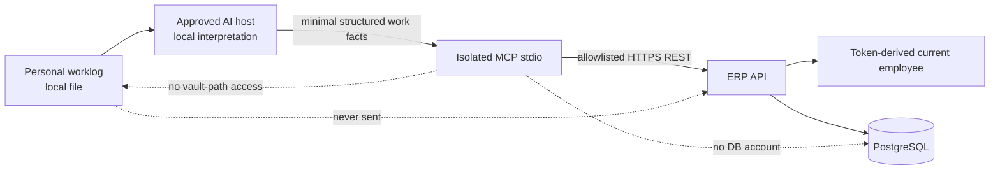

# LSS ERP AI Timesheet Automation Design

## 1. Approval and purpose

The user approved this design direction on 2026-07-25:

> The user writes only the personal worklog. The AI prepares the timesheet,
> asks only about unresolved exceptions, and the user performs the final
> approval.

This is not a manual MCP timesheet-entry feature. It is an AI-assisted
worklog-to-timesheet workflow with a human approval Gate.

The design extends the current isolated MCP collaboration branch. It does not
authorize a release merge, deployment, a real ERP write, or broader ERP access.

## 2. Scope split

### 2.1 Current implementation scope

The current implementation scope is limited to the following outcome:

1. An approved AI host reads the user's worklog locally.
2. The AI host sends only minimal structured work facts to the local MCP.
3. The MCP returns the token owner's timesheet context and eligible project
   candidates.
4. The MCP resolves unambiguous projects and standard common-work rows.
5. The MCP merges resolved work facts into the existing draft without silently
   deleting unrelated rows.
6. The MCP returns resolved names, daily and weekly totals, coverage
   exceptions, and focused clarification questions.
7. A confirmation token is created only when every blocking exception is
   resolved or explicitly accepted.
8. The existing disabled-by-default commit Gate writes only the confirmed,
   token-owned draft and verifies it by readback.

### 2.2 Explicitly deferred scope

The following capabilities are not part of this implementation:

- audio transcription or raw meeting-record ingestion;
- narrative weekly-work-report generation or persistence;
- project creation or general project-information mutation;
- Telegram command intake;
- employee email ingestion or analysis;
- schedule creation or mutation;
- manager or cross-employee access;
- remote MCP transport;
- production deployment or release merge.

Each deferred capability requires its own inventory, data-minimization rule,
scope, REST contract, threat review, test Gate, and user approval.

## 3. Trust and privacy boundary

The AI host owns natural-language interpretation. The MCP does not receive a
worklog file path, scan the vault, or send raw worklog text to ERP.

The MCP input is a bounded `WorklogFact` list. Each fact may contain:

- an opaque `fact_id`;
- a work date;
- a bounded description;
- an optional duration;
- a semantic entry kind;
- an optional project query or project ID;
- an optional work type.

The `fact_id` is local correlation data. It must not contain a filesystem path,
email address, raw transcript, secret, or employee identifier.

## 4. MCP and REST surface

### 4.1 Existing tools retained

- `erp_get_current_user`
- `timesheet_get_week`
- `timesheet_search_projects`
- `timesheet_prepare_draft`
- `timesheet_commit_draft`

`timesheet_prepare_draft` remains the complete-replacement compatibility tool.
Its description must state that an AI host must not use it for partial worklog
updates because omitted rows become removals.

### 4.2 New tools

- `timesheet_get_entry_context`
  - read only;
  - returns the token owner's labor classification, allowed work types,
    project-source values, and expected daily hours for one week;
  - does not return another employee or an editable employee identifier.

- `timesheet_prepare_from_worklog`
  - no remote mutation;
  - accepts structured work facts, not raw worklog text;
  - resolves project candidates;
  - safely merges into the current draft;
  - produces targeted clarification questions and totals;
  - creates a confirmation only when the proposal is safe to commit.

The resulting surface is seven MCP tools over five allowlisted REST endpoints.
Only `timesheet_commit_draft` performs a remote mutation and it remains
disabled by default.

### 4.3 New REST endpoint

`GET /api/timesheets/entry-context?week_start=YYYY-MM-DD`

Required scope: `timesheet:read:self`

The backend derives the employee from `AuthContext`. It returns:

- `week_start` and `week_end`;
- token-owner `labor_type`;
- allowed `project_sources`;
- allowed `work_types`;
- seven `daily_targets` with date, expected hours, and reason.

The MCP client must reject a context response for a different week.

## 5. Canonical timesheet entry

The MCP daily entry remains the confirmation and write unit, but it is expanded
to preserve the existing ERP UI semantics:

- `work_date`;
- optional `project_id`;
- optional `project_name`;
- `project_source`: `실행`, `영업`, or `공통`;
- optional `spg`;
- `hours`;
- `work_type`;
- `description`, mapped to the ERP row note.

The backend remains authoritative for employee ownership and `labor_type`.
The AI cannot choose an employee or labor classification.

Rules:

- an `실행` row requires an eligible active `project_id`;
- an `영업` or `공통` row requires a bounded `project_name`;
- `연차` normalizes to project source `공통`, project name `연차`, and work
  type `공통 > 연차`;
- hours remain quarter-hour increments between 0.25 and 24;
- all work dates must be inside the requested Monday-to-Sunday week;
- unknown fields and authority fields are rejected.

## 6. Worklog fact resolution

`entry_kind` values are:

- `project`;
- `common`;
- `leave`;
- `non_project`.

Resolution rules:

1. `leave` maps deterministically to the standard annual-leave entry.
2. `common` and `non_project` require a project name and work type supplied by
   the AI interpretation. Missing values produce clarification questions.
3. `project` requires either a project ID or a project query.
4. A supplied project ID must match one active result.
5. A project query resolves automatically only when there is one active
   candidate or one exact code/name match.
6. Zero or multiple candidates produce a structured question with bounded
   candidate options.
7. Missing hours produce a question; the MCP never invents a duration.
8. Missing work type produces a question; the MCP may not silently classify a
   project task.

Question IDs are deterministic. The AI can call the prepare tool again after
answering a question or may pass a question ID in
`accepted_question_ids` only after explicit user acceptance of that exception.

## 7. Safe merge and diff

The worklog prepare tool always uses merge mode.

- Existing rows not mentioned in the work facts are preserved.
- A resolved fact replaces an existing row only when the date, project
  identity, work type, and description match.
- Otherwise the fact adds a new row.
- The result reports `preserved_entry_count`.
- No worklog tool input can request whole-week replacement or deletion.

The compatibility `timesheet_prepare_draft` retains replacement semantics for
explicit complete-grid clients. Its tool description and output must make that
mode visible.

## 8. Preview and exception contract

The worklog preparation result includes:

- `mode=merge`;
- current status and version;
- resolved proposal rows with project names;
- `diff`;
- `preserved_entry_count`;
- daily totals;
- weekly total;
- expected daily targets;
- structured clarification questions;
- non-blocking warnings;
- `can_commit`;
- an expiring confirmation token when `can_commit=true`.

Coverage questions are generated when:

- a weekday total is below the backend-provided expected total;
- a daily total exceeds the expected total;
- a day with a zero target contains hours.

Coverage questions are not silently accepted. The user may supply missing work
facts or explicitly accept the deterministic question ID.

Totals over 24 hours and duplicate full semantic rows are hard blockers.

## 9. Confirmation and write

The confirmation binds:

- token-derived user;
- week;
- expected version;
- complete merged entry proposal;
- accepted exception IDs;
- proposal hash;
- one idempotency key.

Commit behavior retains the existing controls:

- canary write disabled by default;
- own draft only;
- submitted, approved, or rejected sheets immutable;
- expected-version enforcement;
- same-key/same-hash replay;
- same-key/different-hash conflict;
- response-loss reconciliation;
- exact post-write readback;
- confirmation consumption only after verification.

## 10. AI-oriented tool metadata

Every tool receives:

- a Korean task-oriented title and description;
- `readOnlyHint`;
- `destructiveHint`;
- `idempotentHint`;
- `openWorldHint`.

The annotations are hints only. Security never depends on annotations.

The worklog prepare description explicitly tells the AI:

- send structured facts only;
- do not send raw worklog text or a path;
- do not guess hours;
- present clarification questions to the user;
- present totals and diff before requesting commit.

## 11. Goal mapping

Exactly one project Goal remains active at a time. The main-developer backend
hand-back Goal remains the current active Goal until accepted.

| Goal | Added or clarified responsibility |
|---|---|
| G0001 | Versioned backend contract must include full MCP/ERP DTO parity evidence |
| G0002 | New entry-context endpoint uses existing self-read scope and default deny |
| G0003 | Expanded entries preserve self, state, version, and uniqueness controls |
| G0004 | Accepted exceptions and merged proposal remain audit/idempotency bound |
| G0005 | Seven tools expose explicit AI-oriented metadata |
| G0006 | Entry-context and richer project-candidate read tools |
| G0007 | Worklog facts, safe merge, questions, daily/weekly totals, shadow prepare |
| G0008 | Confirmed merged-draft commit and exact readback |
| G0009 | Security/fault tests plus AI-quality and no-silent-deletion Gates |
| G0010 | Schedule remains deferred and requires separate approval |
| G0011+ | Weekly report, transcript, project mutation, Telegram, and email remain separate future Goals |

## 12. Verification and acceptance

Local MCP acceptance requires:

- strict schema tests for all new models;
- context response week and enum validation;
- project auto-resolution and ambiguity tests;
- leave/common/non-project tests;
- missing-hours and missing-work-type questions;
- deterministic accepted-question behavior;
- merge preservation and no-silent-deletion tests;
- daily and weekly total tests;
- commit readback with the expanded entry schema;
- stdio list/call and tool-annotation tests;
- allowlist and raw-path/authority-field rejection tests;
- complete MCP regression suite;
- compileall and dependency audit.

Main-developer hand-back additionally requires:

- the real endpoint and OpenAPI hash;
- PostgreSQL and Alembic evidence;
- token-derived self-only behavior;
- DTO mapping for execution, sales, common, and leave rows;
- employee-derived labor type;
- version, idempotency, audit, and rollback evidence;
- legacy UI regression.

Local tests do not authorize a real write or release.
