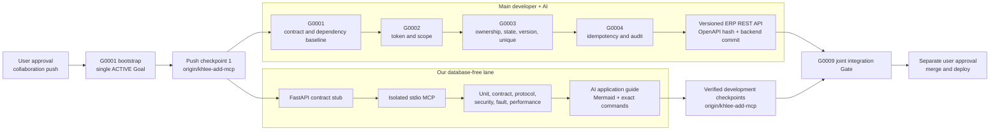
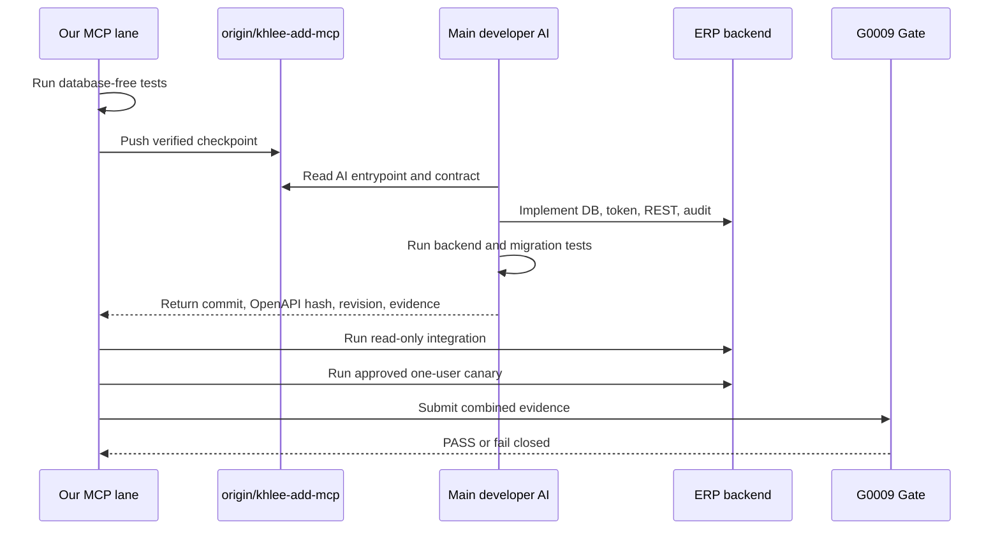
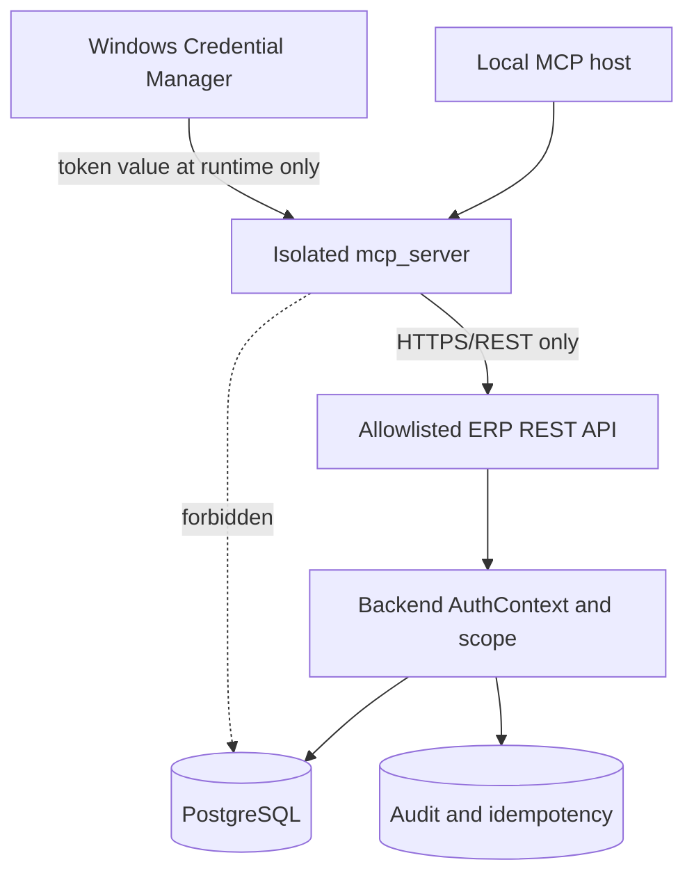

# LSS ERP MCP Collaboration Branch Push Design

- status: APPROVED-IN-CHAT
- approved_by: user
- approved_on: 2026-07-25
- repository: `D:\_Project\LSS_ERP`
- development_branch: `khlee-add-mcp`
- code_baseline: `1e46a0c`
- release_state: `DEVELOPMENT/NOT-RELEASED`

## 1. Decision

Push verified development checkpoints to `origin/khlee-add-mcp` so the main
developer and their AI assistant can consume the contract, tests, and
application instructions early.

This approval permits development-branch push only. It does not permit:

- merge to `main`;
- pull-request merge;
- production or production-like deployment;
- real ERP write activation;
- secret, token, database URL, or database credential publication.

The original `G0009 PASS before push` rule is replaced by two separate gates:

| Gate | Meaning | Rule |
|---|---|---|
| Collaboration push | Share reviewed development evidence on `origin/khlee-add-mcp` | Allowed after the relevant local verification passes |
| Integration release | Merge, deploy, or activate a real ERP write path | Blocked until `LSS-MCP-G0009 COMPLETE/PASS` and separate user approval |

## 2. Chosen execution model

`LSS-MCP-G0001` remains the only active Goal at startup. After its bootstrap is
committed and pushed, the two ownership lanes may progress in parallel:

- Main-developer lane: PostgreSQL, Alembic, token policy, ownership and state
  protection, idempotency, audit, ERP REST endpoints, server application, and
  rollback evidence.
- MCP lane: database-free FastAPI contract stub, isolated `mcp_server`, strict
  REST client, stdio protocol, local prepare/diff, stub-only draft commit, and
  unit/contract/protocol/security/fault/performance tests.

The parallel start changes execution order, not ownership. The MCP lane may
implement and test against the stub before backend hand-back, but it must not
claim real integration or activate a real write path.



## 3. Push checkpoints

### Checkpoint 1 — Goal bootstrap

Contents:

- approved collaboration-push design;
- backend handoff;
- isolated implementation plan;
- `goals/_INDEX.md`;
- `goals/LSS-MCP-G0001/STATUS.md`.

Required evidence:

- branch is `khlee-add-mcp`;
- code baseline is recorded as `1e46a0c`;
- exactly one Goal is `ACTIVE`;
- staged diff contains no secret;
- push target is exactly `origin/khlee-add-mcp`.

### Checkpoint 2 — Database-free MCP foundation

Contents:

- isolated `mcp_server` package;
- fail-closed configuration;
- credential-provider boundary;
- strict schemas and allowlisted REST client;
- database-free FastAPI contract stub;
- read-only stdio tools.

Required evidence:

- TDD red/green evidence for new behavior;
- no import of `backend`, ORM, or database driver;
- no database environment variable or credential;
- unit, contract, protocol, security, and local performance tests pass.

### Checkpoint 3 — Prepare, stub commit, and application package

Contents:

- local prepare/diff;
- explicit confirmation-bound draft commit against the stub only;
- replay and response-loss tests;
- main-developer AI entrypoint;
- exact backend application and rollback instructions;
- OpenAPI and evidence hand-back templates.

Required evidence:

- no unconfirmed write;
- no approved/submitted-record mutation;
- idempotent replay is deterministic;
- all local suites pass;
- documentation commands and referenced paths are valid.

No checkpoint is a release.

## 4. Main-developer AI package

The pushed branch must provide a single entrypoint that tells the main
developer's AI what to read, change, run, and return. The implementation plan
will assign exact files, including:

```text
docs/mcp/AI-MAIN-DEVELOPER-ENTRYPOINT.md
docs/mcp/API-CONTRACT.md
docs/mcp/APPLY-AND-ROLLBACK.md
docs/mcp/EVIDENCE-HAND-BACK.md
docs/mcp/OPERATIONS.md
```

The entrypoint must include:

1. branch and baseline;
2. strict ownership boundary;
3. prohibited secrets and database disclosure;
4. required PostgreSQL and Alembic work;
5. REST routes, scopes, states, versions, unique constraints, idempotency, and
   audit requirements;
6. exact test commands and expected evidence;
7. development-server application sequence;
8. canary, kill switch, rollback, and recovery sequence;
9. required backend commit SHA, OpenAPI hash, migration revision, command
   output, and remaining blockers;
10. a warning that MCP-local PASS is not real-server PASS.



## 5. Contract and data-flow boundaries

The MCP process communicates only with an allowlisted ERP REST base URL. It
must not import backend code or connect to a database.



The local contract stub is test infrastructure only. It may model API state in
memory but must not be imported by production package code.

## 6. Failure and rollback rules

- Missing, expired, revoked, or under-scoped token: fail closed.
- Unknown API route or base URL outside the allowlist: fail closed.
- Stale version, duplicate employee/day entry, or protected state: return a
  deterministic conflict and do not write.
- Timeout before a confirmed commit: retry only under the same idempotency key.
- Timeout after an uncertain commit: reconcile by readback before any retry.
- Secret detected in a staged diff, log, or test artifact: stop the push.
- Backend evidence without command output or commit SHA: do not accept the
  Goal.
- OpenAPI hash drift: stop integration until the contract is reviewed.
- Canary failure: disable the MCP write tool, preserve audit evidence, and
  execute the documented backend rollback.

## 7. Verification strategy

Local verification precedes every collaboration push:

| Layer | Minimum proof |
|---|---|
| Goal | Exactly one `ACTIVE` Goal |
| Unit | Config, credentials boundary, confirmation, diff |
| Contract | Success plus 401, 403, 404, 409, 422, 429, and 5xx mapping |
| Protocol | Official MCP stdio session can initialize, list, and call |
| Security | Isolation, SSRF rejection, secret redaction, path and input rejection |
| Fault | Timeout, response loss, replay, and deterministic reconciliation |
| Performance | Measured local adapter budget with an explicit threshold |
| Documentation | Referenced paths exist; commands parse; Mermaid renders |
| Git | Intended files only; no secret; exact remote branch target |

Real API, PostgreSQL, Credential Manager, canary, and rollback results remain
`NOT-RUN` until actually executed in their authorized environments.

## 8. Completion boundary

This collaboration design is complete when:

- `origin/khlee-add-mcp` contains the verified checkpoints;
- the main developer's AI has one self-contained entrypoint;
- our database-free suites pass;
- local and real-server evidence are clearly separated;
- no secret or database credential is committed;
- `main`, PR merge, and deployment remain untouched;
- G0009 retains authority over integration release.

Actual MCP release is outside this design until G0009 and separate user
approval.
