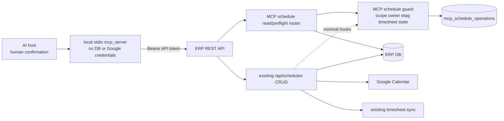
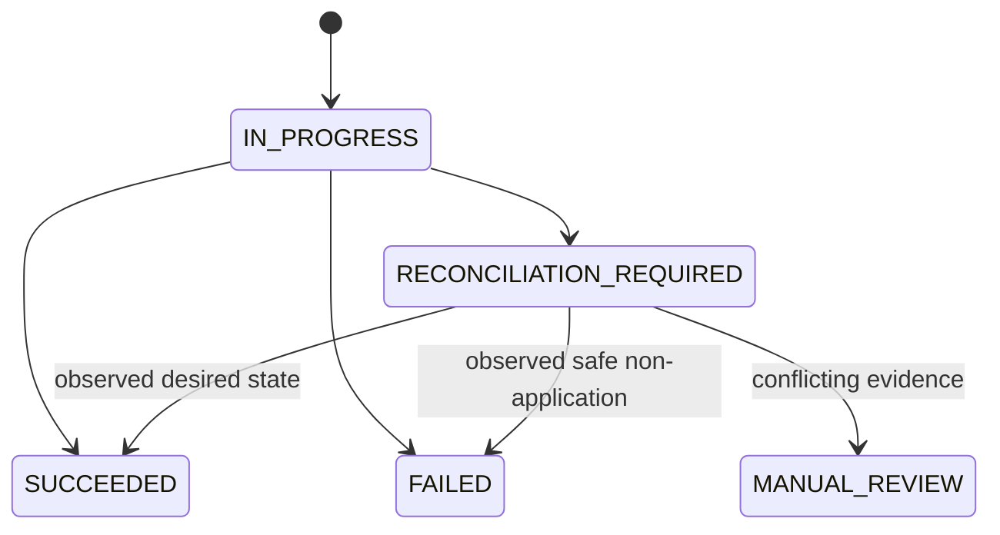

# LSS ERP MCP Enterprise Schedule Design

**Status:** APPROVED-DESIGN / TASKS-1-11-LOCAL-PASS /
TASK-12-EXTERNAL-GATES-NOT-RUN / TASK-13-COMMIT-PUSH-NOT-AUTHORIZED /
POSTGRESQL-RUNTIME-NOT-RUN / WRITE-DISABLED
**Approved:** 2026-07-27
**Target branch:** `khlee-add-mcp`
**Baseline:** `b9c0c1bced40397b713efb4497a1e5ea9f947be7`

## 1. Decision

Continue on the existing `khlee-add-mcp` branch. Preserve the current calendar
UI and `/api/schedules` behavior. Add a separate MCP schedule control layer and
only the smallest backward-compatible hooks needed for scoped authorization,
idempotency, immutable ownership, optimistic concurrency, audit, and
reconciliation.

The standalone local-stdio `mcp_server` remains REST-only. It must not import
backend modules, ORM models, database drivers, Google credentials, or the
personal Obsidian vault.

This design is the selected option 2:

- no rewrite of the existing schedule workflow;
- no frontend change;
- no direct database or Google Calendar access from `mcp_server`;
- minimal hook calls inside the existing schedule router;
- additive backend MCP contracts and operation journal;
- production writes disabled until the external integration gates pass.

“Option 2” above names the overall integration approach chosen during design.
It is distinct from the later concurrency choice. The selected concurrency
**option 1** is database row locking: Employee namespace rows first, then
globally ordered Timesheet rows, as defined normatively in
`docs/mcp/SCHEDULE-MUTATION-LOCKING.md`. Keeping the labels explicit prevents
an implementation reviewer from treating the two decisions as contradictory.

## 2. Design-time Evidence and Problem Boundary

This section preserves the baseline that motivated the design. It is not the
current implementation-status report; use the status header, implementation
plan checkpoint, and `docs/mcp/LOCAL-VERIFICATION.md` for current evidence.

The existing schedule implementation already performs the business workflow:

1. create/update/delete a Google Calendar event;
2. upsert/delete `calendar_schedules`;
3. synchronize related timesheet entries;
4. commit or attempt compensation.

The current MCP exposure is incomplete:

- the legacy internal MCP layer only provides read-only
  `get_schedule_status`;
- the standalone `mcp_server` provides seven timesheet tools and no schedule
  tools;
- `ERPClient` allowlists only identity and timesheet paths;
- API token scopes are stored but are not enforced by `get_current_user`;
- ownership for update/delete is inferred from the display name embedded in
  the Google event summary;
- create has no caller-controlled event ID or durable idempotency record;
- update/delete have no `etag` precondition;
- submitted/approved timesheets can be affected by schedule synchronization;
- response loss and Google/DB partial failure can leave the final state
  uncertain.

Therefore, merely adding MCP tool functions around the existing endpoints
cannot provide a hard production write guarantee.

## 3. Goals

1. Add enterprise schedule list/detail tools.
2. Add create/update/delete preparation with a human-readable diff.
3. Require an unexpired confirmation token before every write.
4. Enforce `schedule:read` and `schedule:write` for API tokens at the backend.
5. Use immutable user identifiers for MCP-created Google events.
6. Prevent duplicate create after response loss with a deterministic Google
   event ID and durable idempotency journal.
7. Reject stale update/delete with Google `etag`.
8. Reject MCP writes that would change submitted or approved timesheets.
9. Classify uncertain outcomes as
   `RECONCILIATION_REQUIRED`, never as implicit success.
10. Keep all current UI calls and response shapes compatible.

## 4. Non-goals

- Frontend calendar redesign or new calendar controls.
- General refactoring or service extraction of `schedule.py`.
- Replacing Google Calendar with Microsoft 365.
- Changing the existing timesheet MCP tools.
- Giving `mcp_server` direct DB, ORM, Google SDK, or credential-file access.
- Automatically rebinding legacy events by display name.
- Production DB migration, deployment, or live Google canary without an
  approved isolated environment.
- Claiming exactly-once distributed transactions across Google Calendar and
  ERP DB.

## 5. Protected and Mutable Boundaries

| Area | Rule |
|---|---|
| `frontend/src/views/CalendarView.vue` | protected; no change |
| existing `/api/schedules` normal UI behavior | protected; request and response compatibility required |
| existing schedule business helpers | reuse; no duplicate implementation in `mcp_server` |
| `backend/app/routers/schedule.py` | MCP-aware hooks plus shared timesheet-lock participation; no wholesale rewrite |
| new backend MCP schedule files | additive implementation area |
| `mcp_server` | schedule schemas/client/tools/tests may be added |
| DB schema | additive operation journal and named Timesheet employee-week unique constraint; do not rewrite `calendar_schedules` |
| Google Calendar | test calendar only until canary approval |

Any task that requires moving or rewriting the existing create/update/delete
workflow must stop and request a new design decision.

## 6. Architecture



The backend remains the resource server and system integration owner.
`mcp_server` only handles tool schemas, local confirmation, strict REST
allowlisting, response validation, and explicit user-facing failure states.

## 7. Backend Contract

### 7.1 New MCP-specific endpoints

| Method | Path | Scope | Purpose |
|---|---|---|---|
| GET | `/api/mcp/schedules` | `schedule:read` | bounded list with object envelope |
| GET | `/api/mcp/schedules/{event_id}` | `schedule:read` | current state, owner binding, `etag`, write eligibility |
| POST | `/api/mcp/schedules/preflight` | `schedule:write` | validate proposal and affected timesheet states without writing |
| GET | `/api/mcp/schedules/operations/{correlation_id}` | `schedule:write` | durable commit/reconciliation status |

Normal create/update/delete continue to use the existing `/api/schedules`
endpoints. An API-token request supplies the following control headers:

- `Idempotency-Key`
- `X-Correlation-ID`
- `If-Match` for update/delete
- `X-LSS-MCP-Schedule: 1`

The backend must derive identity and scope from the bearer token. It must never
trust owner IDs supplied by the MCP request body.

### 7.2 Standard response envelope

New MCP-specific endpoints return:

```json
{
  "success": true,
  "data": {},
  "error": null,
  "meta": {
    "correlation_id": "uuid",
    "timestamp": "UTC timestamp"
  }
}
```

Existing `/api/schedules` responses remain unchanged for ordinary UI calls.
MCP-aware error responses use stable error codes in `detail` or the new
envelope without changing successful legacy responses.

### 7.3 Stable errors

At minimum:

- `missing_scope`
- `legacy_owner_unbound`
- `owner_mismatch`
- `timesheet_locked`
- `stale_event`
- `schedule_state_drift`
- `idempotency_conflict`
- `operation_in_progress`
- `reconciliation_required`
- `write_disabled`
- `upstream_invalid_response`

## 8. Minimal Existing-Router Hooks

The existing schedule router may call a new
`backend/app/services/mcp_schedule_control.py` module at these points:

| Point | Hook responsibility |
|---|---|
| request entry | detect validated API-token MCP context; ordinary JWT UI returns no MCP context |
| before Google create | enforce scope/timesheet state; claim idempotency; derive deterministic event ID |
| event body creation | add private immutable owner, version, correlation, and request hash properties |
| before Google update/delete | strict immutable owner check; verify expected `etag`; block locked timesheets |
| Google request construction | attach `If-Match` for MCP update/delete |
| success | persist normalized result and final state in the operation journal |
| exception/timeout | persist `FAILED` or `RECONCILIATION_REQUIRED` using observed evidence |

The normal JWT UI path does not require MCP headers and retains its current
behavior. Characterization tests must prove this before and after each hook.

## 9. Ownership and Legacy Events

For MCP-created events, Google private extended properties contain:

- `lss_owner_user_id`
- `lss_owner_employee_id`
- `lss_event_version`
- `lss_correlation_id`
- `lss_request_hash`

The backend token identity and `CalendarSchedule.created_by` are authoritative.
The display-name prefix remains presentation metadata only.

MCP write eligibility:

| Event | Read | Update/Delete |
|---|---:|---:|
| immutable owner matches token user | allowed | allowed after other gates |
| immutable owner differs | allowed as redacted enterprise read with `schedule:read` | denied |
| no immutable owner property | allowed with legacy flag | denied as `legacy_owner_unbound` |

No automatic display-name-to-user binding is allowed. A future administrative
rebind workflow requires separate design and approval.

## 10. Timesheet Protection

Preflight computes the union of:

- weeks currently linked to the target event;
- weeks that the proposed date/time range would affect.

If any corresponding timesheet exists with a status other than `작성중`, the
MCP request is rejected before the Google write. This rule applies to create,
update, and delete through the MCP path.

For a newly claimed write, this is not only a read-time preflight. The first
local/linked scope read discovers seed Employee IDs only. After the durable
operation claim, the backend starts a new transaction and locks every seed
`employees` namespace row with `SELECT ... FOR UPDATE` in `Employee.id` order.
While those parent locks are held, it re-queries the current
`calendar_schedules` row and `timesheet_entries`-linked employee-week scope.
UPDATE unions its desired weeks; DELETE uses the current local/linked scope;
CREATE uses its desired weeks.

If that authoritative re-query adds an Employee outside the locked set, the
backend rolls back before any child lock, local mutation, or Google write. It
expands the parent set and restarts in sorted order. MCP reloads its already
committed operation row after each rollback so later finalization never relies
on a stale ORM instance. The scope restart is DB-only and bounded to three
attempts; it is not an automatic Google retry. Persistent churn fails closed
as `timesheet_scope_unstable` with the original correlation ID and no Google
write.

Only after a stable re-query does the backend lock existing affected
`timesheets` rows in deterministic global `week_start, id` order. The MCP path
then rechecks their statuses; ordinary routes retain their existing status
behavior while mutating under the revalidated locks. The parent lock protects
weeks with no Timesheet row; the child lock protects existing headers.

Every writer that can create or mutate the same Timesheet state participates
in the same order: MCP schedule create/update/delete, ordinary schedule
create/update/delete when they synchronize Timesheet entries, and timesheet
save/submit/approve/reject. Each route preserves its existing authentication,
authorization, and response contract, and re-reads state under lock. MCP
schedule routes reuse their existing lock rather than acquiring it twice.

This employee-wide namespace lock is intentionally coarser than a per-week
reservation. It may serialize unrelated weeks for one employee, but closes the
missing-row race without a new reservation table. The named database constraint
`uq_timesheets_employee_week_start` is the final invariant. Alembic revision
`20260727_0016` checks for duplicate employee-week headers and fails closed
before creating the constraint; it never deletes or merges duplicates.

On MCP success, both parent and child locks remain held through the Google
request, local schedule/timesheet synchronization, operation-journal
finalization to `SUCCEEDED`, and the final commit.

On failure, the locked mutation transaction is rolled back first; that final
rollback is the lock-release boundary. Only after rollback may a separate
recovery transaction persist bounded `FAILED`, `RECONCILIATION_REQUIRED`, or
`MANUAL_REVIEW` evidence and the original correlation ID. After rollback there
is no new forward Google mutation and no local schedule/timesheet mutation.
CREATE may perform bounded deterministic-event readback and an ownership-proven
current-invocation compensation delete under the normative compensation guard.
DELETE may perform one bounded read-only Google `GET` to classify 404, present,
or conflicting DB/journal evidence, but never retries delete or compensates.
UPDATE has no automatic readback, retry, or compensation unless separately
designed. After that bounded handling, the recovery transaction writes journal
evidence only. This split is intentional because a failed SQLAlchemy
transaction cannot safely persist journal recovery, and recovery code must not
assume the row locks still exist.

The exact transaction sequence, replay ordering, compensation ownership, and
evidence limits are normative in
`docs/mcp/SCHEDULE-MUTATION-LOCKING.md`.

The existing UI request/response and authorization behavior is not changed in
this Goal. The locking refinement is limited to ordinary schedule writes that
can synchronize Timesheet state; broad legacy security or business-rule
hardening remains a separate decision.

## 11. Idempotency and Concurrency

### 11.1 Create

The server computes a deterministic Google-compatible event ID from:

- authenticated owner user ID;
- category;
- idempotency key;
- canonical request hash.

Only lower base32hex characters are used. A replay with the same key and same
request returns the stored result. The same key with a different request is
`idempotency_conflict`.

If the server loses the response after Google created the event, retry must
reconcile the deterministic event ID rather than create another event.
Stored `FAILED` and `MANUAL_REVIEW` creates return their stored stable code,
state, and correlation ID without a Google call. Stored `IN_PROGRESS` and
`RECONCILIATION_REQUIRED` creates may perform exactly one bounded read-only
Google observation of the deterministic event. Expected evidence reconstructs
local state under the Employee-then-Timesheet locks with no Google insert;
conflicting
evidence becomes `MANUAL_REVIEW`; unavailable observation preserves and returns
the stored `RECONCILIATION_REQUIRED` evidence and original correlation ID.

### 11.2 Update/Delete

Preparation records the current Google `etag`. Commit requires the same value
through `If-Match`. A mismatch is `stale_event`; the user must prepare again.

The idempotency journal stores the requested action and normalized desired
state. A replay returns the stored result or operation state.

After a DELETE failure rollback, one bounded read-only Google `GET` may
classify 404/present/conflicting DB and journal evidence. It never retries the
delete or compensates. UPDATE uncertain outcomes have no automatic readback,
retry, or compensation in this design.

Replay lookup and canonical-hash validation occur before mutable timesheet
status checks. In particular, a stored `SUCCEEDED` result remains replayable
after a timesheet changes from `작성중` to `제출` or `승인`.

For create reconciliation, observing a deterministic event from an earlier
invocation never grants permission to compensate-delete that event. A
compensation delete requires proof that the current invocation attempted the
insert and that the expected event was accepted.

## 12. Operation Journal

Add an isolated `mcp_schedule_operations` table rather than changing the
existing `calendar_schedules` columns.

Required fields:

- primary key;
- authenticated `user_id`;
- `category`;
- `action`;
- optional `event_id`;
- unique `idempotency_key` per user;
- unique `correlation_id`;
- canonical `request_hash`;
- optional `expected_etag`;
- optional `desired_state_hash`;
- `status`;
- redacted `result_json`;
- redacted `error_json`;
- `created_at` and `updated_at`.

Status state machine:



Secrets, bearer tokens, Google credential paths, event descriptions containing
sensitive free text, and personal vault paths must not be stored.

## 13. MCP Tool Surface

| Tool | Write hint | Result |
|---|---:|---|
| `schedule_list` | read-only | bounded enterprise schedule items |
| `schedule_get` | read-only | current item, owner binding, `etag`, eligibility |
| `schedule_prepare_create` | read-only | bounded redacted `before=null`/`after`; field-name-only visible/requested/unverified impact with `comparison_complete`; affected/locked weeks, stable denials, proposal hash, and an eligible-only confirmation token |
| `schedule_prepare_update` | read-only | bounded redacted before/after plus expected `etag`; field-name-only visible/requested/unverified impact with `comparison_complete`; affected/locked weeks, stable denials, proposal hash, and an eligible-only confirmation token |
| `schedule_prepare_delete` | read-only | bounded redacted before/`after=null` deletion projection; deterministic visible/requested impact with `comparison_complete`; affected/locked weeks, stable denials, proposal hash, and an eligible-only confirmation token |
| `schedule_commit` | destructive | one confirmed operation when both write gates are enabled |
| `schedule_operation_status` | read-only | durable result or reconciliation state |

The selected enterprise read policy allows a `schedule:read` token to list and
inspect bounded, content-redacted schedules regardless of owner. It never
returns the owner identifier or user-entered content. `schedule_get` and
preflight compare the local temporal projection with the current Google event
and fail closed as `409 schedule_state_drift` when they disagree. All mutation
paths remain token-owner-only.

All three prepare results expose field names, not redacted field values.
`visible_changed_fields` contains only safe before/after fields whose displayed
values are definitely different. `requested_write_fields` names the normalized
fields that a later commit would send.
`unverified_requested_fields` identifies requested `content`, `type`, and
supplied `timesheet_project_*` fields whose current values are unavailable or
deliberately redacted. `comparison_complete` is therefore false whenever any
such field exists. No prepare response returns the full normalized proposal.

Schedule confirmation uses a separate store and dataclass. Only an eligible,
coherent prepare issues a confirmation token and defensively stores the full
normalized proposal in bounded local memory; the proposal is never returned
in the prepare result. Its hash binds the result and confirmation to that
exact proposal. The current timesheet `ConfirmationStore` is not generalized
or modified during this Goal.

`claim` validates the exact Task 7 idempotency-key grammar before changing any
binding or in-flight state. A successful claim returns an immutable bounded
lease containing a defensive confirmation copy and a lease ID. The default
lease factory is cryptographically random; deterministic injected factories
are test-only. The store records `token -> lease_id`, and only that matching
lease may release or consume the claim. A missing, wrong, or stale lease
cannot clear another actor's in-flight ownership. Task 9 retains this lease
through the commit attempt and presents it to the matching release or consume
operation.

TTL expiry never revokes an active lease. Purge skips an expired in-flight
confirmation, and read/claim attempts return
`confirmation_commit_in_progress` without removing its token, idempotency
binding, lease history, or owner. The item continues to count against bounded
capacity. Its matching owner may consume after TTL, or release and
deterministically remove the expired token. No unrelated operation may cause
automatic ownership loss.

Local proposal/request validation returns only fixed
`invalid_schedule_proposal` or `invalid_schedule_request` errors and never
includes rejected content, category, event ID, or unknown input values.
Framework-level Pydantic argument rejection is also redacted at the FastMCP
boundary to `invalid_tool_arguments` while retaining the strict advertised and
runtime schema. The advertised top-level schema states
`additionalProperties=false`, and runtime rejects unknown top-level fields
before tool code or write-gate evaluation.
Validated ERP transport errors remain unchanged. An injected clock must return
a timezone-aware `datetime`; a naive clock fails with the fixed
`confirmation_clock_not_timezone_aware` error.

Task 8 implements the callable read-only preparation and local confirmation
contract. Task 9 registers the seven schedule tools, wires the separate local
write gate, attempts to consume the matching owner lease after a definite
success or any exception after typed-write entry, and exposes read-only
operation-status retrieval. This includes post-entry `ValueError`, unexpected
exceptions, cancellation, and process-level exceptions; exception type cannot
reclassify a potentially sent operation as safe to retry. Only a failure known
to occur before the typed write is entered releases the matching lease. A
release failure emits `confirmation_release_failed` and remains fail-closed.
Consumption failure never masks the original result and is reported as
`confirmation_finalization=INFLIGHT_FAIL_CLOSED`.

An uncertain result is never retried automatically. Its correlation material is
the versioned string `lss-erp-schedule-correlation:v1`, NUL, decimal
authenticated `user_id`, NUL, and the UTF-8 idempotency key. Its ID is
`schedule_v1_` plus the first 40 hexadecimal SHA-256 characters of that
material. This separates users because backend idempotency is user-scoped while
correlation is globally unique. The host persists authenticated `user_id` and
the key before commit, so the correlation can be recovered after stdio response
loss or cancellation without resending. Process-local confirmation state is
not durable across restart; backend journal absence or conflicting evidence
requires manual review.
The complete input, owner-lease, dual-gate, result, and replay contract is
maintained with the code in
`docs/mcp/SCHEDULE-CONFIRMATION-AND-PREPARE.md`.

## 14. Write Gates

Two independent gates are required:

1. local MCP setting: `LSS_ERP_SCHEDULE_CANARY_WRITE=false` by default;
2. backend setting: `MCP_SCHEDULE_WRITE_ENABLED=false` by default.

Both must be enabled for commit. Read and prepare remain available when write
is disabled. The local setting accepts only the exact lowercase environment
literals `true` and `false`; the timesheet `LSS_ERP_CANARY_WRITE` setting is
independent. The MCP generates the bounded correlation ID and Task 7 typed
client headers; callers cannot inject arbitrary headers. The generated
correlation is deterministic from authenticated `user_id` plus idempotency key
so an operator can recover it after a lost local response without cross-user
collision.

No production write is allowed by this design document. An approved isolated
ERP backend, test DB, test account, API token scopes, and dedicated Google test
calendar are prerequisites for canary.

## 15. Verification Strategy

### 15.1 Characterization

- current UI/JWT create/update/delete responses unchanged;
- current Google event body unchanged when no MCP context exists;
- current compensation paths remain reachable;
- frontend calendar file has no diff.

### 15.2 Backend unit/contract

- API token scope allow/deny/revoked/expired;
- deterministic event ID format and stability;
- same-key replay and different-payload conflict;
- private owner metadata;
- legacy owner rejection;
- owner mismatch rejection;
- submitted/approved timesheet rejection before Google call;
- Employee-before-Timesheet lock ordering, including a missing target week;
- post-parent-lock CalendarSchedule/TimesheetEntry scope re-query;
- UPDATE desired-week union and DELETE current-scope revalidation;
- bounded rollback/restart when a new Employee appears, including MCP
  operation-row rebind and persistent-churn fail-closed replay;
- timesheet save/submit/approve/reject and ordinary schedule writer
  participation with locked-state re-read;
- model/SQLite duplicate employee-week rejection;
- Alembic `0016` duplicate preflight plus exact named constraint
  upgrade/downgrade structure, with no automatic row deletion;
- `etag` match/mismatch;
- operation status transitions and redaction;
- rollback migration structure.

### 15.3 Standalone MCP

- strict schedule schemas;
- exact static path allowlist plus validated event-ID routes;
- list response size limit and object-envelope validation;
- confirmation TTL/hash/user/action binding;
- commit disabled by default;
- no automatic retry after an uncertain write;
- tool annotations and stdio protocol;
- no DB/ORM/Google SDK imports;
- no secret or personal vault path leakage.

### 15.4 Fault injection

- Google create succeeds then response is lost;
- duplicate event ID on replay;
- Google update succeeds then DB commit fails;
- Google delete succeeds then DB commit fails;
- readback differs from desired state;
- operation journal unavailable;
- compensation fails;
- timeout before and after an observable side effect.

## 16. Completion Definitions

### Local development complete

- all planned backend and `mcp_server` tests pass locally;
- existing 108 MCP tests remain passing;
- new tool list and protocol tests pass;
- frontend calendar file remains unchanged;
- migration upgrade/downgrade is tested against an approved non-production DB
  or explicitly remains `NOT-RUN`;
- schedule writes remain disabled by default;
- documentation and handoff are current;
- commit/push occur only after fresh verification and user authorization.

### Operational complete

Operational completion is a separate gate and cannot be claimed from local
tests:

- isolated PostgreSQL test environment available;
- dedicated Google test calendar available;
- real API token with exact scopes issued;
- migration upgrade and rollback pass;
- create/update/delete canary and fault matrix pass;
- reconciliation evidence is deterministic;
- deployment and rollback are approved.

## 17. External References

- MCP tools and human-in-the-loop guidance:
  <https://modelcontextprotocol.io/specification/2025-11-25/server/tools>
- MCP security best practices:
  <https://modelcontextprotocol.io/docs/tutorials/security/security_best_practices>
- Google Calendar custom event IDs:
  <https://developers.google.com/workspace/calendar/api/guides/create-events>
- Google Calendar extended properties:
  <https://developers.google.com/workspace/calendar/api/guides/extended-properties>
- Google Calendar resource versioning and `etag`:
  <https://developers.google.com/workspace/calendar/api/guides/version-resources>
